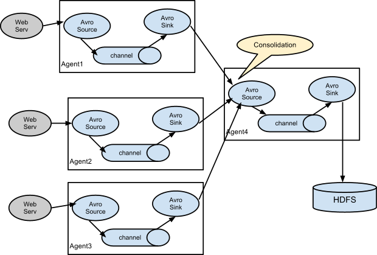

# 什么是Flume

Apache Flume是一个分布式的、可靠的和可用的系统，它能把不同数据源的海量日志数据有效地收集、汇总和移动，最后存入一个集中式数据存储系统中。

Flume除了可以收集日志数据外，还可以收集其他数据。由于Flume的数据源是可定制的，因此可以用来传输大量的Event Data，Event Data可以是网络流量数据、社会媒体产生的数据、电子邮件以及其他数据源产生的数据。

# Flume架构

Flume的数据流由Event贯穿始终，如下图：


1、**Event ：** Event是Flume的基本数据流单位，Event由消息内容（a byte payload）和可选的消息头组成，消息头一系列字符串属性。
2、**Agent：** Agent是Flume的最小的独立运行单位，由Source、Sink和Channel三大组件构成。
3、**Source：** Event由外部系统生成，如上图的WebServer，外部系统会根据Source的需求把指定格式的Event推送到Agent，Source会捕获这些Event并进行格式化，Source支持多种Event格式，如Avro、Thrift等。Source处理后的Event会被转发到一个或多个Channel中。
4、**Channel：**  Channel可以看成是一个数据缓冲区（类似消息队列），Channel中的Event一直保存到Sink处理完成为止。
5、**Sink：**  Sink负责持久化日志或者把Event推向另一个Source，Sink处理后的Event会从Channel中移除。


**Flume支持用户建立多级流，也就是Event通过多个Agent后才达到最终目的。**

这种情况应用的场景比较多，比如要收集上千个网站（网站集群）的日志，可以为这些网站配置多个Agent来收集日志，每个Agent收集一个或多个网站的日志，然后把这些Agent的数据汇集到统一的Agent中，最后由这个统一的Agent把数据持久化，如保存到HDFS。 



# Flume的特点

**高可靠性**

对于每个Agent，Event首先存放到Channel中，然后再传递到下一个Agent或者持久化到数据库中（如HDFS）。Channel中的Event数据直到下一个Agent接收完成或者持久化到数据库中完成才会被删除。

Flume通过基于事务的传递方式来保证事件传递的可靠性。在单个流中，Source和Sink被封装进一个事务中，Event保存在Channel中直到处理完成，该Event才会从Channel中删除。事务保证了Event在流中点到点传递的可靠性。如果是多级流，前一个Agent的Sink和后一个Agent的Source同样有它们的事务来保证Event数据安全的保存到后一个Agent的Channel中。 

**可恢复性**

Flume通过Channel保存Event数据，其中FileChannel可以把Event数据持久化到本地的文件系统中。MemoryChannel把Event数据保存在内存中，MemoryChannel具有更高的性能，不过可恢复性较差（一旦断电或者Agent进程关掉Event数据就会丢失）。 

# Flume的安装

其实flume的用法很简单—-书写一个配置文件，在配置文件当中描述source、channel与sink的具体实现，而后运行一个agent实例，在运行agent实例的过程中会读取配置文件的内容，这样flume就会采集到数据。 

在那台机器采集数据，就需要在那台机器上安装Flume

## 解压Flume到安装目录

``` 
[root@master1 Flume]# tar -zxvf apache-flume-1.8.0-bin.tar.gz 
```

## 配置环境变量

/etc/profile

``` 
#FLUME
export FLUME_HOME=/root/Flume/apache-flume-1.8.0-bin
export PATH=$FLUME_HOME/bin:$PATH
```

## 配置Flume

/root/Flume/apache-flume-1.8.0-bin/conf/netcatdemo.conf

``` 
#声明三种组件
agent1.sources = r1
agent1.channels = c1
agent1.sinks = k1

#定义source信息
agent1.sources.r1.type=netcat
agent1.sources.r1.bind=localhost
agent1.sources.r1.port=8888

#定义sink信息
agent1.sinks.k1.type=logger

#定义channel信息
agent1.channels.c1.type=memory

#一个source可以绑定多个channel
agent1.sources.r1.channels=c1
#一个sink只能绑定一个channel
agent1.sinks.k1.channel=c1
```

## 启动Agent

``` 
<!--
	-f 指定配置文件   
	-n 指定agent名称(与配置文件中代理的名字相同) 
	-Dflume.root.logger=DEBUG,console 设置日志等级
-->
[root@master1 bin]# ./flume-ng agent -f ../conf/netcatdemo.conf -n agent1 -Dflume.root.logger=INFO,console
```

## 测试

``` 
<!--
	1.使用nc命令向Flume Agent Source输入一段字符
-->

//启动netcat客户端,并发送数据
[root@master1 ~]# nc localhost 8888
this is test
OK

<!--
	2.在Flume Agent查看采集到的数据
-->
18/12/13 23:56:08 INFO sink.LoggerSink: Event: { headers:{} body: 74 68 69 73 20 69 73 20 74 65 73 74             this is test }
```


# Flume 常用的 Source类型

## NetCat Source

Netcat source 在某一端口上进行侦听，它将每一行文字变成一个事件源，也就是数据是基于换行符分隔。它的工作就像命令nc -k -l [host] [port] 换句话说，它打开一个指定端口，侦听数据将每一行文字变成Flume事件，并通过连接通道发送。

上面的列子就是NetCat Source；

## exec Source

实时收集日志：监控的是某个文件；

1、配置文件 exec_source_demo.conf

``` 
execagent.sources = r1
execagent.sinks = k1
execagent.channels = c1

execagent.sources.r1.type=exec
#监控的文件
execagent.sources.r1.command=tail -F /root/file/exec/test.txt

execagent.sinks.k1.type=logger

execagent.channels.c1.type=memory

execagent.sources.r1.channels=c1
execagent.sinks.k1.channel=c1
```

2、创建文件/root/file/exec/test.txt

3、启动Agent
[root@master1 bin]# ./flume-ng agent -f ../conf/exec_source_demo.conf -n execagent -Dflume.root.logger=INFO,consoleseqagent

4、向文件中添加数据，观察Flume是否正确收集数据。
[root@master1 exec]# echo 't am is' >> test.txt

## 批量收集
监控一个文件夹，静态文件。
收集完之后，会重命名文件成新文件。新文件后缀是.compeleted.

批量收集时，文本的每行文件作为一个事件。

1、配置文件 spooldir_source_demo.conf

``` 
spooldiragent.sources = r1
spooldiragent.channels = c1
spooldiragent.sinks = k1

spooldiragent.sources.r1.type=spooldir
#指定收集目录
spooldiragent.sources.r1.spoolDir=/root/file/spooldir
spooldiragent.sources.r1.fileHeader=true

spooldiragent.sinks.k1.type=logger

spooldiragent.channels.c1.type=memory

spooldiragent.sources.r1.channels=c1
spooldiragent.sinks.k1.channel=c1

```
2、创建文件夹/root/spooldir，并放入需要被收集的文件；

3、启动Agent
[root@master1 bin]# ./flume-ng agent -f ../conf/spooldir_source_demo.conf -n spooldiragent -Dflume.root.logger=INFO,consoleseqagent

## seq source

不断生成从0开始的数字，主要用于压力测试

1、配置文件 seq_source_demo.conf

``` 
seqagent.sources = r1
seqagent.channels = c1
seqagent.sinks = k1

seqagent.sources.r1.type=seq
# 生成的最大数
seqagent.sources.r1.totalEvents=1000

seqagent.sinks.k1.type=logger

seqagent.channels.c1.type=memory

seqagent.sources.r1.channels=c1
seqagent.sinks.k1.channel=c1

```

2、启动Agent

[root@master1 bin]# ./flume-ng agent -f ../conf/seq_source_demo.conf -n seqagent -Dflume.root.logger=INFO,consoleseqagent

# Flume sink

## HDFS sink

1、配置文件sink_hdfs_demo.conf

``` 
hdfssinkagent.sources = r1
hdfssinkagent.channels = c1
hdfssinkagent.sinks = k1

hdfssinkagent.sources.r1.type = netcat
hdfssinkagent.sources.r1.bind = localhost
hdfssinkagent.sources.r1.port = 8888

hdfssinkagent.sinks.k1.type = hdfs
hdfssinkagent.sinks.k1.hdfs.path = /root/flume/events/%y-%m-%d/%H%M/%S
#文件的前缀
hdfssinkagent.sinks.k1.hdfs.filePrefix = events-

#是否是产生新目录,每十秒产生一个新目录,一般控制的目录方面。
hdfssinkagent.sinks.k1.hdfs.round = true			
hdfssinkagent.sinks.k1.hdfs.roundValue = 10
hdfssinkagent.sinks.k1.hdfs.roundUnit = second

#因为在配置中我们使用了日期(/%y-%m-%d/%H%M/%S)，这里标注使用的是本地时间
hdfssinkagent.sinks.k1.hdfs.useLocalTimeStamp=true

#间隔多久产生新文件，默认是:30（秒） 0表示不以时间间隔为准。
hdfssinkagent.sinks.k1.hdfs.rollInterval=10
#文件到达多大再产生一个新文件，默认是:1024（bytes）0表示不以文件大小为准。
hdfssinkagent.sinks.k1.hdfs.rollSize=10
#event达到多大再产生一个新文件，默认是:10（个）0表示不以event数目为准。
hdfssinkagent.sinks.k1.hdfs.rollCount=3

hdfssinkagent.channels.c1.type=memory

hdfssinkagent.sources.r1.channels = c1
hdfssinkagent.sinks.k1.channel = c1
```

2、启动Agent

[root@master1 bin]# ./flume-ng agent -f ../conf/sink_hdfs_demo.conf -n hdfssinkagent

3、使用NetCat向Flume发送数据

[root@master1 ~]# nc localhost 8888

4、查看HDFS中是否已存在发送的数据

##  Hive sink

向HIVE中收集数据，会转换成MR程序，所以会非常的慢，一般我们不使用Hive sink。
这里我们不做任何说明。

## HBase sink

1、配置文件sink_hbase_demo.conf

``` 
hbasesinkagent.sources = r1
hbasesinkagent.channels = c1
hbasesinkagent.sinks = k1

hbasesinkagent.sources.r1.type = netcat
hbasesinkagent.sources.r1.bind = localhost
hbasesinkagent.sources.r1.port = 8888

hbasesinkagent.sinks.k1.type = hbase
#表名
hbasesinkagent.sinks.k1.table = ns1:t12
#列族
hbasesinkagent.sinks.k1.columnFamily = f1
hbasesinkagent.sinks.k1.serializer = org.apache.flume.sink.hbase.RegexHbaseEventSerializer

hbasesinkagent.channels.c1.type=memory

hbasesinkagent.sources.r1.channels = c1
hbasesinkagent.sinks.k1.channel = c1
```
2、启动Agent

[root@master1 bin]# ./flume-ng agent -f ../conf/sink_hbase_demo.conf -n hbasesinkagent

3、使用NetCat向Flume发送数据

[root@master1 ~]# nc localhost 8888

4、查看Hbase中是否已存在发送的数据

# 使用avroSource和AvroSink实现跃点agent处理

总体设计

agent1 : 监听netcat端口，并收集数据到agent2。
agent2:  监听agent1端口，并将收集到的数据打印到屏幕上。

1、agent1配置文件 avro_hop_agent1.conf

``` 
agent1.sources = r1
agent1.sinks= k1
agent1.channels = c1

agent1.sources.r1.type=netcat
agent1.sources.r1.bind=localhost
agent1.sources.r1.port=8888

agent1.sinks.k1.type = avro
agent1.sinks.k1.hostname=localhost
agent1.sinks.k1.port=9999

agent1.channels.c1.type=memory

agent1.sources.r1.channels = c1
agent1.sinks.k1.channel = c1
```

2、agent2配置文件 avro_hop_agent2.conf

``` 
agent2.sources = r2
agent2.sinks= k2
agent2.channels = c2

agent2.sources.r2.type=avro
agent2.sources.r2.bind=localhost
agent2.sources.r2.port=9999

agent2.sinks.k2.type = logger

agent2.channels.c2.type=memory

agent2.sources.r2.channels = c2
agent2.sinks.k2.channel = c2
```

3、启动agent2
[root@master1 bin]# ./flume-ng agent -f ../conf/avro_hop_agent2.conf -n agent2 -Dflume.root.logger=INFO,consoleseqagent

4、启动agent1
[root@master1 bin]# ./flume-ng agent -f ../conf/avro_hop_agent1.conf -n agent1

5、启动netcat客户端验证是否成功
[root@master1 bin] localhost nc 8888

# HDFS 和 HBase的选择
HDFS : 统计分析
HBase : 随机定位，可以查询某一行的具体数据，可以很方便的进行查询；
