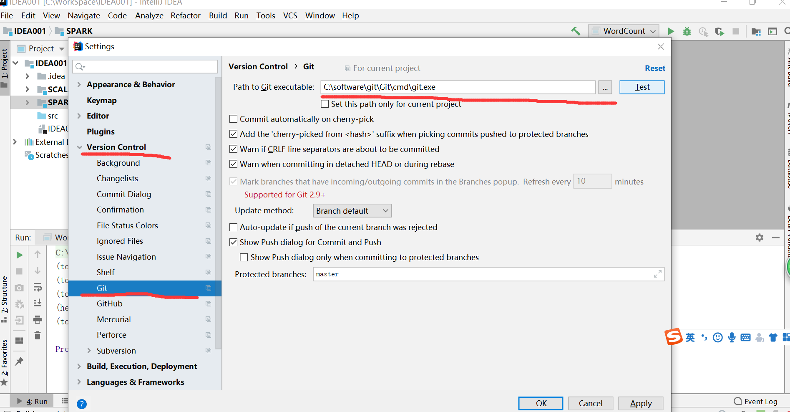

# Git常用命令

## 设置帐号身份标识

>git config --global user.email "1152853133@qq.com"
>git config --global user.name "dongk"

## 常用命令
 
>git init
通过git init命令把这个目录变成Git可以管理的仓库。

>git add
用命令git add告诉Git，把文件添加到仓库。

>git commit
用命令git commit告诉Git，把文件提交到仓库。

## 远程仓库命令

>git remote add origin git@github.com:123dongkang0/Git.git

关联远程仓库

添加后，远程库的名字就是origin，这是Git默认的叫法，也可以改成别的，但是origin这个名字一看就知道是远程程库。

>git push -u origin master

把本地库的内容推送到远程，用git push命令，实际上是把当前分支master推送到远程。

由于远程库是空的，我们第一次推送master分支时，加上了-u参数，Git不但会把本地的master分支内容推送的远程的master分支，还会把本地的master分支和远程的master分支关联起来，在以后的推送或者拉取时就可以简化命令。

此后，每次本地提交后，都可以使用命令git push origin master推送到远程仓库。

# IDEA集成git方法

## 第一步 按照下图打开

## 第二步 你会看到一个弹出框，然后打开如图

操作完上面步骤之后，点击OK就可以了。这样IDEA就成功的集成了git了。

# 在IDEA上拉Git项目下来操作

选择下面选项然后会出现：

填完之后直接clone就可以了，第一次使用会弹出输入线上git网站的用户名和密码。这样就完成了将项目拉下本地的操作了。

