git-sourcetree

# bitbucket 账号

账户名：1152853133@qq.com
用户名: dongkang123456
密码：dkdk1234

# 什么是Sourcetree

拥有可视化界面的项目版本控制软件，适用于git项目管理。

# SSH 配置

**第一步**
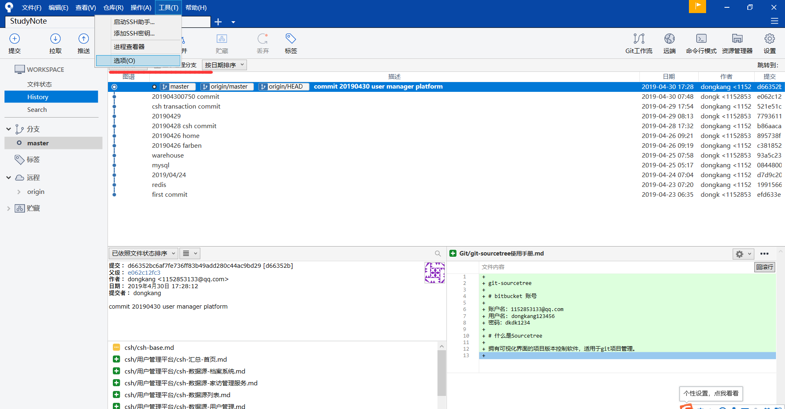

**第二步**
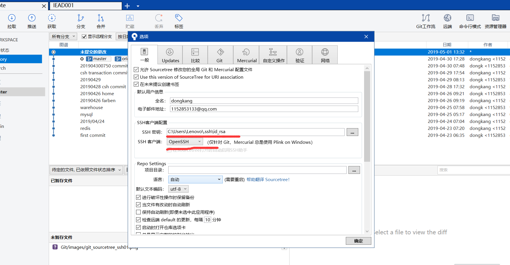

# 克隆远程仓库

# 提交到本地仓库

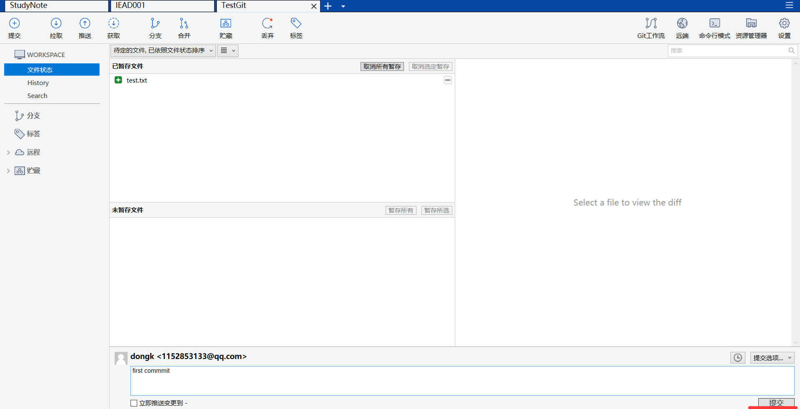

# 推送到远程仓库

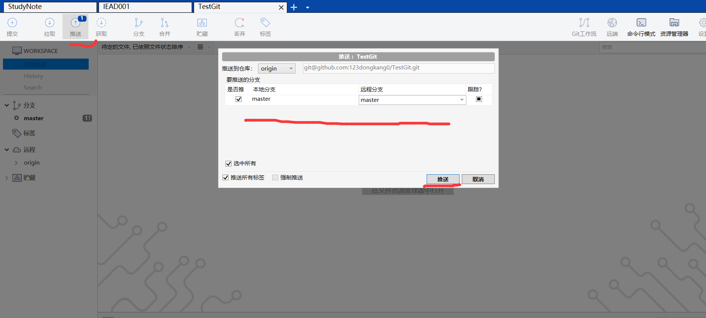

# 创建分支

我们在同一台机器上创建两个文件夹lisi、wangwu分别模拟李四、王五两个人合作开发的场景；

李四创建分支lisi;
王五创建分支wangwu;

王五在本地创建一个分支
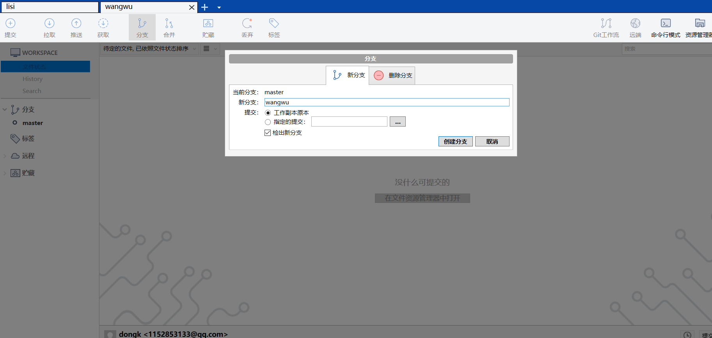

李四在本地创建一个分支
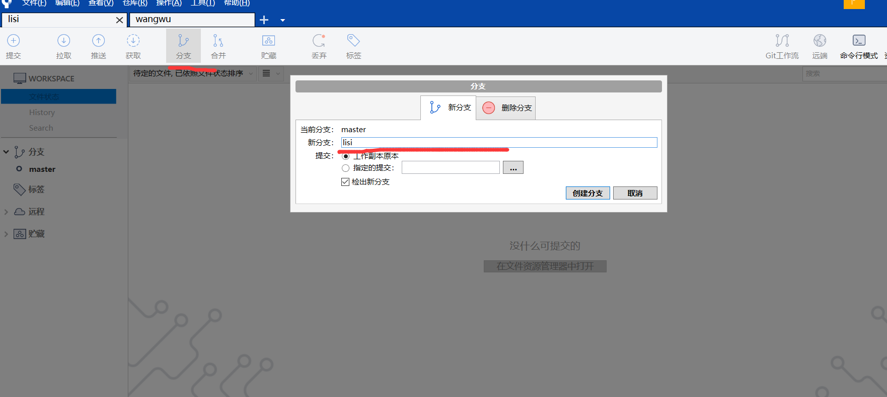

李四、王五都将自己的分支推送到远程仓库

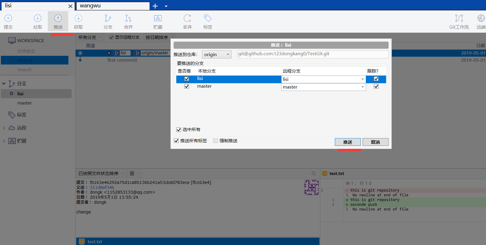

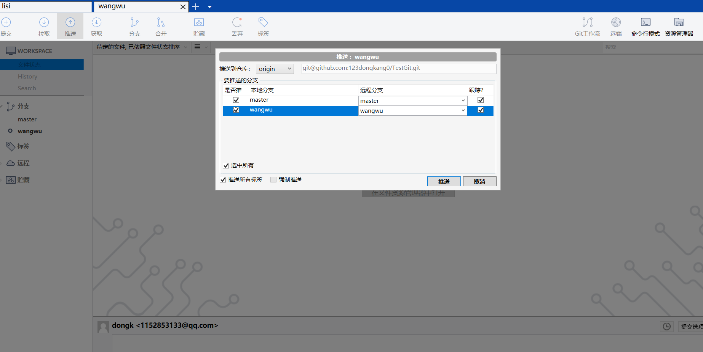

# 获取、检出

获取：从远程仓库获取到本地仓库；
检出：从本地仓库检出到当前工作区；

李四拉取王五的分支并检出，王五拉取李四的分支并检出；
下面以李四拉取王五的分支为例说明；

从远程仓库获取王五push上去的分支
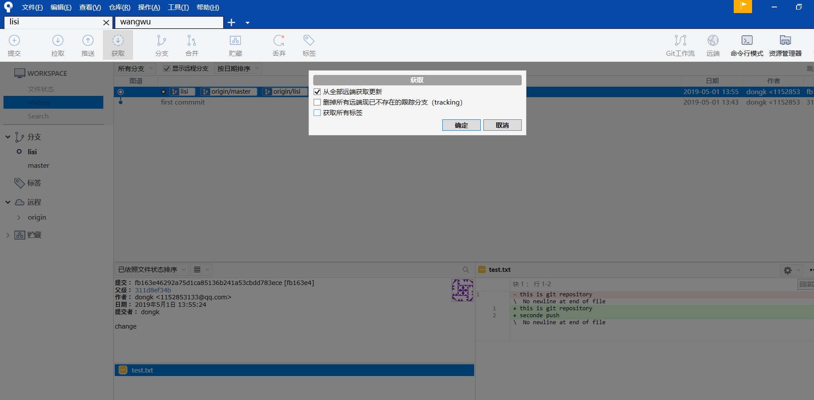

检出到当前工作区
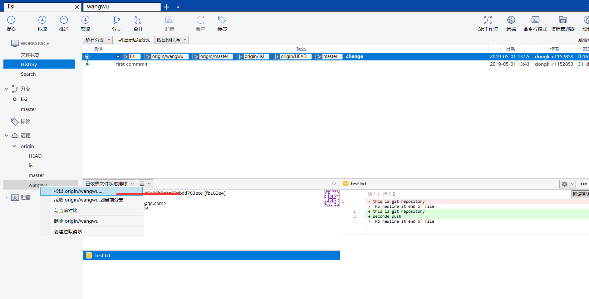

检出后工作区多了一个分支-"wangwu"
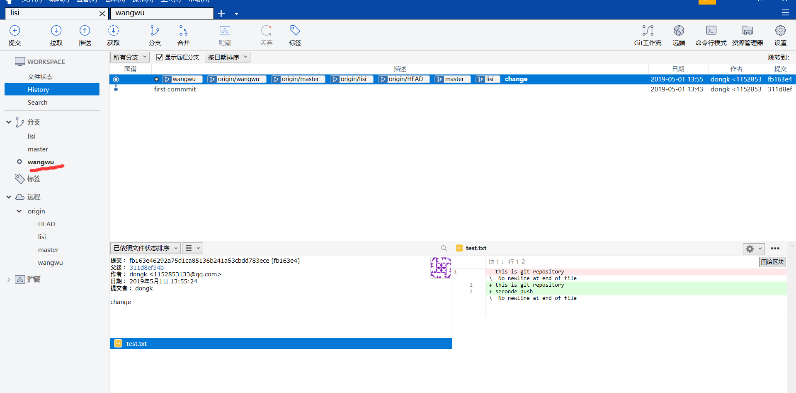

# 获取和拉取的区别

拉取：前者是 pull；
获取：后者是 fetch；
pull 等于 fetch + merge。

# 分支合并

假设李四在lisi分支上开发客户系统，王五在wangwu分支上开发订单系统；

开发完成后，李四需要将wangwu分支合并到lisi分支；

假设他们都已经将代码提交到远程仓库；

第一步：拉取wangwu分支到当前工作区；
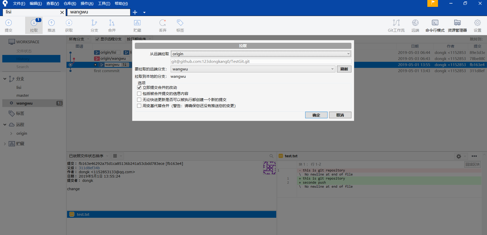

第二步：选中lisi分支；
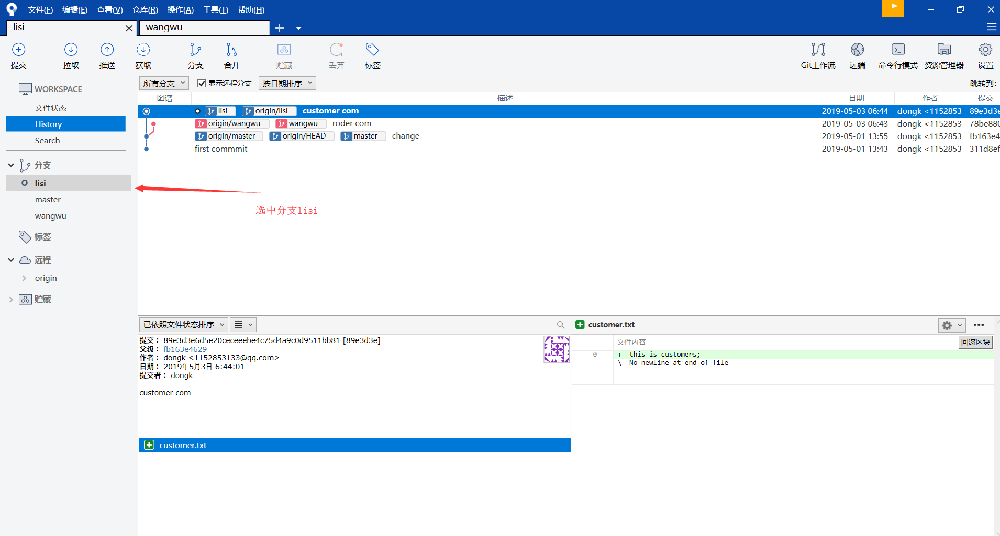

第三步：右击王五分支，合并wangwu分支到lisi分支；
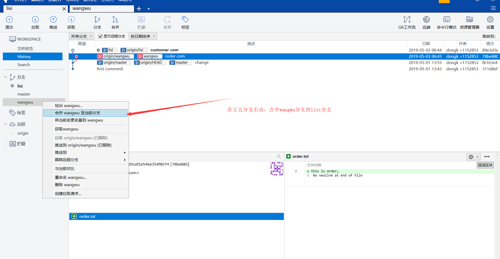

第四步：合并完成；
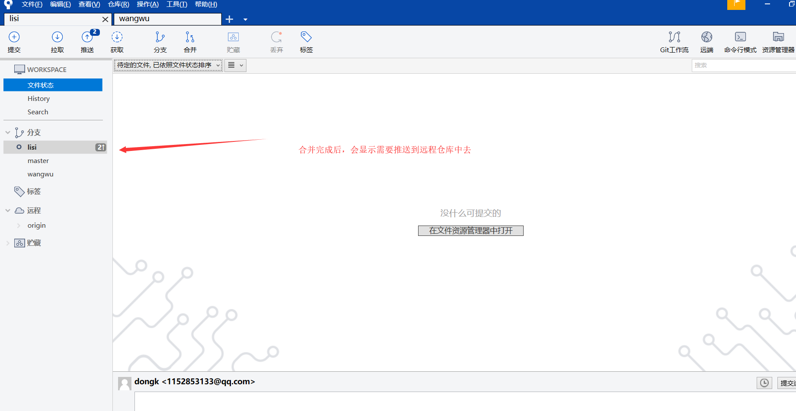

# 解决冲突

比如李四、王五都在master分支进行开发；
王五首先修改了test.txt文件，并提交到远程仓库；
李四修改test.txt文件之后，在提交之前，先进行pull操作，就会产生冲突；

第一步：lisi pull操作有冲突产生；
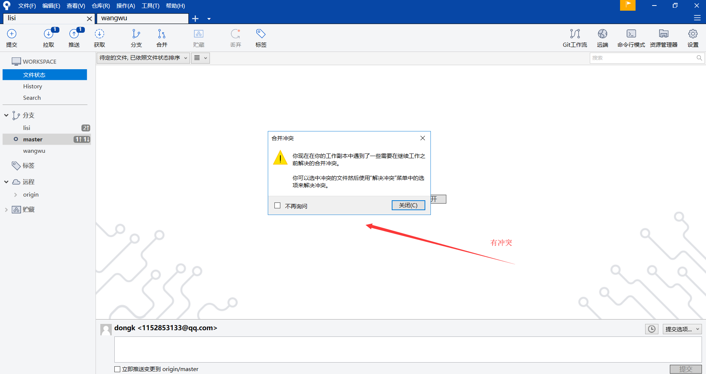
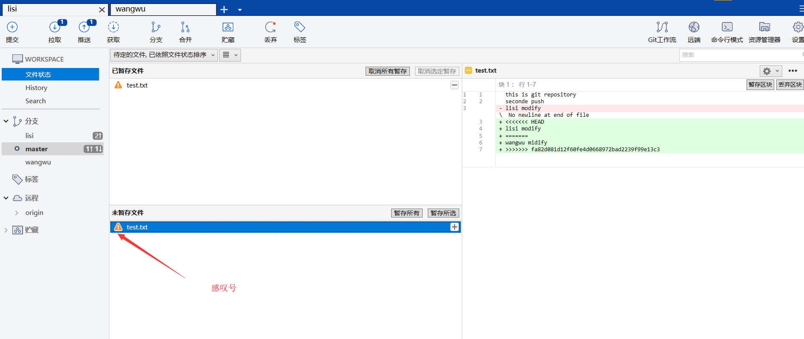

第二步：使用我的版本解决冲入(就是使用李四的代码)
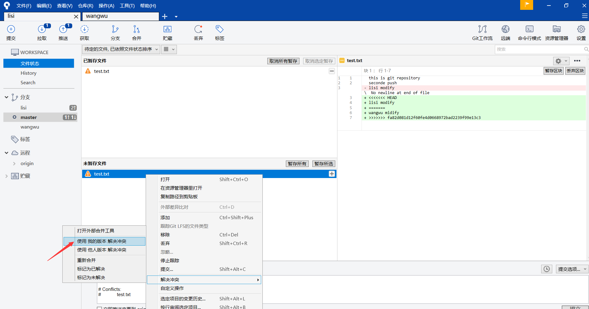

第三步：推送到远程仓库
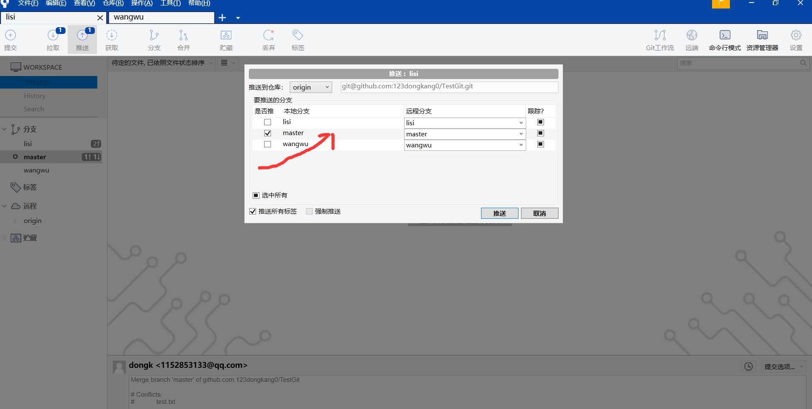

第四步：查看远程仓库，保存的是李四的代码
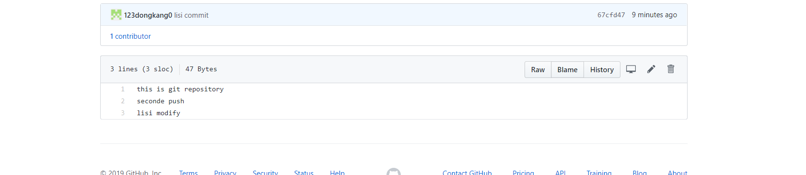