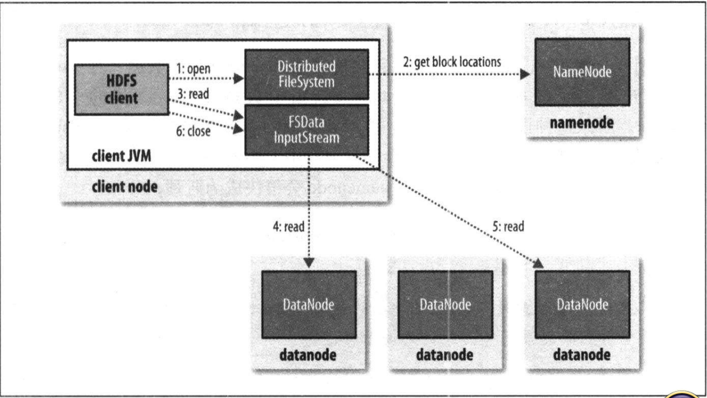
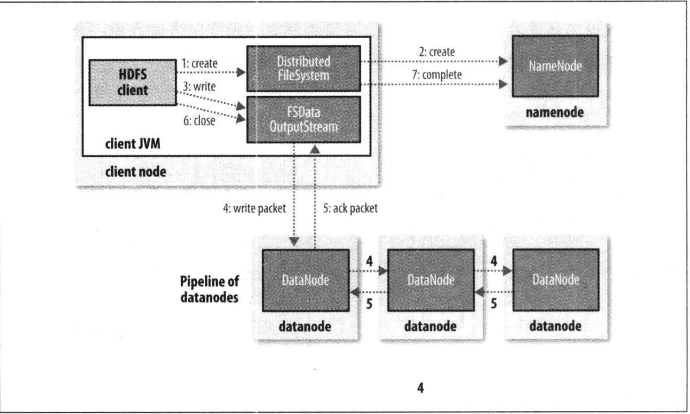
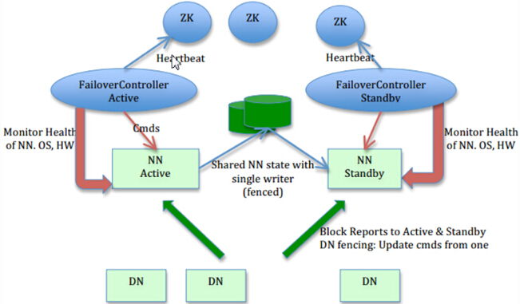
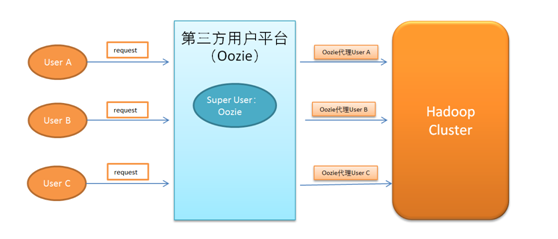

# Hadoop的特点

官方文档
https://hadoop.apache.org/docs/r2.6.5/

* 开源的 分布式的框架；

* 它不支持多个写入者的操作，也不支持在文件的任意位置进行修改(只能在文件末尾写数据);

* 有效的容错机制;


# 大数据能够解决什么问题

* 分布式存储;

* 分布式计算;


# 大数据和云计算的区别

**大数据：** 大数据主要是对海量数据的分析和计算，大数据的4V特点：Volume（大量）、Velocity（高速）、Variety（多样）、Value（价值）。

**云计算（cloud computing）：** 是基于互联网的相关服务的增加、使用和交付模式，通常涉及通过互联网来提供动态易扩展且经常是虚拟化的资源。如一台2T内存 100T硬盘的大型服务器，通过虚拟化技术分配给多个用户使用，就是典型的云计算模式。云计算的基本概念是服务。


# Hadoop的三种运行模式

* **本地模式：** 无需任何守护进程，所有程序都在同一个JVM上执行。独立模式测试和调试非常方便，因此该模式在开发阶段比较合适。

*  **伪分布式模式：**  Hadoop守护进程运行在本地机器上，模拟一个小规模的集群。

*  **完全分布式模式：** Hadoop守护进程运行在一个集群上。

## 1、Hadoop独立模式。

不需要做任何操作;默认属性专为本地模式所设定，且本地模式无需任何守护进程，因此独立模式下不需要任何操作。


## 2、Hadoop伪分布模式。

### 2.1、配置Hadoop环境变量

```
//===========        /etc/profile       =================//   

HADOOP_HOME=/home/dongk/Hadoop
PATH=$PATH:$JAVA_HOME/bin:$MAVEN_HOME/bin:$HADOOP_HOME/sbin
```


### 2.2、配置Hadoop

#### core-site.xml

```
//===== ${HADOOP_HOME}/etc/hadoop/core-site.xml  配置   ==========//
        
  <?xml version="1.0" encoding="UTF-8"?>
    <configuration>
    	<property>
    		<name>fs.defaultFS</name>
    		<value>hdfs://localhost/</value>
    	</property>
   </configuration>
```

#### hdfs-site.xml

```
//=====  2. ${HADOOP_HOME}/etc/hadoop/hdfs-site.xml  配置  =========//       
<?xml version="1.0" encoding="UTF-8"?>
   <configuration>
    	<!--副本数为1个 -->
    	<property>
    		<name>dfs.replication</name>
    		<value>1</value>
    	</property>
    
       <!--指定一系列目录来供 namenode 存储永久性的文件系统元数据，多个目录使用 , 号分割 -->
    	<property>
    		<name>dfs.namenode.name.dir</name>
    		<value>/home/dongk/Hadoop/hadoop-2.6.0/tmp/dfs/name</value>
    	</property>
    
        <!--指定datanode存储数据块的目录列表，多个目录使用 , 号分割 -->
    	<property>
    		<name>dfs.datanode.data.dir</name>
    		<value>/home/dongk/Hadoop/hadoop-2.6.0/tmp/dfs/data</value>
    	</property>
    	
   </configuration>
```

#### marped-site.xml

```
//=====  3. ${HADOOP_HOME}/etc/hadoop/mapred-site.xml  配置     ==========//

	<?xml version="1.0"?>
	<configuration>
		<property>
			<name>mapreduce.framework.name</name>
			<value>yarn</value>
		</property>
	</configuration>
```

#### yarn-site.xml

```
//======= 4. ${HADOOP_HOME}/etc/hadoop/yarn-site.xml  配置     ============//
	
	<?xml version="1.0"?>
	<configuration>
		<property>
			<name>yarn.resourcemanager.hostname</name>
			<value>localhost</value>
		</property>
		<property>
			<name>yarn.nodemanager.aux-services</name>
			<value>mapreduce_shuffle</value>
		</property>
	</configuration>
```

### 2.3、配置SSH

```
1)生成公私秘钥对。
  $>ssh-keygen -t rsa -P '' -f ~/.ssh/id_rsa

2)生成~/.ssh文件夹，里面有id_rsa(私钥) + id_rsa.pub(公钥)

3)追加公钥到~/.ssh/authorized_keys文件中(文件名、位置固定)
	$>cd ~/.ssh
	$>cat id_rsa.pub >> authorized_keys

4)修改authorized_keys的权限为644.
	$>chmod 644 authorized_keys

5)测试
	$>ssh localhost
```

### 2.4、格式化HDFS 

```
 dongk@y700:~/Hadoop/hadoop-2.6.0/bin$ ./hdfs namenode -format
```


### 2.5、启动所有的守护进程

```
dongk@y700:~/Hadoop/hadoop-2.6.0/sbin$ ./start-all.sh 
```

**如果启动报错：Error: JAVA_HOME is not set and could not be found.手动配置JAVA_HOME，如下：**

```

//=== ${HADOOP_HOME}/etc/hadoop/hadoop-env.sh  配置 ====//   
export JAVA_HOME=/home/dongk/Java/jdk1.8.0_171
```

### 2.6、验证配置是否成功

http://localhost:50070 （查看namenode）。

## 3、Hadoop完全分布式

namenode节点
​	192.168.1.191 master1

datanode节点
​	192.168.1.181 salve1
​	192.168.1.182 salve2
​	192.168.1.183 salve3

### 3.1、配置SSH免密码登录

我们的目地是主节点免密码登录到其它的3个数据节点中。

```
在四台机器上分别执行如下命令，生成密钥对;
> ssh-keygen -t rsa

在master1上执行下面四条语句，追加公钥到其它的节点;
 >scp id_rsa.pub root@master1:/root/.ssh/authorized_keys
 >scp id_rsa.pub root@salve1:/root/.ssh/authorized_keys
 >scp id_rsa.pub root@salve2:/root/.ssh/authorized_keys
 >scp id_rsa.pub root@salve3:/root/.ssh/authorized_keys
```


### 3.2、修改配置文件

#### core-site.xml

```
<?xml version="1.0" encoding="UTF-8"?>
	<configuration>
	    <!-- 制定hdfs的nameservice为ns1 -->
	    <property>
		<name>fs.defaultFS</name>
		<value>hdfs://master1</value>
	    </property>
	    <property>
		<name>hadoop.tmp.dir</name>
		<value>/root/Hadoop/hadoop-2.6.2/tmp</value>
	    </property>
	</configuration>
```


#### hdfs-site.xml

```
    <?xml version="1.0" encoding="UTF-8"?>
	<configuration>
		<!-- 配置namenode文件夹 -->
		<property>
		        <name>dfs.namenode.name.dir</name>
		        <value>/root/Hadoop/hadoop-2.6.2/dfs/name</value>
		</property>
		<!-- 配置datanode文件夹 -->
		<property>
		       <name>dfs.datanode.data.dir</name>
		       <value>/root/Hadoop/hadoop-2.6.2/dfs/data</value>
		</property>
	</configuration>
```


####  mapred-site.xml

```
    <?xml version="1.0"?>
	<configuration>
	    <property>
		<name>mapreduce.framework.name</name>
		<value>yarn</value>
	    </property>
	</configuration>
```


#### yarn-site.xml

```
    <?xml version="1.0"?>
	<configuration>
	        <property>
	           <name>yarn.resourcemanager.hostname</name>
	           <value>master1</value>
	        </property>
	        <property>
	           <name>yarn.nodemanager.aux-services</name>
	           <value>mapreduce_shuffle</value>
	        </property>
	</configuration>
```

#### slaves

```
salve1
salve2
salve3
```


### 3.3、将配置好的Hadoop分发到各个节点

```
>scp -r Hadoop root@salve1:/root/
>scp -r Hadoop root@salve2:/root/
>scp -r Hadoop root@salve3:/root/
```

### 3.4、格式化hdfs

```
在namenode节点上面格式化hdfs
>./hdfs namenode -format
```


### 3.5、启动Hadoop集群

```
 >./start-all.sh
```

# Hadoop集群常用命令

## 1、查看帮助

比如要查看hdfs命令的帮助，只需要输入hdfs命令按回车键即可。如下：

```
[root@master1 bin]# hdfs
```

## 2、hdfs

### 2.1、查看目录信息

```
[root@master1 bin]# hdfs dfs -ls /
```

### 2.2、从本地put文件到HDFS

```
[root@master1 bin]# hdfs dfs -put /root/temp/customers.txt /root/customers.txt
```

### 2.3、新建文件夹

```
[root@master1 bin]# hdfs dfs -mkdir /root
```

### 2.4、修改文件的权限

```
[root@master1 bin]# hdfs dfs -chmod 777 /root
```

### 2.5、查看镜像文件

镜像文件是存放的是目录结构(你也可以理解是一个树形结构)，文件属性等信息。

**可以通过下面的命令查看镜像文件的内容。**

``` 
<!--
	-i 输入文件，即需要查看的镜像文件；
	-o 输出文件；
	-p 表示以什么形式输出；
-->
[root@master1 current]# hdfs oiv -i fsimage_0000000000000000507 -o fsimage.xml -p XML
```

**fsimage.xml文件的内容如下**

```
<?xml version="1.0"?>
<fsimage>
    <NameSection>
        <genstampV1>1000</genstampV1>
        <genstampV2>1009</genstampV2>
        <genstampV1Limit>0</genstampV1Limit>
        <lastAllocatedBlockId>1073741833</lastAllocatedBlockId>
        <txid>648</txid>
    </NameSection>
    <INodeSection>
        <lastInodeId>16392</lastInodeId>
        <inode>
            <id>16385</id>
            <type>DIRECTORY</type>
            <name></name>
            <mtime>1544176176495</mtime>
            <permission>root:supergroup:rwxr-xr-x</permission>
            <nsquota>9223372036854775807</nsquota>
            <dsquota>-1</dsquota>
        </inode>
        <inode>
            <id>16386</id>
            <type>DIRECTORY</type>
            <name>root</name>
            <mtime>1544177181094</mtime>
            <permission>root:supergroup:rwxrwxrwx</permission>
            <nsquota>-1</nsquota>
            <dsquota>-1</dsquota>
        </inode>
        <inode>
            <id>16387</id>
            <type>DIRECTORY</type>
            <name>file</name>
            <mtime>1544177778437</mtime>
            <permission>root:supergroup:rwxrwxrwx</permission>
            <nsquota>-1</nsquota>
            <dsquota>-1</dsquota>
        </inode>
        <inode>
            <id>16390</id>
            <type>FILE</type>
            <name>replicateBlockSize.md</name>
            <replication>2</replication>
            <mtime>1544177181233</mtime>
            <atime>1544177181094</atime>
            <perferredBlockSize>1024</perferredBlockSize>
            <permission>dongkang:supergroup:rw-r--r--</permission>
            <blocks>
                <block>
                    <id>1073741826</id>
                    <genstamp>1002</genstamp>
                    <numBytes>1024</numBytes>
                </block>
                <block>
                    <id>1073741827</id>
                    <genstamp>1003</genstamp>
                    <numBytes>1024</numBytes>
                </block>
                <block>
                    <id>1073741828</id>
                    <genstamp>1004</genstamp>
                    <numBytes>1024</numBytes>
                </block>
                <block>
                    <id>1073741829</id>
                    <genstamp>1005</genstamp>
                    <numBytes>1024</numBytes>
                </block>
                <block>
                    <id>1073741830</id>
                    <genstamp>1006</genstamp>
                    <numBytes>1024</numBytes>
                </block>
                <block>
                    <id>1073741831</id>
                    <genstamp>1007</genstamp>
                    <numBytes>595</numBytes>
                </block>
            </blocks>
        </inode>
        <inode>
            <id>16392</id>
            <type>FILE</type>
            <name>word.txt</name>
            <replication>3</replication>
            <mtime>1544177778678</mtime>
            <atime>1544177778437</atime>
            <perferredBlockSize>134217728</perferredBlockSize>
            <permission>dongkang:supergroup:rw-r--r--</permission>
            <blocks>
                <block>
                    <id>1073741833</id>
                    <genstamp>1009</genstamp>
                    <numBytes>16</numBytes>
                </block>
            </blocks>
        </inode>
    </INodeSection>
    <INodeReferenceSection></INodeReferenceSection>
    <SnapshotSection>
        <snapshotCounter>1</snapshotCounter>
    </SnapshotSection>
    <INodeDirectorySection>
        <directory>
            <parent>16385</parent>
            <inode>16386</inode>
        </directory>
        <directory>
            <parent>16386</parent>
            <inode>16387</inode>
            <inode>16390</inode>
        </directory>
        <directory>
            <parent>16387</parent>
            <inode>16392</inode>
        </directory>
    </INodeDirectorySection>
    <FileUnderConstructionSection></FileUnderConstructionSection>
    <SnapshotDiffSection>
        <diff>
            <inodeid>16385</inodeid>
        </diff>
    </SnapshotDiffSection>
    <SecretManagerSection>
        <currentId>0</currentId>
        <tokenSequenceNumber>0</tokenSequenceNumber>
    </SecretManagerSection>
    <CacheManagerSection>
        <nextDirectiveId>1</nextDirectiveId>
    </CacheManagerSection>
</fsimage>

```

### 2.6、手动保存镜像文件

1）hdfs dfsadmin -saveNamespace 可以理解为一种将日志文件和镜像文件糅合在一起的操作；
2）保存镜像文件必须在安全模式下进行操作；

```
[root@master1 bin]# hdfs dfsadmin -saveNamespace
```

### 2.7、查看编辑日志

顾名思义编辑日志当然是记录对文件的新增、修改、删除操作的；编辑日志一般命名规则为：“edits_\*”(下面你会看到类似的文件)， 它是在NameNode启动后，记录对文件系统的改动序列。在Hadoop中编辑日志自动向前滚动，我们也可以通过命令手动滚动日志。

**可以通过如下的命令查看编辑日志的内容。**

```
<!--
	-i 输入文件，即需要查看的日志文件；
	-o 输出文件；
	-p 表示以什么形式输出；
-->
[root@master1 current]# hdfs oev -i edits_0000000000000000647-0000000000000000648 -o edit.xml -p XML
```

**edit.xml文件的内容如下**

```
<?xml version="1.0" encoding="UTF-8"?>
<EDITS>
  <EDITS_VERSION>-60</EDITS_VERSION>
  <RECORD>
    <OPCODE>OP_START_LOG_SEGMENT</OPCODE>
    <DATA>
      <TXID>1579</TXID>
    </DATA>
  </RECORD>
</EDITS>

```

### 2.8、手动滚动编辑日志

**我们可以手动的滚动编辑日志**

```
[root@master1 bin]# ls /root/Hadoop/hadoop-2.6.2/dfs/name/current
edits_0000000000000000524-0000000000000000525  
edits_0000000000000001050-0000000000000001051 
edits_inprogress_0000000000000001603
[root@master1 bin]# hdfs dfsadmin -rollEdits
Successfully rolled edit logs.
New segment starts at txid 1605
[root@master1 bin]# ls /root/Hadoop/hadoop-2.6.2/dfs/name/current edits_0000000000000001052-0000000000000001053  
edits_inprogress_0000000000000001605
```

我们可以看到执行 hdfs dfsadmin -rollEdits 命令之前正在使用的编辑日志是 edits_inprogress_0000000000000001603；执行hdfs dfsadmin -rollEdits 命令之后正在使用的编辑日志是edits_inprogress_0000000000000001605。毫无疑问日志向前滚动了。

### 2.9、安全模式管理

安全模式是HDFS所处的一种特殊的状态；在这种状态下，文件系统只接受读数据请求，而不接受删除、修改等操作。

在NameNode主节点启动时，HDFS首先进入安全模式，DataNode在启动的时候会向namenode汇报可用的block等状态，当整个系统达到安全标准时，HDFS自动离开安全模式。

要离开安全模式，需要满足以下条件： 
1）达到副本数量要求的block比例满足要求； 
2）可用的datanode节点数满足配置的数量要求； 
3） 1、2 两个条件满足后维持的时间达到配置的要求。

**我们可以通过下面的命令强制进入、退出安全模式。如下：**

```
<!-- 查看是否是安全模式状态 -->
[root@master1 bin]# hdfs dfsadmin -safemode get

<!-- 进入安全模式 -->
[root@master1 bin]# hdfs dfsadmin -safemode enter

<!-- 退出安全模式 -->
[root@master1 bin]# hdfs dfsadmin -safemode leave
```

### 2.10、目录配额

```
<!--
	1、对HDFS中某个目录，设置文件和目录数量之和的最大值（子目录也计算在内）；
	2、如果设置的值为 1，则表示是一个空目录；
-->
[root@master1 bin]# hdfs dfsadmin -setQuota 5 /root

<!--
	清除目录配额；
-->
[root@master1 bin]# hdfs dfsadmin -clrQuota /root
```

### 2.11、空间配额

```
<!--
	1、空间配额是对位于该目录中的文件字节数的硬限制；
	2、计算空间配额包含副本数(如文件 "word.data" 大小为1M，在计算空间配额的时候为 3M(假设存在3个副本))。
-->
<!--
	设置 /root 目录下最多存储 1024 字节大小的数据；
-->
[root@master1 bin]# hdfs dfsadmin -setSpaceQuota 1024 /root

<!--
	清除空间配额；
-->
[root@master1 bin]# hdfs dfsadmin -clrSpaceQuota /root
```

### 2.12、快照(HdfsSnapShots)

#### 快照作用

快照是HDFS文件系统的只读的基于某时间点的拷贝，可以针对某个目录，或者整个文件系统做快照。快照比较常见的应用场景是数据备份，以防一些用户错误或灾难恢复。

#### 快照的特点

1）创建快照时，block块并不会被拷贝。快照文件中只记录了block列表和文件大小，不会做任何数据拷贝。
2）快照不会对正常的HDFS操作有任何影响：创建快照以后发生的修改操作，被按操作时间的倒序（from newer to older）记录下来。所以当前的数据能被直接获取，而快照点的数据，则通过在当前的数据基础上减去执行过的操作来获取。
3）如果一个目录下已经存在快照，那么只有当先删除所有快照后才能对这个目录进行删除和重命名等操作。
4）不允许嵌套的snapshottable目录。也就是说，如果一个目录被设置为snapshottable，那么它的父目录和子目录都不允许被设置为snapshottable。


#### 允许快照

设置 /root/file 目录允许创建快照。只有集群的管理员才有权限进行如下操作

``` 
[root@master1 bin]# hdfs dfsadmin -allowSnapshot /root/file
```

#### 禁止快照

设置 /root/file 目录禁止创建快照；只有集群的管理员才有权限进行如下操作

``` 
[root@master1 bin]# hdfs dfsadmin -disallowSnapshot /root/file
```

#### 创建快照

对 /root/file 文件夹创建快照，快照名称为 20181207snap；创建操作需要目录的所属人权限。

``` 
[root@master1 bin]# hdfs dfs -createSnapshot /root/file 20181207snap
```

#### 删除快照

删除快照 20181208snap；删除操作需要目录的所属人权限。

``` 
[root@master1 bin]# hdfs dfs -deleteSnapshot /root/file 20181208snap
```

#### 重命名快照

快照 20181207snap 重命名为 20181208snap；重命名操作需要目录的所属人权限。

``` 
[root@master1 bin]# hdfs dfs -renameSnapshot /root/file 20181207snap 20181208snap
```

#### 快照的目录

我们创建的快照保存在当前快照目录下的.snapshot文件夹中

``` 
[root@master1 bin]# hdfs dfs -renameSnapshot /root/file 20181207snap 20181208snap
Found 1 items
drwxrwxrwx   - root supergroup          0 2018-12-07 18:09 /root/file/.snapshot/20181208snap
```

#### 查看快照

我们可以使用如下的命令查看快照的内容

``` 
[root@master1 bin]# hdfs dfs -cat /root/file/.snapshot/20181208snap/word.txt
```

### 2.13、新建文件（-touchz ）

创建一个0字节的空文件

``` 
[root@master1 bin]# hdfs dfs -touchz /root/file/word.txt
```

# Hadoop配置文件详解

## 1、hdfs-site.xml

```
<!--
	块（block）的最小值设置，
	值必须是 512 的整数倍
-->
<property>
  <name>dfs.namenode.fs-limits.min-block-size</name>
  <value>1048576</value>
  <description>Minimum block size in bytes, enforced by the Namenode at create
      time. This prevents the accidental creation of files with tiny block
      sizes (and thus many blocks), which can degrade
      performance.</description>
</property>
```


# HDFS读写数据流程

## HDFS 中的block、packet、chunk

1、block 
这个大家应该知道，文件上传前需要分块，这个块就是block，一般为128MB，当然你可以去改，不顾不推荐。因为块太小：寻址时间占比过高。块太大：Map任务数太少，作业执行速度变慢。它是最大的一个单位。

2、packet 
packet是第二大的单位，它是client端向DataNode，或DataNode的PipLine之间传数据的基本单位，默认64KB。

3、chunk 
chunk是最小的单位，它是client向DataNode，或DataNode的PipLine之间进行数据校验的基本单位，默认512Byte，因为用作校验，故每个chunk需要带有4Byte的校验位。所以实际每个chunk写入packet的大小为516Byte。

## HDFS读流程


1）FileSystem对象的open()方法打开希望读取的对象，对于HDFS来说，这个对象是DistributedFileSystem的一个实例；
2）DistributedFileSystem通过远程调用（RPC）namenode，以获取文件起始块的位置；DistributedFileSystem类在这一步骤会返回一个FSDataInputStream对象,该对象管理着dataNode和nameNode的I/O。
3）FSDataInputStream调用read方法。
4）FSDataInputStream选择距离最近（根据网络拓扑结构得到）文件中第一个块所在的位置读取数据。
5）当块达到末端时,FSDataInputStream关闭与该datanode的连接，然后寻找下一个块的最佳位置。
6）读取完成,FSDataInputStream调用close方法关闭连接。
**注释：FSDataInputStream在与datanode通信的时候遇到错误，会尝试从这个块的另外一个临近的datanode节点读取数据。并且会将故障报告给namenode保证以后不会从该节点上读取数据块。** 

## HDFS写流程


1）客户端通过对DistributedFileSystem对象调用create()调用来新建一个文件；
2）DistributedFileSystem对namenode创建一个RPC调用；
3）校验HDFS命名空间中是否存在这个文件，校验该用户是否有创建文件的权限；如果所有校验都通过，则返回一个FSDateOutputStream对象，该对象负责处理和datanode、namenode之间的通信；否则抛出IOException异常；
4）将需要上传的文件划分成一个个packet,写入到第一个datanode中，由第一个datanode负责写入第二个datanode(副本)，依次类推....；
5）datanode返回确认信息；
6）调用close()方法关闭流；
7）联系namenode，告知数据写入完成；

## 读写过程如何保持数据的完整

通过校验和。因为每个chunk中都有一个校验位，一个个chunk构成packet，一个个packet最终形成block，故可在block上求校验和。

HDFS 的client端即实现了对 HDFS 文件内容的校验和 (checksum) 检查。当客户端创建一个新的HDFS文件时候，分块后会计算这个文件每个数据块的校验和，此校验和会以一个隐藏文件形式保存在同一个 HDFS 命名空间下。当client端从HDFS中读取文件内容后，它会检查分块时候计算出的校验和（隐藏文件里）和读取到的文件块中校验和是否匹配，如果不匹配，客户端可以选择从其他 Datanode 获取该数据块的副本。

# Hadoop节点的服役和退役

## Hadoop节点的服役

下面我们将 salve4 添加到Hadoop集群中 

1)新建白名单文件dsf.include文件；

``` 
salve1
salve2
salve3
salve4

<!--
发送到其它节点
-->
[root@master1 hadoop]# scp dfs.include root@192.168.1.181:/root/Hadoop/hadoop-2.6.2/etc/hadoop/dfs.include
[root@master1 hadoop]# scp dfs.include root@192.168.1.182:/root/Hadoop/hadoop-2.6.2/etc/hadoop/dfs.include
[root@master1 hadoop]# scp dfs.include root@192.168.1.183:/root/Hadoop/hadoop-2.6.2/etc/hadoop/dfs.include
[root@master1 hadoop]# scp dfs.include root@192.168.1.184:/root/Hadoop/hadoop-2.6.2/etc/hadoop/dfs.include

```

2)分别在在hdfs-site.xml yarn-site.xml文件中添加属性；

**hdfs-site.xml**
``` 
<!-- 配置白名单 -->
<property>
	<name>dfs.hosts</name>
	<value>/root/Hadoop/hadoop-2.6.2/etc/hadoop/dfs.include</value>
</property>

<!--
	发送到其它的节点
-->
[root@master1 hadoop]# scp hdfs-site.xml root@192.168.1.181:/root/Hadoop/hadoop-2.6.2/etc/hadoop/hdfs-site.xml
[root@master1 hadoop]# scp hdfs-site.xml root@192.168.1.182:/root/Hadoop/hadoop-2.6.2/etc/hadoop/hdfs-site.xml
[root@master1 hadoop]# scp hdfs-site.xml root@192.168.1.183:/root/Hadoop/hadoop-2.6.2/etc/hadoop/hdfs-site.xml
[root@master1 hadoop]# scp hdfs-site.xml root@192.168.1.184:/root/Hadoop/hadoop-2.6.2/etc/hadoop/hdfs-site.xml

```
**yarn-site.xml**

``` 
<!-- 配置白名单 -->
<property>
	<name>yarn.resourcemanager.nodes.include-path</name>
	<value>/root/Hadoop/hadoop-2.6.2/etc/hadoop/dfs.include</value>
</property>

<!--
	发送到其它的节点
-->
[root@master1 hadoop]# scp yarn-site.xml root@192.168.1.181:/root/Hadoop/hadoop-2.6.2/etc/hadoop/yarn-site.xml
[root@master1 hadoop]# scp yarn-site.xml root@192.168.1.182:/root/Hadoop/hadoop-2.6.2/etc/hadoop/yarn-site.xml
[root@master1 hadoop]# scp yarn-site.xml root@192.168.1.183:/root/Hadoop/hadoop-2.6.2/etc/hadoop/yarn-site.xml
[root@master1 hadoop]# scp yarn-site.xml root@192.168.1.184:/root/Hadoop/hadoop-2.6.2/etc/hadoop/yarn-site.xml

```

3)在namenode节点执行刷新命令；

``` 
<!-- 刷新namenode -->
[root@master1 sbin]# ./hdfs dfsadmin -refreshNodes

<!-- 刷新resourcemanager -->
[root@master1 bin]# yarn rmadmin -refreshNodes
```

4)在slaves文件中添加新节点ip；

``` 
salve1
salve2
salve3
salve4

<!--
	发送到其它节点
-->
[root@master1 hadoop]# scp slaves root@192.168.1.181:/root/Hadoop/hadoop-2.6.2/etc/hadoop/slaves
[root@master1 hadoop]# scp slaves root@192.168.1.182:/root/Hadoop/hadoop-2.6.2/etc/hadoop/slaves
[root@master1 hadoop]# scp slaves root@192.168.1.183:/root/Hadoop/hadoop-2.6.2/etc/hadoop/slaves
[root@master1 hadoop]# scp slaves root@192.168.1.184:/root/Hadoop/hadoop-2.6.2/etc/hadoop/slaves
```

5)单独启动新的节点中的datanode  NodeManager进程；

``` 
<!--
	启动datanode进程
-->
[root@salve4 sbin]# ./hadoop-daemon.sh start datanode

<!--
	启动NodeManager进程
-->
[root@salve4 sbin]# ./yarn-daemon.sh start nodemanager
```

6)检查新节点是否添加成功；

``` 
	http://master1:50070/  （查看namenode）
	http://master1:8088/   (查看resourcemanage)
	
```

## Hadoop节点的退役
下面我们将 salve4 节点从Hadoop集群中退役

1)新建黑名单文件dsf.exclude文件；
``` 
salve4

<!--
发送到其它节点
-->
[root@master1 hadoop]# scp dsf.exclude root@192.168.1.181:/root/Hadoop/hadoop-2.6.2/etc/hadoop/dsf.exclude
[root@master1 hadoop]# scp dsf.exclude root@192.168.1.182:/root/Hadoop/hadoop-2.6.2/etc/hadoop/dsf.exclude
[root@master1 hadoop]# scp dsf.exclude root@192.168.1.183:/root/Hadoop/hadoop-2.6.2/etc/hadoop/dsf.exclude
[root@master1 hadoop]# scp dsf.exclude root@192.168.1.184:/root/Hadoop/hadoop-2.6.2/etc/hadoop/dsf.exclude

```

2)分别在在hdfs-site.xml yarn-site.xml文件中添加属性；

**hdfs-site.xml**
``` 
<!-- 配置黑名单 -->
<property>
	<name>dfs.hosts.exclude</name>
	<value>/root/Hadoop/hadoop-2.6.2/etc/hadoop/dsf.exclude</value>
</property>

<!--
	发送到其它的节点
-->
[root@master1 hadoop]# scp hdfs-site.xml root@192.168.1.181:/root/Hadoop/hadoop-2.6.2/etc/hadoop/hdfs-site.xml
[root@master1 hadoop]# scp hdfs-site.xml root@192.168.1.182:/root/Hadoop/hadoop-2.6.2/etc/hadoop/hdfs-site.xml
[root@master1 hadoop]# scp hdfs-site.xml root@192.168.1.183:/root/Hadoop/hadoop-2.6.2/etc/hadoop/hdfs-site.xml
[root@master1 hadoop]# scp hdfs-site.xml root@192.168.1.184:/root/Hadoop/hadoop-2.6.2/etc/hadoop/hdfs-site.xml

```
**yarn-site.xml**

``` 
<!-- 配置黑名单 -->
<property>
	<name>yarn.resourcemanager.nodes.exclude-path</name>
	<value>/root/Hadoop/hadoop-2.6.2/etc/hadoop/dsf.exclude</value>
</property>

<!--
	发送到其它的节点
-->
[root@master1 hadoop]# scp yarn-site.xml root@192.168.1.181:/root/Hadoop/hadoop-2.6.2/etc/hadoop/yarn-site.xml
[root@master1 hadoop]# scp yarn-site.xml root@192.168.1.182:/root/Hadoop/hadoop-2.6.2/etc/hadoop/yarn-site.xml
[root@master1 hadoop]# scp yarn-site.xml root@192.168.1.183:/root/Hadoop/hadoop-2.6.2/etc/hadoop/yarn-site.xml
[root@master1 hadoop]# scp yarn-site.xml root@192.168.1.184:/root/Hadoop/hadoop-2.6.2/etc/hadoop/yarn-site.xml

```

3)在namenode节点执行刷新命令；

``` 
<!-- 刷新namenode -->
[root@master1 sbin]# ./hdfs dfsadmin -refreshNodes

<!-- 刷新resourcemanager -->
[root@master1 bin]# yarn rmadmin -refreshNodes
```
4）查看WebUI,节点状态为 decommisstion in progress 。

5）当所有的要退役的节点状态为 Decommissioned 时,表示数据转移工作已经完成。

6）从 slaves 、白名单中移除该节点。

7）在namenode节点执行刷新命令；

``` 
<!-- 刷新namenode -->
[root@master1 sbin]# ./hdfs dfsadmin -refreshNodes

<!-- 刷新resourcemanager -->
[root@master1 bin]# yarn rmadmin -refreshNodes
```

# Hadoop HA（高可用）的安装和配置

## Hadoop HA解决方案

1） QJM ：QJM方式是采用journalnode来共享edits文件；
2） NFS  ： NFS方式是采用NFS方式是采用远程共享目录来共享edits文件；

## HA 集群简介

一个典型的HDFS(HA) 集群中，使用两台单独的机器配置为NameNodes 。在任何时间点，确保NameNodes 中只有一个处于Active 状态，其他的处在Standby 状态。其中ActiveNameNode 负责集群中的所有客户端操作，StandbyNameNode 仅仅充当备机，保证一旦ActiveNameNode 出现问题能够快速切换。

为了保证Standby 节点与Active 节点的状态保持同步，目前是通过两个节点同时访问一个共享的存储设备( 如NFS，在本例中我们不适用NFS，而使用journal来实现) 来实现的，在以后的版本中可能会做进一步的改进。

当Active 节点的namespace 发生改变时，存储在共享目录中的日志文件也会被修改，Standby 节点监测到日志变化后，将其作用到自身的namespace 。当Active 节点发生故障需要进行切换时，Standby 节点由Standby 状态转换为Active 状态前将会把所有未读日志作用到自身的namespace 以确保自身的namespace 与主节点的namespace 保持一致。

## HA集群示意图



1） **JounalNode：** 用于Active NameNode ， Standby NameNode 同步数据，本身由一组JounnalNode节点组成，该组节点奇数个。
2） **ZKFC：**   监控NameNode进程，用于namenode主从切换。

## HA集群设计

|    机器 |   安装软件  |    启动进程 |
| --- | --- | --- |
| 192.168.1.191（master1）    | JDK、Hadoop                         |   NameNode、DFSZKFailoverController(zkfc)、ResourceManager  |
| 192.168.1.192（master2）    |  JDK、Hadoop                        |   NameNode、DFSZKFailoverController(zkfc)、ResourceManager  |
| 192.168.1.181（salve1）       | JDK、Hadoop、Zookeeper    |   DataNode、NodeManager、JournalNode、QuorumPeerMain  |
| 192.168.1.182（salve2）       | JDK、Hadoop、Zookeeper    |   DataNode、NodeManager、JournalNode、QuorumPeerMain  |
| 192.168.1.183（salve3）       |  JDK、Hadoop、Zookeeper   |   DataNode、NodeManager、JournalNode、QuorumPeerMain  |


# Hadoop 代理用户机制

Hadoop2.0版本开始支持ProxyUser的机制。含义是使用User A的用户认证信息，以User B的名义去访问hadoop集群。对于服务端来说就认为此时是User B在访问集群，相应对访问请求的鉴权（包括HDFS文件系统的权限，YARN提交任务队列的权限）都以用户User B来进行。User A被认为是superuser（这里super user并不等同于hdfs中的超级用户，只是拥有代理某些用户的权限，对于hdfs来说本身也是普通用户），User B被认为是proxyuser。

在Hadoop的用户认证机制中，如果使用的是Simple认证机制，实际上ProxyUser的使用意义并不大，因为客户端本身就可以使用任意用户对服务端进行访问，服务端并不会做认证。而在使用了安全认证机制（例如Kerberos）的情况下，ProxyUser认证机制就很有作用：

1、用户的管理会比较繁琐，每增加一个新的用户，都需要维护相应的认证信息（kerberosKeyTab），使用ProxyUser的话，只需要维护少量superuser的认证信息，而新增用户只需要添加proxyuser即可，proxyuser本身不需要认证信息。

2、通常的安全认证方式，适合场景是不同用户在不同的客户端上提交对集群的访问；而实际应用中，通常有第三方用户平台或系统会统一用户对集群的访问，并且执行一系列任务调度逻辑，例如Oozie、华为的BDI系统等。此时访问集群提交任务的实际只有一个客户端。使用ProxyUser机制，则可以在这一个客户端上，实现多个用户对集群的访问。


使用ProxyUser访问hadoop集群，访问请求的UGI对象中实际包含了以下信息：

1、proxyUser用户名
2、superUser用户名
3、superUser的认证信息（kerberos等安全认证模式下） 而非ProxyUser方式访问，UGI中只包含了普通用户及其认证信息。 通过ProxyUser方式访问hadoop集群，认证鉴权流程如下：



1、对SuperUser进行认证，在Simple认证模式下直接通过认证，在Kerberos认证模式下，会验证ticket的合法性。
2、代理权限认证，即认证SuperUser是否有权限代理proxyUser。这里权限认证的逻辑的实现可以通过hadoop.security.impersonation.provider.class参数指定。在默认实现中通过一系列参数可以指定每个SuperUser允许代理用户的范围。

3、访问请求鉴权，即验证proxyUser是否有权限对集群（hdfs文件系统访问或者yarn提交任务到资源队列）的访问。这里的鉴权只是针对proxyUser用户而已经与SuperUser用户无关，及时superUser用户有权限访问某个目录，而proxyUser无权限访问，此时鉴权也会返回失败。

注释：不需要对proxyUser进行ticket认证。

## 通过代理的方式访问集群。

1、代码

``` 
// 创建superUser用户
	UserGroupInformationsuperUser = UserGroupInformation.getCurrentUser();
	//创建proxyUser用户
	UserGroupInformationproxyUgi = UserGroupInformation.createProxyUser(“proxyUser”, superUser);
	// 使用proxyUser用户访问集群
	proxyUgi.doAs(new PrivilegedExceptionAction<Void>() {
	@Override
	public Void run() throws Exception {
	// 使用proxy用户访问hdfs
	FileSystemfs = FileSystem.get(conf);
	fs.mkdirs(new Path(“/proxyUserDir”));
	// 使用proxy用户提交mr作业
	JobClientjc = new JobClient(conf);
	
	jc.submitJob(conf);
	
	  return null;
	  }
	});
```

2、服务端配置

``` 
<property>
	<name>hadoop.proxyuser.userA.hosts</name>
	<value>*</value>
</property>
<property>
	<name>hadoop.proxyuser.userA.users</name>
	<value>user1,user2</value>
</property>
```
表示允许用户userA，在任意主机节点，代理用户user1和user2

代理用户权限相关配置的改动，需要修改core-site.xml文件中相关配置。修改后配置并不会自动更新到服务器（这与fair-scheduler.xml配置会自动更新不同）。修改配置后需要执行以下命令进行同步，分别将信息更新到namenode和resourcemananger上。

hdfs dfsadmin –refreshSuperUserGroupsConfiguration

yarn rmadmin –refreshSuperUserGroupsConfiguration

# Java客户端

## 1、通过Maven导入 Hadoop 依赖包

**pom.xml**

```
<?xml version="1.0" encoding="UTF-8"?>
<project xmlns="http://maven.apache.org/POM/4.0.0"
         xmlns:xsi="http://www.w3.org/2001/XMLSchema-instance"
         xsi:schemaLocation="http://maven.apache.org/POM/4.0.0 http://maven.apache.org/xsd/maven-4.0.0.xsd">
    <modelVersion>4.0.0</modelVersion>

    <groupId>com.dongk</groupId>
    <artifactId>hdfs</artifactId>
    <version>1.0-SNAPSHOT</version>

    <dependencies>

        <dependency>
            <groupId>org.apache.hadoop</groupId>
            <artifactId>hadoop-client</artifactId>
            <version>2.6.2</version>
        </dependency>

        <dependency>
            <groupId>junit</groupId>
            <artifactId>junit</artifactId>
            <version>4.11</version>
        </dependency>

    </dependencies>
</project>
```


## 2、拷贝Hadoop 配置文件到项目根目录

**core-site.xml** 

```
<?xml version="1.0" encoding="UTF-8"?>
<?xml-stylesheet type="text/xsl" href="configuration.xsl"?>
<!--
  Licensed under the Apache License, Version 2.0 (the "License");
  you may not use this file except in compliance with the License.
  You may obtain a copy of the License at

    http://www.apache.org/licenses/LICENSE-2.0

  Unless required by applicable law or agreed to in writing, software
  distributed under the License is distributed on an "AS IS" BASIS,
  WITHOUT WARRANTIES OR CONDITIONS OF ANY KIND, either express or implied.
  See the License for the specific language governing permissions and
  limitations under the License. See accompanying LICENSE file.
-->

<!-- Put site-specific property overrides in this file. -->

<configuration>
    <!-- 制定hdfs的nameservice为ns1 -->
    <property>
        <name>fs.defaultFS</name>
        <value>hdfs://master1</value>
    </property>
    <property>
        <name>hadoop.tmp.dir</name>
        <value>/root/Hadoop/hadoop-2.6.2/tmp</value>
    </property>
</configuration>

```

## 3、从HDFS读取文件

```
package com.dongk.hdfs;

import org.apache.hadoop.conf.Configuration;
import org.apache.hadoop.fs.FSDataInputStream;
import org.apache.hadoop.fs.FileSystem;
import org.apache.hadoop.fs.Path;
import org.apache.hadoop.io.IOUtils;
import org.junit.Test;

import java.io.ByteArrayOutputStream;


public class HDFSDemo {

    @Test
    public void read() throws Exception {
        //Configuration 对象封装了服务器的配置，默认加载根目录下的core-site.xml
        Configuration conf = new Configuration();
        //FileSystem 是一个系统实例，可以将其看作是 HDFS
        FileSystem fs = FileSystem.get(conf);
        //Path 代表一个文件
        Path path = new Path("hdfs://master1/root/customers.txt") ;
        //FSDataInputStream 支持随机访问，可以从流的任意位置读取数据
        FSDataInputStream fis = fs.open(path);
        ByteArrayOutputStream baos = new ByteArrayOutputStream();
        IOUtils.copyBytes(fis,baos,1024);
        fis.close();
        System.out.println(new String(baos.toByteArray()));
    }

}

```

## 4、写入数据

```
package com.dongk.hdfs;

import org.apache.hadoop.conf.Configuration;
import org.apache.hadoop.fs.FSDataOutputStream;
import org.apache.hadoop.fs.FileSystem;
import org.apache.hadoop.fs.Path;
import org.junit.Test;

public class HDFSDemo {
    @Test
    public void write() throws Exception {
        Configuration conf = new Configuration();
        FileSystem fs = FileSystem.get(conf);
        Path path = new Path("hdfs://master1/root/helloWorld.txt") ;
        FSDataOutputStream fout = fs.create(path);
        fout.write("how are you?".getBytes());
        fout.close();
    }
}

```

## 5、指定副本数和块大小

```
package com.dongk.hdfs;

import org.apache.hadoop.conf.Configuration;
import org.apache.hadoop.fs.FSDataInputStream;
import org.apache.hadoop.fs.FSDataOutputStream;
import org.apache.hadoop.fs.FileSystem;
import org.apache.hadoop.fs.Path;
import org.apache.hadoop.io.IOUtils;
import org.junit.Test;

import java.io.ByteArrayOutputStream;
import java.io.FileInputStream;


public class HDFSDemo {

    /**
     * 指定副本数和块大小
     * */
    @Test
    public void  replicateBlockSize() throws Exception{
        Configuration conf = new Configuration();
        FileSystem fs = FileSystem.get(conf);
        FSDataOutputStream fout = fs.create(
                  new Path("hdfs://master1/root/replicateBlockSize.md"),
                  true,
                  1024,
                  (short) 2,     //指定副本数为2
                  1024);         //指定块大小为1024个字节

        FileInputStream fis = new FileInputStream("E:/Temp/replicateBlockSize.md");
        IOUtils.copyBytes(fis,fout,1024);
        fout.close();
        fis.close();
    }

}

```

# Hadoop 常见问题

## 1、There are 0 datanode(s) running and no node(s) are excluded in this operation.

**解决办法如下：**

这是因为未关闭防火墙所致，使用 "systemctl stop firewalld.service"  命令分别关闭master1、salve1、salve2、salve3机器上的防火墙；问题解决。

