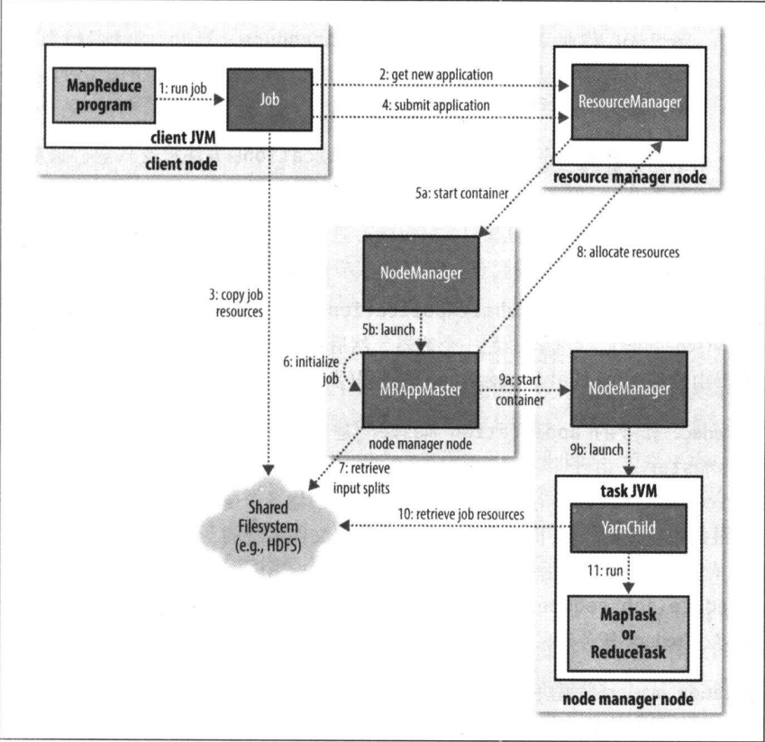

# 什么是MapReduce?
我们使用MapReduce来处理大规模数据集，Mapreduce任务过程分为2个阶段：map阶段和reduce阶段，每个阶段都使用键值对作为输入和输出，其类型由程序员选择。程序员还需要写两个函数：map函数和reduce函数。

# MapReduce 流程简单解析
一个完整的 MapReduce 程序在分布式运行时有两类实例进程：

1、MRAppMaster：负责整个程序的过程调度及状态协调

2、Yarnchild：负责 map 阶段的整个数据处理流程

3、Yarnchild：负责 reduce 阶段的整个数据处理流程 

以上两个阶段 MapTask 和 ReduceTask 的进程都是 YarnChild，并不是说这 MapTask 和 ReduceTask 就跑在同一个 YarnChild 进行里


1、split
在 split 阶段会把需要处理的数据划分为不同的切片；把个切片交给不同 map 程序进行处理；切片后数据会被解析为 kv 对输入到 map 进行处理。

2、map
在 map 阶段可以对输入的 kv 对进行处理后再以 kv 对的形式输出。

3、Shuffle（混洗）
shuffle 的目的是保证 reduce 处理的数据是有序的，并且尽可能的减少时间和资源消耗。shuffle 过程需要分别在 map 端和 reduce 端进行。

3.1、Map Shuffle

在 map 端的 shuffle 过程是对 map 的输出结果进行一系列处理，最终得到一个分区有序的文件。分区指的是需要同一个 reduce 处理的数据存储在一起；有序指的是同一个分区内的数据按照 key 升序排列。整体流程如下：

3.1.1、partition（分区）
partition 阶段计算并保存 map 输出的每对 kv 需要发送到的 reduce 编号。

3.1.2、spill（溢写）
map 输出的数据需要先输出到一个叫做 kvbuffer 的内存缓冲区，等缓冲区到达阈值的时候一次性把数据写入硬盘，这个过程叫做 spill。kvbuffer 的大小默认是 100M，阈值是 80%。这样设计的目的是为了提高写数据的效率，同时保证写数据的时候不会阻塞 map 的输出。

3.1.3、sort（排序）
在溢写之前会对缓冲区中的数据按照 partition 和 key 进行升序排列，然后再写入硬盘。排序的结果就是 kvbuffer 中的数据是按照 partition 聚集在一起，同一 partiton 中的数据按照 key 有序排列。

3.1.4、merge（合并）
如果 map 的输出数据量很大，可能会进行好几次 spill 操作，产生很多溢写文件。map 输出完毕后我们还需把所有的 spill 文件 merge 为一个文件。最终的合并结果仍然保证数据按照 partition 聚集在一起，同一 partiton 中的数据按照 key 有序排列。

3.2、Reduce Shuffle
在 reduce 端 shuffle 的目的是从不同的 map 端获取数据，进行排序合并后输入给 reduce。

3.2.1、 copy（下载）
reduce 端会从 map 端的合并文件中下载对应自己的那一部分数据。如果数据量较小会放在内存中，数据量较大的话会写入磁盘。

3.2.2 、megre && sort && grouping（合并，排序，聚合）
把来自不同 map 的数据边合并边按照 key 进行排序。把所有 value 按照 k 聚合到一个个的迭代器中，形成新的 kv 对。这些新的 kv 对会输入给 reduce 进行处理。

4、 reduce
在 reduce 阶段可以对输入的 kv 对进行处理后再以 kv 对的形式输出。

5、输出

# MapReduce 分区和分组的区别？

分区:
分区的目的是根据Key值决定Mapper的输出记录被送到哪一个Reducer上去处理。

分组：
在reduce阶段，reducer接收到所有映射到这个reducer的map输出后，也是会调用job.setSortComparatorClass设置的key比较函数类对所有数据对排序。然后开始构造一个key对应的value迭代器。这时就要用到分组，使用job.setGroupingComparatorClass设置的分组函数类。只要这个比较器比较的两个key相同，他们就属于同一个组（它们的value放在一个value迭代器，而这个迭代器的key使用属于同一个组的所有key的第一个key。最后就是进入Reducer的reduce方法，reduce方法的输入是所有的key和它的value迭代器。

# MapReduce框架的主要任务？

* 选择恰当的运行mapper的设备；
* 启动和监控mapper的执行；
* 为reduce的执行选择合适的节点；
* 对mapper的输出进行排序和清洗，并且将该输出传送给reducer节点；
* 启动和监控reduce的执行； 

**下面我们用一个例子来说明MapReduce是如何使用的**
根据给出的气温记录，求出每年的最高温度。

## 1.数据格式

19970601 +12 ：表示1997年06月01日气温为12度

``` 
19970601 +12
19970701 +02
19970801 -02
19980601 +13
19980701 +03
19980801 -03
19990601 +14
19990701 +04
19990801 -04
```

## 2.MapReduce的逻辑数据流

在各个阶段，数据的样式如下图所示：


## 3.编写map

``` 
package com.dongk.mapreduce;

import org.apache.hadoop.io.IntWritable;
import org.apache.hadoop.io.LongWritable;
import org.apache.hadoop.io.Text;
import org.apache.hadoop.mapreduce.Mapper;

import java.io.IOException;

/**
 *  LongWritable 输入的key， 表示文件中的行偏移量所以用 Long 类型表示
 *  Text         输入的value， 表示一行文本
 *
 *  Text         输出的key， 表示年份
 *  IntWritable  输出的value  表示温度
 * */
public class MaxTemperatureMapper extends Mapper<LongWritable, Text,Text, IntWritable> {
    @Override
    protected void map(LongWritable key, Text value, Context context) throws IOException, InterruptedException {
        String line = value.toString();
        String year = line.substring(0,4);
        int airTemperature =  airTemperature = Integer.parseInt(line.substring(9,12));
        context.write(new Text(year),new IntWritable(airTemperature));
    }
}

```

## 4.编写reduce

``` 
package com.dongk.mapreduce;

import org.apache.hadoop.io.IntWritable;
import org.apache.hadoop.io.Text;
import org.apache.hadoop.mapreduce.Reducer;

import java.io.IOException;

/**
 *  LongWritable        输入的key,    表示年份
 *  IntWritable         输入的value， 表示温度集合
 *
 *  Text                输出的key， 表示年份
 *  IntWritable         输出的value, 表示最高温度
 * */
public class MaxTemperatureReduce extends Reducer<Text, IntWritable, Text, IntWritable> {

    /***
     *
     * 注意：输入的value是一个集合，表示一年的温度集合
     */
    @Override
    protected void reduce(Text key, Iterable<IntWritable> values, Context context) throws IOException, InterruptedException {
        int maxVlue = Integer.MIN_VALUE;
        for(IntWritable value : values){
            maxVlue = Math.max(maxVlue,value.get());
        }
        context.write(key,new IntWritable(maxVlue));
    }
}

```

## 5.编写job程序

``` 
package com.dongk.mapreduce;

import org.apache.hadoop.conf.Configuration;
import org.apache.hadoop.fs.Path;
import org.apache.hadoop.io.IntWritable;
import org.apache.hadoop.io.Text;
import org.apache.hadoop.mapreduce.Job;
import org.apache.hadoop.mapreduce.lib.input.FileInputFormat;
import org.apache.hadoop.mapreduce.lib.input.TextInputFormat;
import org.apache.hadoop.mapreduce.lib.output.FileOutputFormat;

public class MaxTemperature {

    public static void main(String args[]){
        try{
            Configuration conf = new Configuration();
            conf.set("fs.defaultFS","file:///");
            Job job = Job.getInstance(conf);

            //添加输入路径,可以添加多个
            FileInputFormat.addInputPath(job,new Path(args[0]));
            //设置输出路径，输出路径只能有一个
            FileOutputFormat.setOutputPath(job,new Path(args[1]));

            job.setJobName("MaxTemperature");                   //作业名称
            job.setJarByClass(MaxTemperature.class);            //搜索类
            job.setInputFormatClass(TextInputFormat.class);     //设置输入格式

            job.setMapperClass(MaxTemperatureMapper.class);     //mapper类
            job.setOutputKeyClass(Text.class);                  //mapper输出 key
            job.setOutputValueClass(IntWritable.class);         //mapper输出 value

            job.setReducerClass(MaxTemperatureReduce.class);    //reducer类
            job.setOutputKeyClass(Text.class);                  //reducer输出 key
            job.setOutputValueClass(IntWritable.class);         //reducer输出 value

            job.waitForCompletion(false);              //false表示不需要详细信息

        }catch(Exception io){
            io.printStackTrace();
        }
    }
}

```

## 6.在本地运行程序

在IDEA中运行程序，设置如2个输入参数：

file:///root/mr file:///root/mr/out

# Yarn 作业提交过程



## 作业提交 
从Resource Manager中获取新的ID，这是一个应用程序的ID（步骤2）；
检查作业的输出分片，计算输入分片并将作业资源复制到HDFS中；
调用Resource Manager调用submitApplication()提交作业；

## 作业初始化 
(1)
首先，Resource Manager里的Application Manager会为每一个application(比如一个用户提交的MapReduce Job)在NodeManager里面申请一个container；
schedule则在NodeManager里面分配申请的container。然后在该container里面启动一个Application Master(步骤5a，5b)；

(2)
Application Master的主类是MRAppMaster；
其通过创造一些bookkeeping对象来监控作业的进度, 得到任务的进度和完成报告(步骤6)；
然后其通过分布式文件系统得到由客户端计算好的输入分片(split)(步骤7)；
然后为每个输入分片创建一个map任务, 根据mapreduce.job.reduces创建reduce任务对象；

(3)
Application Master决定如何运行构成整个作业的任务；
如果作业很小, Application Master会选择在其自己的JVM中运行任务, 这种作业称作是被unerized, 或者是以uber模式的方式运行。 

## 任务分配 

如果不是小作业, 那么应用管理器向资源管理器请求container来运行所有的map任务和reduce任务(步骤8)，每个任务对应一个container，且只能在该container上运行；

这些请求是通过心跳来传输的, 包括每个map任务的数据位置, 比如存放输入分片的主机名和机架(rack). 调度器利用这些信息来调度任务, 尽量将任务分配给存储数据的节点, 或者退而分配给和存放输入分片的节点相同机架的节点；

请求也包括了任务的内存需求, 默认情况下map和reduce任务的内存需求都是1024MB，可以通过mapreduce.map.memory.mb和mapreduce.reduce.memory.mb来配置。 

## 任务执行 

当一个任务由Resource Manager的调度器分配给一个container后, Application Master通过节点管理器来启动container(步骤9a，步骤9b)；
任务由一个主类为YarnChild的Java应用执行，在运行任务之前首先本地化任务需要的资源, 比如作业配置, JAR文件, 以及分布式缓存的所有文件(步骤10)；
最后, 运行map或reduce任务(步骤11)。

## 进度和状态更新 

作业的状态有正在运行、运行成功、运行失败等；

YARN中的任务将其进度和状态(包括counter)返回给Application Master,作为作业的汇聚视图；

## 作业完成 

除了向Application Master请求作业进度外, 客户端每5分钟都会通过调用waitForCompletion()来检查作业是否完成；
时间间隔可以通过mapreduce.client.completion.pollinterval来设置；
作业完成之后, 应用管理器和container会清理工作状态, OutputCommiter的作业清理方法也会被调用，作业的信息会被作业历史服务器存储以备之后用户核查。


# Job文件切片的计算法则

<<Hadoop权威指南>> 第八章 218页

//设置最大有效字节数为12字节
FileInputFormat.setMaxInputSplitSize(job,12);
//设置最小有效字节数为1字节
FileInputFormat.setMinInputSplitSize(job,1);

# RecordReader读取法则

不管我们设置的切片计算法则是何种，RecordReader总是每次读取一行。

# 压缩和解压缩

<<Hadoop权威指南>> 第五章 99 页

1. 为什么要压缩？
 减少磁盘存储空间，减少网络传输带宽。
 
2. 对于某些不可切割的压缩，压缩的意义在哪里了？
可以对小文件进行压缩（小于块大小的文件），这些文件并不需要进行切割。 


3. 利用CompressionCodec进行压缩。

``` 
package com.dongk.compression;

import org.apache.hadoop.conf.Configuration;
import org.apache.hadoop.io.IOUtils;
import org.apache.hadoop.io.compress.*;
import org.apache.hadoop.util.ReflectionUtils;
import org.junit.Test;

import java.io.FileInputStream;
import java.io.FileOutputStream;

public class CompressionZip {

    @Test
    public void compression() throws Exception{
        Class[] zipClasses = {
                DeflateCodec.class,
                GzipCodec.class,
                BZip2Codec.class
        };
        for(Class clazz : zipClasses){
            zip(clazz);
        }
    }
    
    /**
     * 
     * @param codecClass : 压缩格式实现类
     *                   
     **/
    public void zip(Class codecClass) throws Exception{
        Configuration configuration = new Configuration();
        CompressionCodec codec = (CompressionCodec) ReflectionUtils.newInstance(codecClass,configuration);
        FileOutputStream fos = new FileOutputStream("/root/file/temperature" + codec.getDefaultExtension());
        CompressionOutputStream out = codec.createOutputStream(fos);

        IOUtils.copyBytes(new FileInputStream("/root/file/temperature.txt"),out,1024);

        out.close();
    }
}

```

3. 利用CompressionCodec进行解压缩。

``` 
package com.dongk.compression;

import org.apache.hadoop.conf.Configuration;
import org.apache.hadoop.io.IOUtils;
import org.apache.hadoop.io.compress.*;
import org.apache.hadoop.util.ReflectionUtils;
import org.junit.Test;

import java.io.FileInputStream;
import java.io.FileOutputStream;

public class CompressionUnZip {

    @Test
    public void unCompression() throws Exception{
        Class[] zipClasses = {
                DeflateCodec.class,
                GzipCodec.class,
                BZip2Codec.class
        };
        for(Class clazz : zipClasses){
            unZip(clazz);
        }
    }
    
    /**
     * 
     * @param codecClass : 解压缩格式实现类
     *                   
     **/
    public void unZip(Class codecClass) throws Exception{
        Configuration configuration = new Configuration();
        CompressionCodec codec = (CompressionCodec) ReflectionUtils.newInstance(codecClass,configuration);
        FileInputStream fis = new FileInputStream("/root/file/temperature" + codec.getDefaultExtension());
        CompressionInputStream in = codec.createInputStream(fis);

        IOUtils.copyBytes(in,
                 new FileOutputStream("/root/file/temperature" + codec.getDefaultExtension() + ".txt"),
                1024);

        in.close();
    }
}

```

# 远程调试

1. 远程调试原理；

在远程机器上开启Socket的服务端；在本地机器上开启Socket客户端；

2. 远程调试步骤；

2.1 将程序打包成jar文件，并上传到远程机器；

2.2 设置Hadoop环境变量；

[root@master1 bin]# export HADOOP_CLIENT_OPTS=-agentlib:jdwp=transport=dt_socket,server=y,suspend=y,address=8888

2.3 运行程序

[root@master1 bin]# ./hadoop jar /root/file/MAPREDUCE-1.0-SNAPSHOT.jar com.dongk.compression.CompressionZip

2.4 在IDEA中开启远程调试；

run -> Edit Configurations -> Add New Configuration(点击左上角的+) -> Remote

# 序列文件

<<Hadoop权威指南>> 第五章 127 页

序列文件以key - value 的方式存储

## 生成序列文件

``` 
package com.dongk.hdfs;

import org.apache.hadoop.conf.Configuration;
import org.apache.hadoop.fs.FileSystem;
import org.apache.hadoop.fs.Path;
import org.apache.hadoop.io.IntWritable;
import org.apache.hadoop.io.SequenceFile;
import org.apache.hadoop.io.Text;
import org.junit.Test;

public class SequenceFIleWrite {

    /**
     * 写操作
     */
    @Test
    public void save() throws Exception{
        Configuration configuration = new Configuration();
        //使用本地文件系统
        configuration.set("fs.defaultFS","file:///");
        FileSystem fs = FileSystem.get(configuration);
        Path path = new Path("/root/file/sequencefile.seq");
        /*
        * IntWritable.class: 表示key的类型
        * Text.class: 表示value的类型
        */
        SequenceFile.Writer writer = SequenceFile.createWriter(fs,configuration,path, IntWritable.class, Text.class);
        for(int i=0; i<10; i++){
            writer.append(new IntWritable(i),new Text("text" + i));
        }
        writer.close();
    }
}

```

## 使用Hadoop命令查看序列文件

root@ubuntu:~/Hadoop/hadoop-2.6.2/bin# ./hdfs dfs -text /root/file/sequencefile.seq

## 读取序列文件

``` 
package com.dongk.hdfs;

import org.apache.hadoop.conf.Configuration;
import org.apache.hadoop.fs.FileSystem;
import org.apache.hadoop.fs.Path;
import org.apache.hadoop.io.IntWritable;
import org.apache.hadoop.io.SequenceFile;
import org.apache.hadoop.io.Text;
import org.junit.Test;

public class SequenceFIleReader {

    /**
     * 读取操作
     */
    @Test
    public void read() throws Exception{
        Configuration configuration = new Configuration();
        configuration.set("fs.defaultFS","file:///");
        FileSystem fs = FileSystem.get(configuration);
        Path path = new Path("/root/file/sequencefile.seq");

        SequenceFile.Reader reader = new SequenceFile.Reader(fs,path,configuration);

        IntWritable key = new IntWritable();
        Text value = new Text();
        while(reader.next(key,value)){
            System.out.println(key + " : " + value );
        }
        reader.close();
    }
}

```

## 序列文件同步点

同步点：能够再一次定位到记录边界的某个位置； 我们在数据流中由于搜索而跑到任意位置后，可以采取此动作，回到记录边界。

在SequenceFile文件中搜索位置有两种方法，seek()、 sync()；

seek()方法给定的位置如果不是记录边界，程序将报错；

sync()方法给定的位置如果不是记录边界, 将会定位到下一个同步点；

``` 
package com.dongk.hdfs;

import org.apache.hadoop.conf.Configuration;
import org.apache.hadoop.fs.FileSystem;
import org.apache.hadoop.fs.Path;
import org.apache.hadoop.io.IntWritable;
import org.apache.hadoop.io.SequenceFile;
import org.apache.hadoop.io.Text;
import org.junit.Test;

public class SequenceFIleSync {

    /**
     * 写入同步点操作
     **/
    @Test
    public void save() throws Exception{
        Configuration configuration = new Configuration();
        configuration.set("fs.defaultFS","file:///");
        FileSystem fs = FileSystem.get(configuration);
        Path path = new Path("/root/file/sequencefile.seq");
        SequenceFile.Writer writer = SequenceFile.createWriter(fs,configuration,path, IntWritable.class, Text.class);
        for(int i=0; i<10; i++){
            //写同步点操作
            writer.sync();
            writer.append(new IntWritable(i),new Text("text" + i));
        }
        writer.close();
    }

    /**
     *同步点操作
     */
    @Test
    public void read() throws Exception{
        Configuration configuration = new Configuration();
        configuration.set("fs.defaultFS","file:///");
        FileSystem fs = FileSystem.get(configuration);
        Path path = new Path("/root/file/sequencefile.seq");
        SequenceFile.Reader reader = new SequenceFile.Reader(fs,path,configuration);
        IntWritable key = new IntWritable();
        Text value = new Text();

        //定位同步点操作
        reader.sync(190);
        while(reader.next(key,value)){
            System.out.println(reader.getPosition() + " " + key + " : " + value );
        }
        reader.close();
    }
}

```

## 序列文件文件格式

<<Hadoop 权威指南>> 第五章 134页

SequenceFile可切割、可压缩（记录压缩、块压缩），下面是块压缩的例子：

``` 
package com.dongk.hdfs;

import org.apache.hadoop.conf.Configuration;
import org.apache.hadoop.fs.FileSystem;
import org.apache.hadoop.fs.Path;
import org.apache.hadoop.io.IntWritable;
import org.apache.hadoop.io.SequenceFile;
import org.apache.hadoop.io.Text;
import org.apache.hadoop.io.compress.GzipCodec;
import org.junit.Test;

public class SequenceFIleCompressWrite {

    @Test
    public void save() throws Exception{
        Configuration configuration = new Configuration();
        //
        configuration.set("fs.defaultFS","file:///");
        FileSystem fs = FileSystem.get(configuration);
        Path path = new Path("/root/file/sequencefile.seq");
        /*
        * 块压缩
        * 压缩方式采用Gzip
        */
        SequenceFile.Writer writer = SequenceFile.createWriter(
                fs,
                configuration,
                path,
                IntWritable.class,
                Text.class,
                SequenceFile.CompressionType.BLOCK,
                new GzipCodec());
        for(int i=0; i<10; i++){
            writer.append(new IntWritable(i),new Text("text" + i));
        }
        writer.close();
    }
}

```

# MapFile

* MapFile 以 key-value 的形式存储；
* MapFile 的key按照升序写入（可重复），降序程序会抛出异常；
* MapFile对应一个目录，目录下有索引(index)和数据(data)文件，索引和数据文件都是SequenceFile;
* 索引（index）文件将key划分成了区间，用于快速定位；
* 数据（data）文件用于存储数据；

## MapFile 文件写入

``` 
package com.dongk.hdfs;

import org.apache.hadoop.conf.Configuration;
import org.apache.hadoop.fs.FileSystem;
import org.apache.hadoop.io.IntWritable;
import org.apache.hadoop.io.MapFile;
import org.apache.hadoop.io.Text;
import org.junit.Test;

public class MapFileWrite {

    /**
     *写操作
     */
    @Test
    public void save() throws Exception{
        Configuration configuration = new Configuration();
        //
        configuration.set("fs.defaultFS","file:///");
        FileSystem fs = FileSystem.get(configuration);
        /*
        * "/root/file/map" : 这是一个目录
        * IntWritable.class: 表示key的类型
        * Text.class: 表示value的类型
        */
        MapFile.Writer writer = new MapFile.Writer(
                configuration,
                fs,
                "/root/file/map",
                IntWritable.class,
                Text.class
        );
        for(int i=0; i<1000; i++){
            writer.append(new IntWritable(i),new Text("text" + i));
        }
        writer.close();
    }
}

```

## MapFile文件读取

``` 
package com.dongk.hdfs;

import org.apache.hadoop.conf.Configuration;
import org.apache.hadoop.fs.FileSystem;
import org.apache.hadoop.io.IntWritable;
import org.apache.hadoop.io.MapFile;
import org.apache.hadoop.io.Text;

public class MapFileReader {

    /**
     * 读操作
     */
    @Test
    public void read() throws Exception{
        Configuration configuration = new Configuration();
        configuration.set("fs.defaultFS","file:///");
        FileSystem fs = FileSystem.get(configuration);

        MapFile.Reader reader = new MapFile.Reader(fs,
                               "/root/file/map",
                                    configuration);

        IntWritable key = new IntWritable();
        Text value = new Text();
        while(reader.next(key,value)){
            System.out.println(key + " : " + value );
        }
        reader.close();
    }
}

```

# 自定义分区解决数据倾斜

所谓的数据倾斜就是所有的map输出被划分到同一个reduce执行，我们可以通过自定义分区解决数据倾斜；

Hadoop中默认的分区类是 HashPartitioner;

自定义Partitioner的作用
* 根据业务需要，产生多个输出文件；
* 多个reduce任务并发运行，提高整体job的运行效率；

例子：求取最高气温的时候，我们按照年进行分区处理：

YearPartitioner.java

``` 
package com.dongk.mapreduce;

import org.apache.hadoop.io.IntWritable;
import org.apache.hadoop.io.Text;
import org.apache.hadoop.mapreduce.Partitioner;

import java.util.HashMap;
import java.util.Map;

public class YearPartitioner extends Partitioner<Text,IntWritable> {

    private static Map<String,Integer> yearMap = new HashMap<String,Integer>();
    static{
        yearMap.put("1997",0);
        yearMap.put("1998",1);
        yearMap.put("1999",2);
    }

    /**
     * key : 对应map输出的key
     * value : 对应map输出的value
     *
     * */
    public int getPartition(Text key, IntWritable value, int numPartitions) {
        if(yearMap.containsKey(key.toString())){
            return yearMap.get(key.toString());
        }else{
            return 0;
        }
    }
}

```

MaxTemperature.java

``` 
job.setPartitionerClass(YearPartitioner.class);
job.setNumReduceTasks(3);
```

# Combiner

Hadoop允许用户针对map任务的输出指定一个combiner，combiner函数的输出作为reduce函数的输入；

combiner的主要目的是最小化mapper和reducer之间跨网络清洗的键值对的数量来尽可能地节省带宽；

注意 : 求平均值并不适合Combiner，因为平均数的平均数并不是所有数的平均数；

例子：用combiner函数快速找出最快气温：
combiner是通过Reduce类来定义的，一般情况下，它与reduce函数完全相同:

``` 
//只需要添加此一行代码即可
 job.setCombinerClass(MaxTemperatureReduce.class);
```

# 多输入问题(MultipleInputs)

单词统计功能有连个输入源，一个文本文件、一个序列文件；

序列文件Map

``` 
package com.dongk.multinput;

import org.apache.hadoop.io.IntWritable;
import org.apache.hadoop.io.Text;
import org.apache.hadoop.mapreduce.Mapper;

import java.io.IOException;

public class WCSeqMapper extends Mapper<IntWritable, Text, Text, IntWritable> {


    @Override
    protected void map(IntWritable key, Text value, Context context) throws IOException, InterruptedException {
        Text keyout = new Text();
        IntWritable valueout = new IntWritable();
        String[] arr = value.toString().split(" ");
        for(String str : arr){
            keyout.set(str);
            valueout.set(1);
            context.write(keyout,valueout);
        }
    }
}

```

文本文件Map

``` 
package com.dongk.multinput;

import org.apache.hadoop.io.IntWritable;
import org.apache.hadoop.io.LongWritable;
import org.apache.hadoop.io.Text;
import org.apache.hadoop.mapreduce.Mapper;

import java.io.IOException;

public class WCTextMapper extends Mapper<LongWritable, Text, Text, IntWritable> {


    @Override
    protected void map(LongWritable key, Text value, Context context) throws IOException, InterruptedException {
        Text keyout = new Text();
        IntWritable valueout = new IntWritable();
        String[] arr = value.toString().split(" ");
        for(String str : arr){
            keyout.set(str);
            valueout.set(1);
            context.write(keyout,valueout);
        }
    }
}

```

reduce

``` 
package com.dongk.multinput;

import org.apache.hadoop.io.IntWritable;
import org.apache.hadoop.io.Text;
import org.apache.hadoop.mapreduce.Reducer;

import java.io.IOException;


public class WCReducer extends Reducer<Text, IntWritable, Text, IntWritable> {
    @Override
    protected void reduce(Text key, Iterable<IntWritable> values, Context context) throws IOException, InterruptedException {
        int sumvalue = 0;
        for(IntWritable value : values){
            sumvalue += value.get();
        }
        context.write(key, new IntWritable(sumvalue));
    }
}

```

主程序

``` 
package com.dongk.multinput;

import org.apache.hadoop.conf.Configuration;
import org.apache.hadoop.fs.Path;
import org.apache.hadoop.io.IntWritable;
import org.apache.hadoop.io.Text;
import org.apache.hadoop.mapreduce.Job;
import org.apache.hadoop.mapreduce.lib.input.MultipleInputs;
import org.apache.hadoop.mapreduce.lib.input.SequenceFileInputFormat;
import org.apache.hadoop.mapreduce.lib.input.TextInputFormat;
import org.apache.hadoop.mapreduce.lib.output.FileOutputFormat;

public class WCCount {
    public static void main(String args[]) throws Exception{
        Configuration conf = new Configuration();
        conf.set("fs.defaultFS","file:///");
        Job job = Job.getInstance(conf);

        MultipleInputs.addInputPath(job,new Path("/root/mr/text"), TextInputFormat.class,WCTextMapper.class);
        MultipleInputs.addInputPath(job,new Path("/root/mr/seq"), SequenceFileInputFormat.class,WCSeqMapper.class);

        FileOutputFormat.setOutputPath(job,new Path("/root/mr/out"));

        job.setReducerClass(WCReducer.class);

        job.setMapOutputKeyClass(Text.class);
        job.setMapOutputValueClass(IntWritable.class);

        job.setOutputKeyClass(Text.class);
        job.setOutputValueClass(IntWritable.class);

        job.waitForCompletion(true);
    }
}

```

# 计数器的使用

计数器可以帮助我们更好的监控程序的运行状况；

MapReduce 允许用户编写程序来定义计数器，计数器的值可以在mapper或者reducer中增加；

计数器由一个Java枚举类型来定义，以便对有关的计数器分组；

下面我们在wordCount程序中增加计数器，统计运行程序的主机名、进程ID、线程ID、对象名称等信息：

1. 计数器工具类

``` 
package com.dongk.counters;

import java.lang.management.ManagementFactory;
import java.net.InetAddress;
import java.net.UnknownHostException;

public class CountersTool {

    public static String getInfo(Object o, String msg){
        return getHostName() + ":"
                + getPid() + ":"
                + getTid() + ":"
                + getObjInfo(o) + ":"
                + msg;
    }

    /**
     * 得到主机名称
     * */
    public static String getHostName(){
        try {
            return InetAddress.getLocalHost().getHostName();
        } catch (UnknownHostException e) {
            e.printStackTrace();
        }
        return null;
    }

    /**
     * 得到进程ID
     * */
    public static int getPid(){
        try {
            String info = ManagementFactory.getRuntimeMXBean().getName();
            return Integer.parseInt(info.substring(0,info.indexOf("@")));
        } catch (Exception e) {
            e.printStackTrace();
        }
        return 0;
    }

    /**
     * 得到线程ID
     * */
    public static String getTid(){
        try {
            return Thread.currentThread().getName();
        } catch (Exception e) {
            e.printStackTrace();
        }
        return null;
    }

    /**
     * 得到对象信息
     * */
    public static String getObjInfo(Object o){
        try {
            String sname = o.getClass().getSimpleName();
            return sname + "@" + o.hashCode();
        } catch (Exception e) {
            e.printStackTrace();
        }
        return null;
    }
}

```

2. mapper类

``` 
package com.dongk.counters;

import org.apache.hadoop.io.IntWritable;
import org.apache.hadoop.io.LongWritable;
import org.apache.hadoop.io.Text;
import org.apache.hadoop.mapreduce.Mapper;

import java.io.IOException;

public class WCMapper extends Mapper<LongWritable, Text, Text, IntWritable> {


    @Override
    protected void map(LongWritable key, Text value, Context context) throws IOException, InterruptedException {
        Text keyout = new Text();
        IntWritable valueout = new IntWritable();
        String[] arr = value.toString().split(" ");
        for(String str : arr){
            keyout.set(str);
            valueout.set(1);
            context.write(keyout,valueout);
        }
        //计数器累加
        context.getCounter("mapper",CountersTool.getInfo(this,"map")).increment(1);
    }
}

```

3. ruducer类

``` 
package com.dongk.counters;

import org.apache.hadoop.io.IntWritable;
import org.apache.hadoop.io.Text;
import org.apache.hadoop.mapreduce.Reducer;

import java.io.IOException;


public class WCReducer extends Reducer<Text, IntWritable, Text, IntWritable> {
    @Override
    protected void reduce(Text key, Iterable<IntWritable> values, Context context) throws IOException, InterruptedException {
        int sumvalue = 0;
        for(IntWritable value : values){
            sumvalue += value.get();
        }
        context.write(key, new IntWritable(sumvalue));
		//计数器累加
        context.getCounter("reducer",CountersTool.getInfo(this,"reduce")).increment(1);
    }
}

```

4.主程序

``` 
package com.dongk.counters;

import org.apache.hadoop.conf.Configuration;
import org.apache.hadoop.fs.Path;
import org.apache.hadoop.io.IntWritable;
import org.apache.hadoop.io.Text;
import org.apache.hadoop.mapreduce.Job;
import org.apache.hadoop.mapreduce.lib.input.FileInputFormat;
import org.apache.hadoop.mapreduce.lib.output.FileOutputFormat;

public class WCCount {
    public static void main(String args[]) throws Exception{
        Configuration conf = new Configuration();
        conf.set("mapred.jar","/root/file/MAPREDUCE-1.0-SNAPSHOT.jar");
       // conf.set("fs.defaultFS","file:///");
        Job job = Job.getInstance(conf);

        FileInputFormat.addInputPath(job, new Path(args[0]));
        FileOutputFormat.setOutputPath(job,new Path(args[1]));

        job.setMapperClass(WCMapper.class);
        job.setReducerClass(WCReducer.class);

        job.setMapOutputKeyClass(Text.class);
        job.setMapOutputValueClass(IntWritable.class);

        job.setOutputKeyClass(Text.class);
        job.setOutputValueClass(IntWritable.class);

        job.waitForCompletion(true);
    }
}

```

5.在分布式环境下运行程序

[root@master1 bin]# hadoop jar /root/file/MAPREDUCE-1.0-SNAPSHOT.jar com.dongk.counters.WCCount hdfs://master1/root/file/temperature.txt hdfs://master1/root/file/out


# 全排序

什么是全排序？
所谓全排序，就是对输出的所有文件的所有内容都是有序的。

全排序的思路？
就是使用一个partitioner（TotalOrderPartitioner）来划分分区，该方法的关键点是如何划分分区;  我们可以采取采取样本(RandomSampler)的方式来获得分区。

TotalOrderPartitioner ：读取外部生成的分区文件；
RandomSampler：随机采样器；

使用时采样代码放在后面，否则会出现错误；


例子：
对1900-2000年间的气温进行统计。

MaxTemperature.java

``` 
package com.dongk.sortall;

import org.apache.hadoop.conf.Configuration;
import org.apache.hadoop.fs.Path;
import org.apache.hadoop.io.IntWritable;
import org.apache.hadoop.io.Text;
import org.apache.hadoop.mapred.lib.InputSampler;
import org.apache.hadoop.mapred.lib.TotalOrderPartitioner;
import org.apache.hadoop.mapreduce.Job;
import org.apache.hadoop.mapreduce.lib.input.FileInputFormat;
import org.apache.hadoop.mapreduce.lib.input.SequenceFileInputFormat;
import org.apache.hadoop.mapreduce.lib.output.FileOutputFormat;
import org.apache.hadoop.mapreduce.lib.output.TextOutputFormat;

public class MaxTemperature {

    public static void main(String args[]){
        try{
            Configuration conf = new Configuration();
            conf.set("fs.defaultFS","file:///");
            Job job = Job.getInstance(conf);

            FileInputFormat.addInputPath(job,new Path("/root/mr/seq/temperature.seq"));
            FileOutputFormat.setOutputPath(job,new Path("/root/mr/seq/out"));

            job.setJobName("MaxTemperature");
            job.setJarByClass(MaxTemperature.class);
            job.setInputFormatClass(SequenceFileInputFormat.class);

            job.setMapperClass(MaxTemperatureMapper.class);             //mapper类
            job.setOutputKeyClass(IntWritable.class);                   //mapper输出 key
            job.setOutputValueClass(Text.class);                        //mapper输出 value

            job.setNumReduceTasks(3);

            job.setReducerClass(MaxTemperatureReduce.class);           //reducer类
            job.setOutputKeyClass(IntWritable.class);                  //reducer输出 key
            job.setOutputValueClass(IntWritable.class);                //reducer输出 value
            job.setOutputFormatClass(TextOutputFormat.class);

            job.setPartitionerClass(TotalOrderPartitioner.class);
             
			 //创建采样器
			 //0.1 : 每个key被选中的概率
			 //100: 抽取样本的总数
			 //3: 分区数
            InputSampler.Sampler<IntWritable,Text> sampler
                    = new InputSampler.RandomSampler<IntWritable,Text>(0.1,100,3);

            //将采样信息写入分区文件中
            InputSampler.writePartitionFile(job,sampler);

            job.waitForCompletion(false);              //false表示不需要详细信息

        }catch(Exception io){
            io.printStackTrace();
        }
    }
}

```

MaxTemperatureMapper.java

``` 
package com.dongk.sortall;

import org.apache.hadoop.io.IntWritable;
import org.apache.hadoop.io.LongWritable;
import org.apache.hadoop.io.Text;
import org.apache.hadoop.mapreduce.Mapper;

import java.io.IOException;

public class MaxTemperatureMapper extends Mapper<IntWritable, Text,IntWritable, IntWritable> {
    @Override
    protected void map(IntWritable key, Text value, Context context) throws IOException, InterruptedException {
        int temperature = Integer.parseInt(value.toString());
        context.write(key,new IntWritable(temperature));
    }
}

```

MaxTemperatureReduce.java

``` 
package com.dongk.sortall;

import org.apache.hadoop.io.IntWritable;
import org.apache.hadoop.io.Text;
import org.apache.hadoop.mapreduce.Reducer;

import java.io.IOException;

public class MaxTemperatureReduce extends Reducer<IntWritable, IntWritable, IntWritable, IntWritable> {

    @Override
    protected void reduce(IntWritable key, Iterable<IntWritable> values, Context context) throws IOException, InterruptedException {
        int maxVlue = Integer.MIN_VALUE;
        for(IntWritable value : values){
            maxVlue = Math.max(maxVlue,value.get());
        }
        context.write(key,new IntWritable(maxVlue));
    }
}

```

# 二次排序

二次分区就是通过对value分区(key是可以自动排序的)，避免在reduce过程迭代的办法。

实现步骤：
1. 自定义key。
2. 自定义分区类。
3. 自定义分组对比器。


MaxTemperature.java

``` 
package com.dongk.secondarysort;

import org.apache.hadoop.conf.Configuration;
import org.apache.hadoop.fs.Path;
import org.apache.hadoop.io.IntWritable;
import org.apache.hadoop.io.NullWritable;
import org.apache.hadoop.mapreduce.Job;
import org.apache.hadoop.mapreduce.lib.input.FileInputFormat;
import org.apache.hadoop.mapreduce.lib.input.SequenceFileInputFormat;
import org.apache.hadoop.mapreduce.lib.output.FileOutputFormat;
import org.apache.hadoop.mapreduce.lib.output.TextOutputFormat;

public class MaxTemperature {

    public static void main(String args[]){
        try{
            Configuration conf = new Configuration();
            conf.set("fs.defaultFS","file:///");
            Job job = Job.getInstance(conf);

            FileInputFormat.addInputPath(job,new Path("/root/mr/seq/temperature.seq"));
            FileOutputFormat.setOutputPath(job,new Path("/root/mr/seq/out"));

            job.setJobName("MaxTemperature");
            job.setJarByClass(MaxTemperature.class);
            job.setInputFormatClass(SequenceFileInputFormat.class);

            job.setMapperClass(MaxTemperatureMapper.class);             //mapper类
            job.setMapOutputKeyClass(Combokey.class);                   //mapper输出 key
            job.setMapOutputValueClass(NullWritable.class);                        //mapper输出 value

            job.setNumReduceTasks(1);

            job.setReducerClass(MaxTemperatureReduce.class);           //reducer类
            job.setOutputKeyClass(IntWritable.class);                  //reducer输出 key
            job.setOutputValueClass(IntWritable.class);                //reducer输出 value
            job.setOutputFormatClass(TextOutputFormat.class);


            //设置分区类
            job.setPartitionerClass(YearPartitioner.class);
            //设置分组对比器
            job.setGroupingComparatorClass(YearGroupComparator.class);
            //设置排序对比器
            job.setSortComparatorClass(CombokeyComparator.class);

            job.waitForCompletion(false);              //false表示不需要详细信息

        }catch(Exception io){
            io.printStackTrace();
        }
    }
}

```

Combokey.java

``` 
package com.dongk.secondarysort;

import org.apache.hadoop.io.WritableComparable;

import java.io.DataInput;
import java.io.DataOutput;
import java.io.IOException;

public class Combokey implements WritableComparable<Combokey> {

    private int year;
    private int temp;

    public int getYear() {
        return year;
    }

    public void setYear(int year) {
        this.year = year;
    }

    public int getTemp() {
        return temp;
    }

    public void setTemp(int temp) {
        this.temp = temp;
    }

    public int compareTo(Combokey otheryeadr) {
        //year 按年升序
        //temp 按温度逆序
        if(year == otheryeadr.year )
            return -(temp - otheryeadr.temp);
        else
            return year - otheryeadr.year;
    }

    //序列化
    public void write(DataOutput dataOutput) throws IOException {
        dataOutput.writeInt(year);
        dataOutput.writeInt(temp);
    }

    //反序列化
    public void readFields(DataInput dataInput) throws IOException {
        year = dataInput.readInt();
        temp = dataInput.readInt();
    }
}

```

CombokeyComparator.java

``` 
package com.dongk.secondarysort;

import org.apache.hadoop.io.WritableComparable;
import org.apache.hadoop.io.WritableComparator;

import java.io.DataInput;
import java.io.DataOutput;
import java.io.IOException;

public class CombokeyComparator extends WritableComparator {
    protected CombokeyComparator() {
        super(Combokey.class,true);
    }

    @Override
    public int compare(WritableComparable a, WritableComparable b) {
        Combokey keya = (Combokey)a;
        Combokey keyb = (Combokey)b;
        return keya.compareTo(keyb);
    }
}

```

YearPartitioner.java

``` 
package com.dongk.secondarysort;

import org.apache.hadoop.io.NullWritable;
import org.apache.hadoop.mapreduce.Partitioner;

public class YearPartitioner extends Partitioner<Combokey, NullWritable> {
    public int getPartition(Combokey key, NullWritable value, int numPartitions) {
        int year = key.getYear();
        return year % numPartitions;
    }
}

```

YearGroupComparator.java

``` 
package com.dongk.secondarysort;

import org.apache.hadoop.io.WritableComparable;
import org.apache.hadoop.io.WritableComparator;

import java.io.DataInput;
import java.io.DataOutput;
import java.io.IOException;

public class YearGroupComparator extends WritableComparator {
    protected YearGroupComparator() {
        super(Combokey.class,true);
    }

    @Override
    public int compare(WritableComparable a, WritableComparable b) {
        Combokey keya = (Combokey)a;
        Combokey keyb = (Combokey)b;
        return keya.getYear() - keyb.getYear();
    }
}

```

MaxTemperatureMapper.java

``` 
package com.dongk.secondarysort;

import org.apache.hadoop.io.IntWritable;
import org.apache.hadoop.io.NullWritable;
import org.apache.hadoop.io.Text;
import org.apache.hadoop.mapreduce.Mapper;

import java.io.IOException;

public class MaxTemperatureMapper extends Mapper<IntWritable, Text,Combokey, NullWritable> {
    @Override
    protected void map(IntWritable key, Text value, Context context) throws IOException, InterruptedException {
        Combokey combokey = new Combokey();
        combokey.setYear(key.get());
        int temperature = Integer.parseInt(value.toString());
        combokey.setTemp(temperature);
        context.write(combokey,NullWritable.get());
    }
}

```

MaxTemperatureReduce.java

``` 
package com.dongk.secondarysort;

import org.apache.hadoop.io.IntWritable;
import org.apache.hadoop.io.NullWritable;
import org.apache.hadoop.mapreduce.Reducer;

import java.io.IOException;


public class MaxTemperatureReduce extends Reducer<Combokey, NullWritable, IntWritable, IntWritable> {

    @Override
    protected void reduce(Combokey key, Iterable<NullWritable> values, Context context) throws IOException, InterruptedException {
        int year = key.getYear();
        int temp = key.getTemp();
        context.write(new IntWritable(year),new IntWritable(temp));
    }
}

```

# 连接查询

需求：将下面两份数据连接到一起并输出。

## 数据准备
Customers.txt（客户信息）
id,name,age
1,tom,12
2,bob,34
3,daiv,45

orders.txt(订单信息)
id,no,price,cusid
1,001,11.34,1
2,002,12.34,2
3,003,13.34,3
4,004,14.34,1
5,005,15.34,2
6,006,16.34,3

## map端连接

一份数据比较小的情况下（如客户信息比较小），我们可以将较小的数据加载到内存中；此时只需要map阶段，reduce阶段是不需要的；这就是map端连接。

代码清单1：map程序

``` 
package com.dongk.mr.join;

import org.apache.hadoop.conf.Configuration;
import org.apache.hadoop.fs.FSDataInputStream;
import org.apache.hadoop.fs.FileSystem;
import org.apache.hadoop.fs.Path;
import org.apache.hadoop.io.LongWritable;
import org.apache.hadoop.io.NullWritable;
import org.apache.hadoop.io.Text;
import org.apache.hadoop.mapreduce.Mapper;

import java.io.BufferedReader;
import java.io.IOException;
import java.io.InputStreamReader;
import java.util.HashMap;
import java.util.Map;

public class MapJoinMapper extends Mapper<LongWritable, Text,Text, NullWritable> {

    private Map<String, String> allcustomers = new HashMap<String, String>();

    //Initialization Customer information
    @Override
    protected void setup(Context context) throws IOException, InterruptedException {
        try {
            Configuration conf = context.getConfiguration();
            FileSystem fs = FileSystem.get(conf);
            FSDataInputStream fis = fs.open(new Path("/root/mr/join/Customers.txt"));
            BufferedReader br = new BufferedReader(new InputStreamReader(fis));
            String line = null;
            while(( line = br.readLine()) != null){
                String cid = line.substring(0,line.indexOf(","));
                allcustomers.put(cid,line);
            }
        }catch (Exception ex){
            ex.printStackTrace();
        }

    }


    @Override
    protected void map(LongWritable key, Text value, Context context) throws IOException, InterruptedException {
       String line = value.toString();
       //Customer id
       String cid = line.substring(line.lastIndexOf(",") + 1);
       //Order Information
        String orderInfo = line.substring(0,line.lastIndexOf(","));

        String customerInfo = allcustomers.get(cid);
        context.write(new Text(customerInfo + "," + orderInfo), NullWritable.get());
    }
}

```

代码清单：主程序

``` 
package com.dongk.mr.join;

import com.dongk.mapreduce.MaxTemperature;
import com.dongk.mapreduce.MaxTemperatureMapper;
import com.dongk.mapreduce.MaxTemperatureReduce;
import com.dongk.mapreduce.YearPartitioner;
import org.apache.hadoop.conf.Configuration;
import org.apache.hadoop.fs.Path;
import org.apache.hadoop.io.IntWritable;
import org.apache.hadoop.io.NullWritable;
import org.apache.hadoop.io.Text;
import org.apache.hadoop.mapreduce.Job;
import org.apache.hadoop.mapreduce.lib.input.FileInputFormat;
import org.apache.hadoop.mapreduce.lib.input.TextInputFormat;
import org.apache.hadoop.mapreduce.lib.output.FileOutputFormat;

public class MapJoinApp {
    public static void main(String args[]){
        try{
            Configuration conf = new Configuration();
            conf.set("fs.defaultFS","file:///");
            Job job = Job.getInstance(conf);

            //添加输入路径,可以添加多个
            FileInputFormat.addInputPath(job,new Path(args[0]));
            //设置输出路径，输出路径只能有一个
            FileOutputFormat.setOutputPath(job,new Path(args[1]));

            job.setJobName("MapJoinApp");                   //作业名称
            job.setJarByClass(MapJoinApp.class);            //搜索类
            job.setInputFormatClass(TextInputFormat.class);     //设置输入格式

            job.setMapperClass(MapJoinMapper.class);     //mapper类
            job.setMapOutputKeyClass(Text.class);                  //mapper输出 key
            job.setMapOutputValueClass(NullWritable.class);         //mapper输出 value

            job.setNumReduceTasks(0);

            job.waitForCompletion(false);              //false表示不需要详细信息

        }catch(Exception io){
            io.printStackTrace();
        }
    }
}

```

## reduce端连接

如果客户信息和订单信息都比较大，我们就不能将数据保存到内存中去；

程序清单1：自定义key

``` 
package com.dongk.mr.join.reduce;

import org.apache.hadoop.io.WritableComparable;

import java.io.DataInput;
import java.io.DataOutput;
import java.io.IOException;

public class ComboKey implements WritableComparable<ComboKey> {
    /**
     * 0 -> Customer
     * 1 -> Order
     * */
    private int type;

    private int cid;
    private String customerInfo = "";

    private int oid;
    private String orderInfo = "";

    public int getType() {
        return type;
    }

    public void setType(int type) {
        this.type = type;
    }

    public int getCid() {
        return cid;
    }

    public void setCid(int cid) {
        this.cid = cid;
    }

    public String getCustomerInfo() {
        return customerInfo;
    }

    public void setCustomerInfo(String customerInfo) {
        this.customerInfo = customerInfo;
    }

    public int getOid() {
        return oid;
    }

    public void setOid(int oid) {
        this.oid = oid;
    }

    public String getOrderInfo() {
        return orderInfo;
    }

    public void setOrderInfo(String orderInfo) {
        this.orderInfo = orderInfo;
    }

    public int compareTo(ComboKey o) {
        int type1 = o.type;
        int cid1 = o.cid;
        String customerInfo1 = o.customerInfo;
        int oid1 = o.oid;
        String orderInfo1 = o.orderInfo;

        if(cid == cid1){
            if( type == type1){
                return cid - cid1;
            }else{
                if(type == 0)
                    return -1;
                else
                    return 1;
            }
        }else{
            return cid - cid1;
        }
    }

    public void write(DataOutput dataOutput) throws IOException {
        dataOutput.writeInt(type);
        dataOutput.writeInt(cid);
        dataOutput.writeUTF(customerInfo);
        dataOutput.writeInt(oid);
        dataOutput.writeUTF(orderInfo);
    }

    public void readFields(DataInput dataInput) throws IOException {
        this.type = dataInput.readInt();
        this.cid = dataInput.readInt();
        this.customerInfo = dataInput.readUTF();
        this.oid = dataInput.readInt();
        this.orderInfo = dataInput.readUTF();
    }
}

```

程序清单2：自定义分区类，按照cid分区

``` 
package com.dongk.mr.join.reduce;

import org.apache.hadoop.io.NullWritable;
import org.apache.hadoop.mapreduce.Partitioner;

public class CIDPartition extends Partitioner<ComboKey, NullWritable> {
    public int getPartition(ComboKey comboKey, NullWritable nullWritable, int numPartition) {
        return comboKey.getCid() % numPartition;
    }
}

```

程序清单3：自定义排序对比器，按照combokey排序

``` 
package com.dongk.mr.join.reduce;

import org.apache.hadoop.io.WritableComparable;
import org.apache.hadoop.io.WritableComparator;

public class CombokeyComparator extends WritableComparator {
    protected CombokeyComparator(){
        super(ComboKey.class,true);
    }

    @Override
    public int compare(WritableComparable a, WritableComparable b) {
        ComboKey k1 = (ComboKey)a;
        ComboKey k2 = (ComboKey)b;
        return k1.compareTo(k2);
    }
}

```

程序清单4：自定义分组对比器，按照cid分组

``` 
package com.dongk.mr.join.reduce;

import org.apache.hadoop.io.WritableComparable;
import org.apache.hadoop.io.WritableComparator;

public class  CIDGroupComparator extends WritableComparator {

    protected CIDGroupComparator() {

        super(ComboKey.class,true);
    }

    @Override
    public int compare(WritableComparable a, WritableComparable b) {
        ComboKey keya = (ComboKey)a;
        ComboKey keyb = (ComboKey)b;
        return keya.getCid() - keyb.getCid();
    }
}

```

程序清单5：Mapper程序

``` 
package com.dongk.mr.join.reduce;

import org.apache.hadoop.io.LongWritable;
import org.apache.hadoop.io.NullWritable;
import org.apache.hadoop.io.Text;
import org.apache.hadoop.mapreduce.Mapper;
import org.apache.hadoop.mapreduce.lib.input.FileSplit;

import java.io.IOException;

public class ReduceJoinMapper extends Mapper<LongWritable, Text,ComboKey, NullWritable> {
    @Override
    protected void map(LongWritable key, Text value, Context context) throws IOException, InterruptedException {

        String line = value.toString();

        FileSplit split = (FileSplit)context.getInputSplit();
        String path = split.getPath().toString();

        ComboKey comboKey = new ComboKey();
        if(path.contains("Customers")){
            String cid = line.substring(0,line.indexOf(","));
            String customerInfo = line;
            comboKey.setType(0);
            comboKey.setCid(Integer.parseInt(cid));
            comboKey.setCustomerInfo(customerInfo);
        }else{
            String cid = line.substring(line.lastIndexOf(",") + 1);
            String oid = line.substring(0,line.indexOf(","));
            String orderInfo = line.substring(0,line.lastIndexOf(","));
            comboKey.setType(1);
            comboKey.setCid(Integer.parseInt(cid));
            comboKey.setOid(Integer.parseInt(oid));
            comboKey.setOrderInfo(orderInfo);
        }
        context.write(comboKey,NullWritable.get());
    }
}

```

程序清单6：Reduce程序

``` 
package com.dongk.mr.join.reduce;

import org.apache.hadoop.io.NullWritable;
import org.apache.hadoop.io.Text;
import org.apache.hadoop.mapreduce.Reducer;

import java.io.IOException;
import java.util.Iterator;

public class ReduceJoinReducer extends Reducer<ComboKey, NullWritable, Text, NullWritable> {
    @Override
    protected void reduce(ComboKey key, Iterable<NullWritable> values, Context context) throws IOException, InterruptedException {
       Iterator<NullWritable> it = values.iterator();
       it.next();
       int type = key.getType();
       int cid = key.getCid();
       String customerInfo = key.getCustomerInfo();

       while(it.hasNext()){
           it.next();
           String orderInfo = key.getOrderInfo();
           context.write(new Text(customerInfo + "," + orderInfo),NullWritable.get());
       }
    }
}

```

程序清单7：主程序

``` 
package com.dongk.mr.join.reduce;

import org.apache.hadoop.conf.Configuration;
import org.apache.hadoop.fs.Path;
import org.apache.hadoop.io.NullWritable;
import org.apache.hadoop.io.Text;
import org.apache.hadoop.mapreduce.Job;
import org.apache.hadoop.mapreduce.lib.input.FileInputFormat;
import org.apache.hadoop.mapreduce.lib.output.FileOutputFormat;

public class ReduceJoinApp {

    public static void main(String args[]){
        try{
            Configuration conf = new Configuration();
            conf.set("fs.defaultFS","file:///");
            Job job = Job.getInstance(conf);

            FileInputFormat.addInputPath(job,new Path("/root/mr/join"));
            FileOutputFormat.setOutputPath(job,new Path("/root/mr/join/out"));

            job.setJobName("ReduceJoinApp");
            job.setJarByClass(ReduceJoinApp.class);

            job.setMapperClass(ReduceJoinMapper.class);             //mapper类
            job.setMapOutputKeyClass(ComboKey.class);                   //mapper输出 key
            job.setMapOutputValueClass(NullWritable.class);                        //mapper输出 value

            job.setNumReduceTasks(1);

            job.setReducerClass(ReduceJoinReducer.class);           //reducer类
            job.setOutputKeyClass(Text.class);                  //reducer输出 key
            job.setOutputValueClass(NullWritable.class);                //reducer输出 value

            //
            job.setPartitionerClass(CIDPartition.class);
            //
            job.setGroupingComparatorClass(CIDGroupComparator.class);
            //
            job.setSortComparatorClass(CombokeyComparator.class);

            job.waitForCompletion(false);              //false表示不需要详细信息

        }catch(Exception io){
            io.printStackTrace();
        }
    }
}

```

