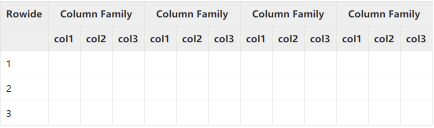
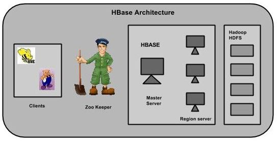

# HBase 简介

HBase是一个基于Hadoop的分布式、可扩展（扩容）的非关系型数据库，用于存储大型数据（十亿行 * 百万列）。它支持随机、实时读写。

#  HBase的特点

* 一致性读写（支持事物）；
* 自动可配置的表切割（一个表存储在不同的机器上）；
* 自动容灾；
* Java API 易于使用；
* 块缓存和布隆过滤器用于实时查询；
* 面向列簇的存储方案；

# HDFS和HBase的区别

|   HDFS  |   HBase  |
| --- | --- |
|  分布式文件系统   |   是一个数据库               |
|  只能顺序访问       |   支持随机查找               |
|  高延迟、批处理   |   低延迟访问单个行记录 |

# HBase 和 客户端交互过程

1. hbase集群启动时，HMaster负责分配区域到指定区域服务器；
2. 联系Zookeeper, 找到META表所在的RegionServer;
3. 找到 row key 所在的RegionServer;
4. RegionServer负责数据的读、写，并将数据缓存到内存中； 

# HBase的存储机制

HBase是一个面向列的数据库，在表中它由行排序。在一个HBase中：
*  表是行的集合；
*  行是列族的集合；
*  列族是列的集合；
*  列是键值对的集合；

下面给出的图是HBase模式的一个例子：


# HBase架构


HBase有三个主要组成部分：主服务器、Zookeeper集群和区域服务器。

1） 主服务器（Master Server）
分配区域给区域服务器；
负责元数据的操作，比如创建表、创建列等。
   
2） Zookeeper集群
选举HMaster，对HMaster，HRegionServer进行心跳检测（貌似是这些机器节点向ZooKeeper上报心跳）
   
3）区域服务器（Region Server）
与客户端进行通信并负责数据的操作。

# HBase的安装

HBase有本地模式、伪分布模式、完全分布式安装；下面我们仅仅演示完全分布式的安装。

Hbase集群设计

192.168.1.191（master1）Master Server
192.168.1.181（salve1）   Region Server    Zookeeper
192.168.1.182（salve2）   Region Server    Zookeeper
192.168.1.183（salve3）   Region Server    Zookeeper

## 1.安装JDK和Hadoop，设置SSH无密登录

略

## 2.安装Zookeeper集群

略

## 3.解压安装包到安装目录

``` 
[root@master1 HBase]# tar -zxvf hbase-1.2.9-bin.tar.gz
```

## 4.配置环境变量

在master1、salve1、salve2、salve3上配置环境变量

``` 
#HBASE
export HBASE_HOME=/root/HBase/hbase-1.2.9
export PATH=$HBASE_HOME/bin:$PATH
```
## 5.配置HBase

/root/HBase/hbase-1.2.9/conf/hbase-env.sh

``` 
#JAVA_HOME
export JAVA_HOME=/root/java/jdk1.8.0_25
#使用独立的zookeeper,默认使用HBase自带的zookeeper
export HBASE_MANAGES_ZK=false
```
/root/HBase/hbase-1.2.9/conf/hbase-site.xml

``` 
<configuration>
	<!-- 使用完全分布式 -->
	<property>
		<name>hbase.cluster.distributed</name>
		<value>true</value>
	</property>
	<!-- 指定hbase数据在hdfs上的存放路径 -->
	<property>
		<name>hbase.rootdir</name>
		<value>hdfs://master1:8020/hbase</value>
	</property>
	<!-- 配置zk地址 -->
	<property>
		<name>hbase.zookeeper.quorum</name>
		<value>salve1:2181,salve1:2181,salve1:2181</value>
	</property>
	<!-- 
	     1.ZooKeeper的zoo.conf中的配置。 快照的存储位置;
	     2.按照zookeeper配置zoo.cfg中的dataDir=/root/Zookeeper/zookeeper-3.4.9/data路径配置即可
         3.把ZooKeeper保存数据的目录地址改掉。
	-->
	<property>
		<name>hbase.zookeeper.property.dataDir</name>
		<value>/root/Zookeeper/zookeeper-3.4.9/data</value>
	</property>		
</configuration>
```

/root/HBase/hbase-1.2.9/conf/regionservers

``` 
salve1
salve2
salve3
```

## 6.分发HBase到salve1、salve2、salve3

``` 
[root@master1 ~]# scp -r HBase root@192.168.1.181:/root
[root@master1 ~]# scp -r HBase root@192.168.1.182:/root
[root@master1 ~]# scp -r HBase root@192.168.1.183:/root
```

## 7.启动HBase

启动HBase之前需首先启动Hadoop、Zookeeper

``` 
[root@master1 bin]# ./start-hbase.sh
```

## 8.验证HBase是否启动

``` 
Web UI 访问地址
http://master1:16010


检查在HDFS的HBase目录
如果一切顺利的话，它会给下面的输出
[root@master1 bin]# ./hdfs dfs -ls /hbase
Found 7 items
drwxr-xr-x   - root supergroup          0 2018-12-13 19:26 /hbase/.tmp
drwxr-xr-x   - root supergroup          0 2018-12-13 19:27 /hbase/MasterProcWALs
drwxr-xr-x   - root supergroup          0 2018-12-13 19:26 /hbase/WALs
drwxr-xr-x   - root supergroup          0 2018-12-13 19:26 /hbase/data
-rw-r--r--   3 root supergroup         42 2018-12-13 19:26 /hbase/hbase.id
-rw-r--r--   3 root supergroup          7 2018-12-13 19:26 /hbase/hbase.version
drwxr-xr-x   - root supergroup          0 2018-12-13 19:26 /hbase/oldWALs

```

# HBase 和 Hadoop HA 集成

1.在hbase-env.sh文件添加hadoop配置文件目录到HBASE_CLASSPATH环境变量并分发；
[/soft/hbase/conf/hbase-env.sh]
export HBASE_CLASSPATH=$HBASE_CLASSPATH:/soft/hadoop/etc/hadoop

2.在hbase/conf/目录下创建到hadoop的hdfs-site.xml符号连接。
>ln -s /soft/hadoop/etc/hadoop/hdfs-site.xml /soft/hbase/conf/hdfs-site.xml

3.修改hbase-site.xml文件中hbase.rootdir的目录值。
[/soft/hbase/conf/hbase-site.xml]
<property>
		<name>hbase.rootdir</name>
		<value>hdfs://mycluster/hbase</value>
</property>

4.将以上步骤分发处理。

# HBase Shell 命令

## 启动HMaster

``` 
./hbase-daemon.sh start master
```

## 启动HRegionServer

``` 
./hbase-daemons.sh start regionserver
```

## 进入HBase Shell命令

``` 
[root@master1 bin]# ./hbase shell
```

# HBase Shell

## 查看帮助

``` 
hbase(main):033:0* help
```

## 常规命令

## namespace命令

**namespace就相当于mysql中库的概念。**

1 查看所有的namespace
>hbase(main):038:0* list_namespace

2 查看某个namespace中的所有表
>hbase(main):043:0> list_namespace_tables 'default'

3 创建namespace
>hbase(main):044:0> create_namespace 'ns1'

## DDL命令

1 创建表
**在namespace ns1下面创建表t1, 该表有一个列簇f1**
>hbase(main):001:0> create 'ns1:t1','f1'

创建表时指定列族的版本数，该列族的所有列都具有相同的数量版本；
>hbase(main):035:0* create 'ns1:t3',{NAME=>'f1',VERSIONS=>3}


2 查看表信息
>hbase(main):004:0> describe 'ns1:t1'

## DML命令

1 插入数据

 **在HBase中，列不需要在建表的时候指定；可以在插入数据的时候动态指定。**
下面向 ns1(namespace)  t1(表) row1（行）f1(列簇) id（列），放入数值100
 下面向ns1(namespace)  t1(表) row1（行）f1(列簇) name（列），放入字符串 "tom"
 下面向ns1(namespace)  t1(表) row1（行）f1(列簇) age（列），放入数值24
>hbase(main):007:0> put 'ns1:t1','row1','f1:id',100
>hbase(main):008:0> put 'ns1:t1','row1','f1:name','tom'
>hbase(main):009:0> put 'ns1:t1','row1','f1:age',24

2 查询数据

下面查询ns1(namespace)  t1(表) row1（行）

``` 
hbase(main):011:0> get 'ns1:t1','row1'
COLUMN                                 CELL                                                      
 f1:age                                 timestamp=1544885285177, value=24                               
 f1:id                                  timestamp=1544885239449, value=100                              
 f1:name                                 timestamp=1544885273685, value=tom                                     
3 row(s) in 0.0440 seconds
```

查询数据的时候指定VERSIONS
>hbase(main):032:0* get 'ns1:t3','row0001',{COLUMN=>'f1',VERSIONS=>4}


3 全表扫面

扫描ns1(namespace)  t1(表)
>hbase(main):001:0> scan 'ns1:t1'

## 删除表

删除ns1(namespace)  t1(表)
>hbase(main):001:0> disable "ns1:t1"            //先禁用
>hbase(main):001:0> drop 'ns1:t1'                 //再删除

## flush 命令

清理内存数据到磁盘
>hbase(main):011:0> flush 'ns1:t1'

## count命令
统计函数
>hbase(main):011:0> flush 'ns1:t1'
Current count: 1000, row: row1002                                                                                                                                    
Current count: 2000, row: row2002                                                                                                                                    
Current count: 3000, row: row3002                                                                                                                                    
Current count: 4000, row: row4002                                                                                                                                    
Current count: 5000, row: row5002                                                                                                                                    
Current count: 6000, row: row6002                                                                                                                                    
Current count: 7000, row: row7002                                                                                                                                    
Current count: 8000, row: row8002                                                                                                                                    
Current count: 9000, row: row9002                                                                                                                                    
9997 row(s) in 1.7740 seconds

## 切分表

1、按照表名切分
>hbase(main):035:0> split 'ns1:t1'

2 、根据rowid切分区域
'ns1:t1,,1548390881412.2b267d599a854f8639eb69ff57f78e5e.'     :   区域名称
'row3333'    :  rowid
>hbase(main):052:0> split 'ns1:t1,,1548390881412.2b267d599a854f8639eb69ff57f78e5e.','row3333'

## 手动迁移区域
                                              区域ENCODED                 ServerName(可以在WEB中找到)
>hbase(main):006:0> move '874a1066d3844addc5cc55f143665dca','salve1,16020,1548405688798'

## 合并区域

合并相邻的两个区域。
                                                           区域1ENCODED                区域2ENCODED
>hbase(main):001:0> merge_region '874a1066d3844addc5cc55f143665dca','e8285bd7d92062a87dade27efe950727'

## 预切割

创建表时，预先对表进行切割。

切割线为row3000、row6000
>hbase(main):001:0> create 'ns1:t2','f1',SPLITS=>['row3000','row6000']

可以使用下面的命令查看 t2 表的详细切割信息；
>hbase(main):005:0> scan 'hbase:meta'

## TTL(Time to Live)

可以在创建表的时候，指定数据的的存活时间(表中的所有数据)
下面创建表t4,指定数据存活时间为10秒。
>hbase(main):038:0> create 'ns1:t4',{NAME=>'f1', TTL=>10, VERSIONS=>3}

## KEEP_DELETED_CELLS

删除key之后，数据是否还保留。
>hbase(main):092:0> create 'ns1:t5',{NAME=>'f1',KEEP_DELETED_CELLS=>true,  VERSIONS=>3}

执行删除语句后
>hbase(main):112:0> delete 'ns1:t5','row0001','f1:name'

使用原生扫描(RAW)，原来的数据还是存在的
>hbase(main):117:0> scan 'ns1:t5',{RAW=>true,VERSIONS=>10}

# Java API操作

## put 操作

``` 
package com.dongk.hbase;

import org.apache.hadoop.conf.Configuration;
import org.apache.hadoop.hbase.HBaseConfiguration;
import org.apache.hadoop.hbase.TableName;
import org.apache.hadoop.hbase.client.Connection;
import org.apache.hadoop.hbase.client.ConnectionFactory;
import org.apache.hadoop.hbase.client.Put;
import org.apache.hadoop.hbase.client.Table;
import org.apache.hadoop.hbase.util.Bytes;

public class HbasePut {

    public static void main(String args[]) throws Exception{
        //配置信息
        Configuration conf = HBaseConfiguration.create();
        //连接
        Connection connection = ConnectionFactory.createConnection(conf);
        //表名
        TableName tname = TableName.valueOf("ns1:t1");
        //表
        Table table = connection.getTable(tname);

        //行
        byte[] rowid = Bytes.toBytes("row2");
        //列镞
        byte[] f1 = Bytes.toBytes("f1");
        //列
        byte[] id = Bytes.toBytes("id");
        //列的值
        byte[] value = Bytes.toBytes("101");

        //
        Put put = new Put(rowid);
        put.addColumn(f1,id,value);

        table.put(put);
    }
}

```

## 百万行数据插入

``` 
package com.dongk.hbase;

import org.apache.hadoop.conf.Configuration;
import org.apache.hadoop.hbase.HBaseConfiguration;
import org.apache.hadoop.hbase.TableName;
import org.apache.hadoop.hbase.client.*;
import org.apache.hadoop.hbase.util.Bytes;

import java.text.DecimalFormat;

public class HbaseBigDataPut {

    public static void main(String args[]) throws Exception{
        Configuration conf = HBaseConfiguration.create();
        Connection connection = ConnectionFactory.createConnection(conf);
        TableName tname = TableName.valueOf("ns1:t1");
        HTable table = (HTable)connection.getTable(tname);
        //
        table.setAutoFlush(false);

        DecimalFormat format = new DecimalFormat();
        format.applyPattern("0000");

        for(int i=3; i<10000; i++){
            byte[] rowid = Bytes.toBytes("row" + format.format(i));
            byte[] f1 = Bytes.toBytes("f1");

            Put put = new Put(rowid);

            //
            put.setWriteToWAL(false);

            put.addColumn(f1,Bytes.toBytes("id"),Bytes.toBytes(i));
            put.addColumn(f1,Bytes.toBytes("name"),Bytes.toBytes("tom" + i));
            put.addColumn(f1,Bytes.toBytes("age"),Bytes.toBytes(i % 100));

            table.put(put);

            //
            if(i % 2000 == 0)
                table.flushCommits();
        }
        table.flushCommits();

    }
}

```

## get操作

``` 
package com.dongk.hbase;

import org.apache.hadoop.conf.Configuration;
import org.apache.hadoop.hbase.HBaseConfiguration;
import org.apache.hadoop.hbase.TableName;
import org.apache.hadoop.hbase.client.*;
import org.apache.hadoop.hbase.util.Bytes;

public class HbaseGet {

    public static void main(String args[]) throws Exception{
        //配置文件
        Configuration conf = HBaseConfiguration.create();
        //获取连接
        Connection connection = ConnectionFactory.createConnection(conf);
        //table名称
        TableName tname = TableName.valueOf("ns1:t1");
        //table
        Table table = connection.getTable(tname);

        //行
        byte[] rowid = Bytes.toBytes("row1");
        Get get = new Get(rowid);

        Result result = table.get(get);
		//f1 : 表示列镞
		//id : 表示列
        byte[] idvalue = result.getValue(Bytes.toBytes("f1"),Bytes.toBytes("id"));

        System.out.println(Bytes.toString(idvalue));
    }

}

```

## 按照指定版本数get

``` 
package com.dongk.hbase;

import org.apache.hadoop.conf.Configuration;
import org.apache.hadoop.hbase.Cell;
import org.apache.hadoop.hbase.HBaseConfiguration;
import org.apache.hadoop.hbase.TableName;
import org.apache.hadoop.hbase.client.*;
import org.apache.hadoop.hbase.util.Bytes;

import java.util.List;

public class HbaseGetVersions {

    public static void main(String args[]) throws Exception{
        Configuration conf = HBaseConfiguration.create();
        Connection connection = ConnectionFactory.createConnection(conf);
        TableName tname = TableName.valueOf("ns1:t3");
        Table table = connection.getTable(tname);

        byte[] rowid = Bytes.toBytes("row0001");
        Get get = new Get(rowid);
        //指定查询最新的两个版本
        get.setMaxVersions(2);

        Result result = table.get(get);
        List<Cell> cells =  result.getColumnCells(Bytes.toBytes("f1"),Bytes.toBytes("name"));
        for(Cell cell : cells){
            String family = Bytes.toString(cell.getFamily());
            Long ts = cell.getTimestamp();
            String value = Bytes.toString(cell.getValue());
            System.out.println(family + ":" + ts + ":" + value);
        }
    }

}

```

## 创建和查询名字空间

``` 
package com.dongk.hbase;

import org.apache.hadoop.conf.Configuration;
import org.apache.hadoop.hbase.HBaseConfiguration;
import org.apache.hadoop.hbase.NamespaceDescriptor;
import org.apache.hadoop.hbase.client.Admin;
import org.apache.hadoop.hbase.client.Connection;
import org.apache.hadoop.hbase.client.ConnectionFactory;

public class HbaseNamespace {
    public static void main(String args[]) throws Exception{
        //
        Configuration conf = HBaseConfiguration.create();
        //
        Connection connection = ConnectionFactory.createConnection(conf);
        Admin admin = connection.getAdmin();

        //创建名字空间
        NamespaceDescriptor ns2 = NamespaceDescriptor.create("ns2").build();
        admin.createNamespace(ns2);

        //查询所有的名字空间
        NamespaceDescriptor[] nss = admin.listNamespaceDescriptors();
        for(NamespaceDescriptor ns : nss)
            System.out.println(ns.getName());
    }
}

```

## 创建表

``` 
package com.dongk.hbase;

import org.apache.hadoop.conf.Configuration;
import org.apache.hadoop.hbase.HBaseConfiguration;
import org.apache.hadoop.hbase.HColumnDescriptor;
import org.apache.hadoop.hbase.HTableDescriptor;
import org.apache.hadoop.hbase.TableName;
import org.apache.hadoop.hbase.client.Admin;
import org.apache.hadoop.hbase.client.Connection;
import org.apache.hadoop.hbase.client.ConnectionFactory;

public class HbaseTable {
    public static void main(String args[])throws Exception{
        //
        Configuration conf = HBaseConfiguration.create();
        //
        Connection connection = ConnectionFactory.createConnection(conf);
        Admin admin = connection.getAdmin();

        //创建表名对象
        TableName tableName = TableName.valueOf("ns2:t2");
        //创建表描述符对象
        HTableDescriptor tableDescriptor = new HTableDescriptor(tableName);
        //创建列族描述符对象
        HColumnDescriptor col = new HColumnDescriptor("f2");
        tableDescriptor.addFamily(col);

        admin.createTable(tableDescriptor);
    }
}

```

## 删除数据

删除名字空间ns1下表t1， rowid为‘row9999’，列族为‘f1’ 的id和name列；

``` 
package com.dongk.hbase;

import org.apache.hadoop.conf.Configuration;
import org.apache.hadoop.hbase.HBaseConfiguration;
import org.apache.hadoop.hbase.TableName;
import org.apache.hadoop.hbase.client.*;
import org.apache.hadoop.hbase.util.Bytes;

public class HbaseDeleteData {
    public static void main(String args[]) throws Exception{
        Configuration conf = HBaseConfiguration.create();
        Connection connection = ConnectionFactory.createConnection(conf);

        TableName tableName = TableName.valueOf("ns1:t1");
        Table table = connection.getTable(tableName);

        Delete del = new Delete(Bytes.toBytes("row9999"));
        del.addColumn(Bytes.toBytes("f1"),Bytes.toBytes("id"));
        del.addColumn(Bytes.toBytes("f1"),Bytes.toBytes("name"));

        table.delete(del);
    }
}

```

## 全表扫描

``` 
package com.dongk.hbase;

import org.apache.hadoop.conf.Configuration;
import org.apache.hadoop.hbase.HBaseConfiguration;
import org.apache.hadoop.hbase.TableName;
import org.apache.hadoop.hbase.client.*;
import org.apache.hadoop.hbase.util.ByteStringer;
import org.apache.hadoop.hbase.util.Bytes;

import java.util.Iterator;

public class HbaseScan {
    public static void main(String args[]) throws Exception{
        Configuration conf = HBaseConfiguration.create();
        Connection connection = ConnectionFactory.createConnection(conf);

        TableName tableName = TableName.valueOf("ns1:t1");
        Table table = connection.getTable(tableName);

        Scan scan = new Scan();
        //设定开始行
        scan.setStartRow(Bytes.toBytes("row9000"));
        //设定结束行
        scan.setStopRow(Bytes.toBytes("row9998"));
        ResultScanner rs = table.getScanner(scan);
        Iterator<Result> results = rs.iterator();
        while(results.hasNext()){
            Result result = results.next();
            byte[] name = result.getValue(Bytes.toBytes("f1"),Bytes.toBytes("name"));
            System.out.println(Bytes.toString(name));
        }
    }
}


```

## 动态扫描

``` 
package com.dongk.hbase;

import org.apache.hadoop.conf.Configuration;
import org.apache.hadoop.hbase.HBaseConfiguration;
import org.apache.hadoop.hbase.TableName;
import org.apache.hadoop.hbase.client.*;
import org.apache.hadoop.hbase.util.Bytes;

import java.util.Iterator;
import java.util.Map;
import java.util.NavigableMap;

public class HbaseDynamicScan {
    public static void main(String args[]) throws Exception{
        Configuration conf = HBaseConfiguration.create();
        Connection connection = ConnectionFactory.createConnection(conf);

        TableName tableName = TableName.valueOf("ns1:t1");
        Table table = connection.getTable(tableName);

        Scan scan = new Scan();
        scan.setStartRow(Bytes.toBytes("row9000"));
        scan.setStopRow(Bytes.toBytes("row9010"));
        ResultScanner rs = table.getScanner(scan);
        Iterator<Result> results = rs.iterator();
        while(results.hasNext()){
            Result result = results.next();

            //Map<列族,Map<列,Map<时间戳,列值>>>
            NavigableMap<byte[], NavigableMap<byte[], NavigableMap<Long, byte[]>>> row = result.getMap();
            for(Map.Entry<byte[], NavigableMap<byte[], NavigableMap<Long, byte[]>>> rowentry : row.entrySet()){
                //列族
                String famliy = Bytes.toString(rowentry.getKey());
                NavigableMap<byte[], NavigableMap<Long, byte[]>> columns =  rowentry.getValue();
                for(Map.Entry<byte[], NavigableMap<Long, byte[]>> columnsentry : columns.entrySet() ){
				   //列
                    String column = Bytes.toString(columnsentry.getKey());
                    NavigableMap<Long, byte[]> columnValue = columnsentry.getValue();
                    for(Map.Entry<Long, byte[]> values : columnValue.entrySet()){
					  //时间戳
                        Long timestamp = values.getKey();
						//列值
                        String value = Bytes.toString(values.getValue());
                        System.out.println(famliy + ":" + column + ":" + timestamp + ":" + value);
                    }
                }
            }

        }
    }
}

```

# 扫描器缓存和批量处理

1）什么是缓存器和批量处理。
缓存器：缓存是面向行的操作。客户端每next()一次，就与HBase服务器建立一次RPC请求；我们可以开启扫描器缓存，这样服务器一次就可以发送指定条数据到客户端。
批量处理：批量处理是面向列的操作。即每次返回对少列；

2）缓存的类型

a) 表层面缓存器，对所有的客户端有效。

在HBase配置文件中配置下面的属性即可；
<property>
<name>hbase.client.scanner.caching</name>
<value>2147483647</value>
<source>hbase-default.xml</source>
</property>

b）操作层面缓存器, 只对特定的用户有效。
``` 
package com.dongk.hbase;

import org.apache.hadoop.conf.Configuration;
import org.apache.hadoop.hbase.HBaseConfiguration;
import org.apache.hadoop.hbase.TableName;
import org.apache.hadoop.hbase.client.*;
import org.apache.hadoop.hbase.util.Bytes;

import java.util.Iterator;

public class HbaseCaching {
    public static void main(String args[])throws  Exception{
        long starttime = System.currentTimeMillis();

        Configuration conf = HBaseConfiguration.create();
        Connection connection = ConnectionFactory.createConnection(conf);

        TableName tableName = TableName.valueOf("ns1:t1");
        Table table = connection.getTable(tableName);

        Scan scan = new Scan();
        //设置缓存为1000行
        scan.setCaching(1000);
		//设置每次返回一列
        scan.setBatch(1);
        ResultScanner rs = table.getScanner(scan);
        Iterator<Result> results = rs.iterator();
        while(results.hasNext()){
            Result result = results.next();
            byte[] name = result.getValue(Bytes.toBytes("f1"),Bytes.toBytes("name"));
            System.out.println(Bytes.toString(name));
        }

        long endtime = System.currentTimeMillis();
        System.out.println(endtime - starttime);
    }
}

```

# 过滤器

## RowFilter

行过滤器：过滤掉所有不满足条件的行；

RowFilter 属于比较过滤器，和RowFilter类似的过滤器还有FamilyFilter(列族过滤器)、QualifierFilter(列过滤器)，它们的使用方法一模一样；

我们要实现和下面SQL语句一样的功能，就可以使用行过滤器；
SELECT * FROM ns1:t1 WHERE row <= 'row1000'；

``` 
package com.dongk.hbase;

import org.apache.hadoop.conf.Configuration;
import org.apache.hadoop.hbase.HBaseConfiguration;
import org.apache.hadoop.hbase.TableName;
import org.apache.hadoop.hbase.client.*;
import org.apache.hadoop.hbase.filter.BinaryComparator;
import org.apache.hadoop.hbase.filter.CompareFilter;
import org.apache.hadoop.hbase.filter.RowFilter;
import org.apache.hadoop.hbase.util.Bytes;

import javax.swing.*;
import java.util.Iterator;

public class HbaseRowFilter {
    public static void main(String args[]) throws Exception{
        Configuration conf = HBaseConfiguration.create();
        Connection connection = ConnectionFactory.createConnection(conf);

        TableName tableName = TableName.valueOf("ns1:t1");
        Table table = connection.getTable(tableName);

        Scan scan = new Scan();
        //小于等于 "row1000" 的行
        RowFilter rowFilter = new RowFilter(CompareFilter.CompareOp.LESS_OR_EQUAL,
                new BinaryComparator(Bytes.toBytes("row1000")));
        scan.setFilter(rowFilter);

        ResultScanner rs = table.getScanner(scan);
        Iterator<Result> results = rs.iterator();
        while(results.hasNext()){
            Result result = results.next();
            System.out.println(Bytes.toString(result.getRow()));
        }
    }
}

```

## ValueFilter

值过滤器：过滤掉所有不满足条件的单元格

ValueFilter属于比较过滤器，使用方法如下：

``` 
package com.dongk.hbase;

import org.apache.hadoop.conf.Configuration;
import org.apache.hadoop.hbase.HBaseConfiguration;
import org.apache.hadoop.hbase.TableName;
import org.apache.hadoop.hbase.client.*;
import org.apache.hadoop.hbase.filter.*;
import org.apache.hadoop.hbase.util.Bytes;

import java.util.Iterator;

public class HbaseValueFilter {
    public static  void main(String args[]) throws  Exception{
        Configuration conf = HBaseConfiguration.create();
        Connection connection = ConnectionFactory.createConnection(conf);

        TableName tableName = TableName.valueOf("ns1:t1");
        Table table = connection.getTable(tableName);

        Scan scan = new Scan();
        //过滤value包含"tom1"的所有的单元格
        ValueFilter valueFilter = new ValueFilter(CompareFilter.CompareOp.EQUAL,
                new SubstringComparator("tom1"));
        scan.setFilter(valueFilter);

        ResultScanner rs = table.getScanner(scan);
        Iterator<Result> results = rs.iterator();
        while(results.hasNext()){
            Result result = results.next();
            System.out.println(Bytes.toString(result.getRow()));
        }
    }
}

```

## SingleColumnValueFilter

单列值过滤器：如果列的值不满足指定条件，则整行被过滤掉；

SingleColumnValueFilter属于比较过滤器，使用方法如下：

``` 
package com.dongk.hbase;

import org.apache.hadoop.conf.Configuration;
import org.apache.hadoop.hbase.HBaseConfiguration;
import org.apache.hadoop.hbase.TableName;
import org.apache.hadoop.hbase.client.*;
import org.apache.hadoop.hbase.filter.*;
import org.apache.hadoop.hbase.util.Bytes;

import java.util.Iterator;

public class HbaseSingleColumnValueFilter {

    public static  void main(String args[]) throws  Exception{
        Configuration conf = HBaseConfiguration.create();
        Connection connection = ConnectionFactory.createConnection(conf);

        TableName tableName = TableName.valueOf("ns1:t1");
        Table table = connection.getTable(tableName);

        Scan scan = new Scan();
        //所有name列等于tom1111的行被选择出来
        SingleColumnValueFilter filter = new SingleColumnValueFilter(
                Bytes.toBytes("f1"),
                Bytes.toBytes("name"),
                CompareFilter.CompareOp.EQUAL,
                new BinaryComparator(Bytes.toBytes("tom1111"))
        );

        scan.setFilter(filter);

        ResultScanner rs = table.getScanner(scan);
        Iterator<Result> results = rs.iterator();
        while(results.hasNext()){
            Result result = results.next();
            byte[] name = result.getValue(Bytes.toBytes("f1"),Bytes.toBytes("name"));
            byte[] age = result.getValue(Bytes.toBytes("f1"),Bytes.toBytes("age"));
            System.out.println(Bytes.toString(result.getRow()) + ":" + age +
                    ":" + Bytes.toString(name));
        }
    }
}

```

## SingleColumnValueExcludeFilter

单列值排它过滤器：排除满足条件的列；

SingleColumnValueExcludeFilter属于比较过滤器，使用方法如下：

``` 
package com.dongk.hbase;

import org.apache.hadoop.conf.Configuration;
import org.apache.hadoop.hbase.HBaseConfiguration;
import org.apache.hadoop.hbase.TableName;
import org.apache.hadoop.hbase.client.*;
import org.apache.hadoop.hbase.filter.*;
import org.apache.hadoop.hbase.util.Bytes;

import java.util.Iterator;

public class HbaseSingleColumnValueFilter {

    public static  void main(String args[]) throws  Exception{
        Configuration conf = HBaseConfiguration.create();
        Connection connection = ConnectionFactory.createConnection(conf);

        TableName tableName = TableName.valueOf("ns1:t1");
        Table table = connection.getTable(tableName);

        Scan scan = new Scan();
        //既然我们知道name是“tom1111”，就不需要服务器返回，以节省网络带宽。
        SingleColumnValueExcludeFilter filter = new SingleColumnValueExcludeFilter(
                Bytes.toBytes("f1"),
                Bytes.toBytes("name"),
                CompareFilter.CompareOp.EQUAL,
                new BinaryComparator(Bytes.toBytes("tom1111"))
        );

        scan.setFilter(filter);

        ResultScanner rs = table.getScanner(scan);
        Iterator<Result> results = rs.iterator();
        while(results.hasNext()){
            Result result = results.next();
            byte[] name = result.getValue(Bytes.toBytes("f1"),Bytes.toBytes("name"));
            byte[] age = result.getValue(Bytes.toBytes("f1"),Bytes.toBytes("age"));
            System.out.println(Bytes.toString(result.getRow()) + ":" + age +
                    ":" + Bytes.toString(name));
        }
    }
}

```

## PrefixFilter

前缀过滤器： rowkey开头几个字符满足条件即可； 

PrefixFilter属于比较过滤器，使用方法如下：

``` 
package com.dongk.hbase;

import org.apache.hadoop.conf.Configuration;
import org.apache.hadoop.hbase.HBaseConfiguration;
import org.apache.hadoop.hbase.TableName;
import org.apache.hadoop.hbase.client.*;
import org.apache.hadoop.hbase.filter.BinaryComparator;
import org.apache.hadoop.hbase.filter.CompareFilter;
import org.apache.hadoop.hbase.filter.PrefixFilter;
import org.apache.hadoop.hbase.filter.SingleColumnValueExcludeFilter;
import org.apache.hadoop.hbase.util.ByteStringer;
import org.apache.hadoop.hbase.util.Bytes;

import java.util.Iterator;

public class HbasePrefixFilter {

    public static  void main(String args[]) throws  Exception{
        Configuration conf = HBaseConfiguration.create();
        Connection connection = ConnectionFactory.createConnection(conf);

        TableName tableName = TableName.valueOf("ns1:t1");
        Table table = connection.getTable(tableName);

        Scan scan = new Scan();
        //rowkey 以 “row999” 开头的行
        PrefixFilter filter = new PrefixFilter(Bytes.toBytes("row999"));

        scan.setFilter(filter);

        ResultScanner rs = table.getScanner(scan);
        Iterator<Result> results = rs.iterator();
        while(results.hasNext()){
            Result result = results.next();
            byte[] name = result.getValue(Bytes.toBytes("f1"),Bytes.toBytes("name"));
            byte[] age = result.getValue(Bytes.toBytes("f1"),Bytes.toBytes("age"));
            System.out.println(Bytes.toString(result.getRow()) + ":" + age +
                    ":" + Bytes.toString(name));
        }
    }
}

```

## FilterList

FilterList可以实现一些复杂的查询，我们可以使用FilterList实现类似于下面SQL语句的查询：

select * from t1 where (
                                      (age <=13 and name like 't%')
									  or
									  (age >= 13 and name like '%9')
                                  )
					
``` 
package com.dongk.hbase;

import org.apache.hadoop.conf.Configuration;
import org.apache.hadoop.hbase.HBaseConfiguration;
import org.apache.hadoop.hbase.TableName;
import org.apache.hadoop.hbase.client.*;
import org.apache.hadoop.hbase.filter.*;
import org.apache.hadoop.hbase.util.Bytes;

import java.util.Iterator;

public class hbaseFilterList {
    public static  void main(String args[]) throws  Exception{
        Configuration conf = HBaseConfiguration.create();
        Connection connection = ConnectionFactory.createConnection(conf);

        TableName tableName = TableName.valueOf("ns1:t1");
        Table table = connection.getTable(tableName);

        //age <= 13
        SingleColumnValueFilter ft1 = new SingleColumnValueFilter(
                Bytes.toBytes("f1"),
                Bytes.toBytes("age"),
                CompareFilter.CompareOp.LESS_OR_EQUAL,
                new BinaryComparator(Bytes.toBytes(13))
        );

        //name like 't%'
        SingleColumnValueFilter ft2 = new SingleColumnValueFilter(
                Bytes.toBytes("f1"),
                Bytes.toBytes("name"),
                CompareFilter.CompareOp.EQUAL,
                new RegexStringComparator("^t")
        );

        FilterList fl1 = new FilterList(FilterList.Operator.MUST_PASS_ALL);
        fl1.addFilter(ft1);
        fl1.addFilter(ft2);

        //age >= 13
        SingleColumnValueFilter ft3 = new SingleColumnValueFilter(
                Bytes.toBytes("f1"),
                Bytes.toBytes("age"),
                CompareFilter.CompareOp.GREATER_OR_EQUAL,
                new BinaryComparator(Bytes.toBytes(13))
        );

        //name like '%9'
        SingleColumnValueFilter ft4 = new SingleColumnValueFilter(
                Bytes.toBytes("f1"),
                Bytes.toBytes("name"),
                CompareFilter.CompareOp.EQUAL,
                new RegexStringComparator("9$")
        );

        FilterList fl2 = new FilterList(FilterList.Operator.MUST_PASS_ALL);
        fl2.addFilter(ft3);
        fl2.addFilter(ft4);

        FilterList filter = new FilterList(FilterList.Operator.MUST_PASS_ONE);
        filter.addFilter(fl1);
        filter.addFilter(fl2);


        Scan scan = new Scan();
        scan.setFilter(filter);

        ResultScanner rs = table.getScanner(scan);
        Iterator<Result> results = rs.iterator();
        while(results.hasNext()){
            Result result = results.next();
            byte[] name = result.getValue(Bytes.toBytes("f1"),Bytes.toBytes("name"));
            byte[] age = result.getValue(Bytes.toBytes("f1"),Bytes.toBytes("age"));
            System.out.println(Bytes.toString(result.getRow()) +
                    ":" + Bytes.toInt(age) +
                    ":" + Bytes.toString(name));
        }
    }
}

```

# 计数器					
								  
所谓计数器，其实就是一列。它的特殊之处在于一次RPC请求中保持原子性操作；

## 在 shell 操作中使用计数器

下面在命名空间ns1下面添加一张表t7,并为f1列族添加计数器；

//创建t7表，并添加列族f1
hbase(main):004:0> create 'ns1:t7','f1'

//在列row0001上添加计数器 counter
hbase(main):005:0> incr 'ns1:t7','row0001','f1:counter',1

//的到计数器的值
hbase(main):007:0> get_counter 'ns1:t7','row0001','f1:counter'

## 使用API 对计数器进行增量操作

``` 
package com.dongk.hbase;

import org.apache.hadoop.conf.Configuration;
import org.apache.hadoop.hbase.HBaseConfiguration;
import org.apache.hadoop.hbase.TableName;
import org.apache.hadoop.hbase.client.Connection;
import org.apache.hadoop.hbase.client.ConnectionFactory;
import org.apache.hadoop.hbase.client.Increment;
import org.apache.hadoop.hbase.client.Table;
import org.apache.hadoop.hbase.util.Bytes;

public class HbaseIncrement {
    public  static void main(String args[]) throws Exception{
        Configuration conf = HBaseConfiguration.create();
        Connection connection = ConnectionFactory.createConnection(conf);
        TableName tname = TableName.valueOf("ns1:t7");
        Table table = connection.getTable(tname);

        Increment incr = new Increment(Bytes.toBytes("row0001"));
        incr.addColumn(Bytes.toBytes("f1"), Bytes.toBytes("counter"),1);
        table.increment(incr);
    }
}

```

# 协处理器

使用场景：二级索引

注册协处理器，并分发到HBase集群的每台机器上面；

``` 

<property>
		<name>hbase.coprocessor.region.classes</name>
		<value>com.dongk.hbase.coprocessor.MyRegionObserver</value>
	</property>
	
```

导出jar包；

拷贝jar包到hbase lib 目录下面，并分发到HBase集群的每台服务器上；

# HBase Row Key设计原则

* rowkey长度原则：rowkey应该尽量设计的短，最好不要超过16个字节；
* rowkey散列原则：建议高位采用散列字段处理，有程序随机生成；低位放时间字段，这样将数据均衡分布在每个RegionServer；
* rowkey唯一性原则：rowkey必须保持唯一性；

**通话记录rowkey设计实例**

**1.通话记录信息**

|    主叫 |  被叫   | 时间    | 时长    |     |
| --- | --- | --- | --- | --- |
|     |     |     |     |     |

**2.rowkey设计**

**3.实现**

1、创建HBase表calllogs；
hbase(main):003:0> create 'ns1:calllogs','f1'


# HBase的热点问题

# HBase二级索引


# HBase设计技巧

1、列族、列的长度尽量短，，最好不要超过5位；
2、列族要尽可能的少(因为每个列族是一个文件，列族多就代表了文件就比较多，rowkey对应起来会比较麻烦)，最好不要超过3个列族；


# HBase和Hive集成

将HBase的数据映射到hive上，就可以使用hive的查询语句；

//"hbase.table.name" = "ns1:t11" : 表示hbase中命名空间为ns1,表名是t11。
//hbase.columns.mapping : 中的值分别对应hbase表中的 列族：列的形式，其中 :key是固定写法，对应hbase中的rowkey。
//org.apache.hadoop.hive.hbase.HBaseStorageHandler : 使用的处理器。
CREATE TABLE t11(key string, name string, age int) STORED BY 'org.apache.hadoop.hive.hbase.HBaseStorageHandler' WITH SERDEPROPERTIES("hbase.columns.mapping" = ":key,cf:name,cf:age") TBLPROPERTIES("hbase.table.name" = "ns1:t11");

//在hbase中插入数据
put 'ns1:t11','row1','cf:name','dongkang'
put 'ns1:t11','row1','cf:age',27

//在hive中查询数据，可以看到刚才插入的数据
hive> select * from t11;