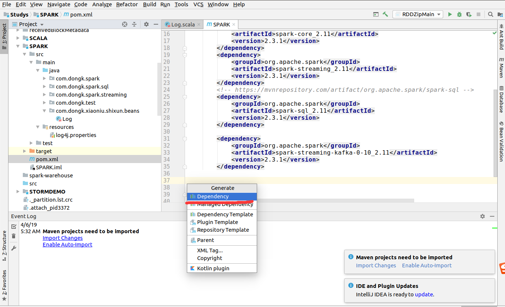
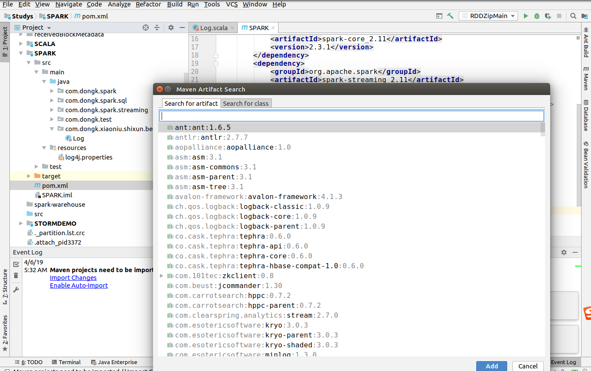
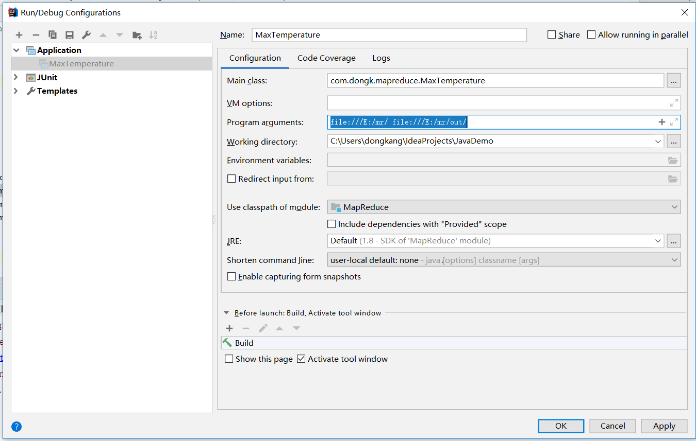
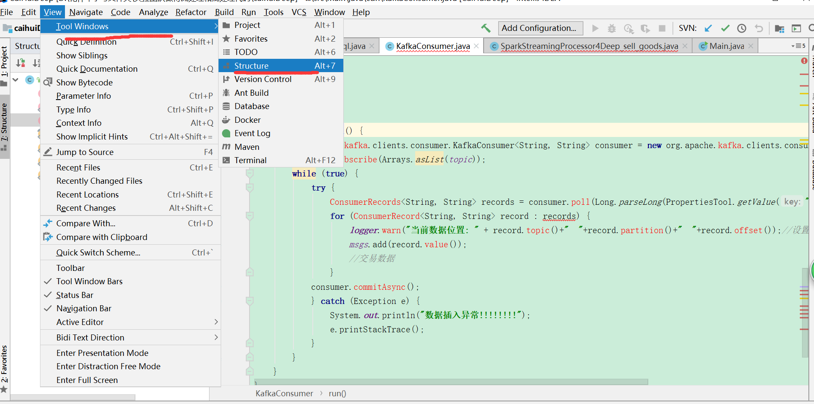
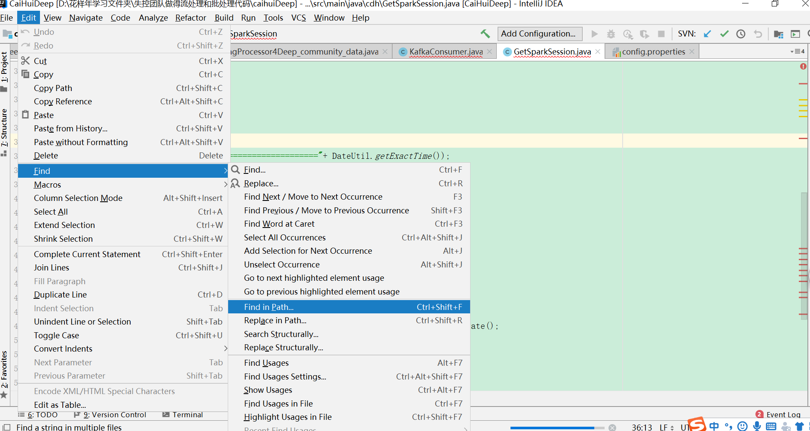
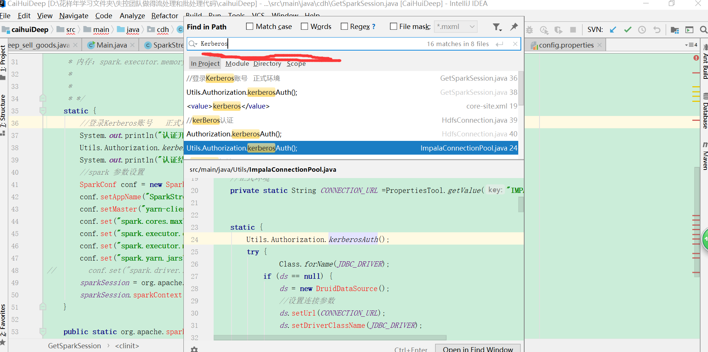

# IntelliJ IDEA 和 Eclipse 的区别

IntelliJ IDEA 和 Eclipse中相关概念对应如下：

| Eclipse  | IntelliJ IDEA |
| -------- | ------------- |
| 命名空间 | 项目          |
| 项目     | 模块          |

# IntelliJ IDEA 安装tomcat

1、File—>Setting—>Build,Execution,Deployment—->Application Servers—>”+”这里添加了之后Edit Configuration里面就可以看到Tomcat Server了。

2、点击Run-Edit Configurations，点击左侧“+”，选择Tomcat；

# IntelliJ IDEA Maven 配置

**第一步**

选择菜单 File > Settings

**第二步**

在设置页面搜索关键字 "maven"， 并做如下设置即可

# IntelliJ IDEA 快捷键设置

**第一步**

选择菜单 File > Settings

**第二步**

在设置页面搜索关键字 "keymap"， 并做如下设置即可

# IntelliJ IDEA 为模块增加Maven依赖

**第一步** 右击需要添加Maven依赖的模块，选择 Add Framework Support

**第二步**  勾选Maven依赖

# IntelliJ IDEA代码编辑区字体大小设置

**第一步**

选择菜单 File > Settings

**第二步**

选择 Edit > Font

# IntelliJ IDEA 常用快捷键

## 格式化文本快捷键

Ctrl + Alt + L

## 重写方法

Ctrl + O

## 删除一行

Ctrl + X

## 搜索本地Maven仓库的依赖包

Alt + Insert

## 自动补全返回值

Ctrl + Alt + V

## 返回上次查看代码的位置

Ctrl + Alt + ->

## 错误解决办法提示

Alt + Enter

# 设置运行参数

如果Application下面没有你要设置的主方法类，则先运行一次主方法类即可。

Run >> Edit Configurations

# 展示一个类的所有结构

展示类中的所有方法

# 全局搜索

在整个工程中，搜索某个字符串出现在那些文件中

第一步： 打开搜索框

第二步：输入搜索的字符串，进行搜索

