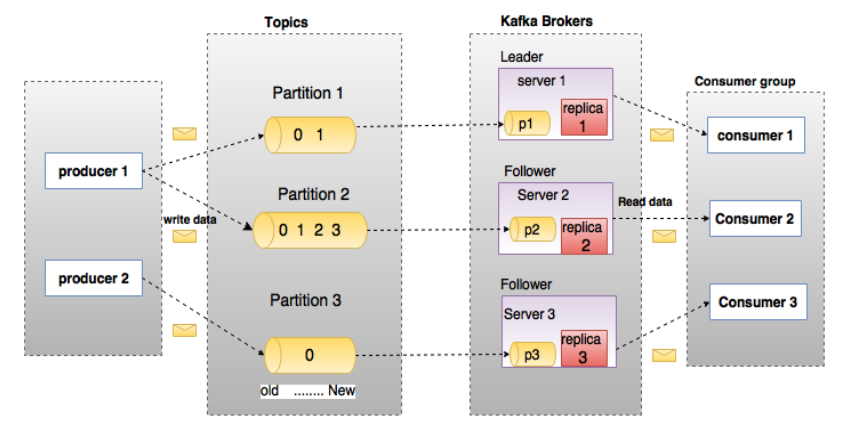

# 什么是Kafka

JMS ：java message service（异构系统间通信）

Apache Kafka是一个分布式的发布-订阅消息系统，能够支撑海量数据的数据传递。在离线和实时的消息处理业务系统中，Kafka都有广泛的应用。
Kafka将消息持久化到磁盘中，并对消息创建了备份保证了数据的安全。Kafka在保证了较高的处理速度的同时，又能保证数据处理的低延迟和数据的零丢失。

Kafka的优势在于：
* 可靠性：Kafka是一个具有分区机制、副本机制和容错机制的分布式消息系统
* 可扩展性：Kafka消息系统支持集群规模的热扩展
* 高性能：Kafka在数据发布和订阅过程中都能保证数据的高吞吐量。即便在TB级数据存储的情况下，仍然能保证稳定的性能。

# Kafka 术语



上图中一个topic配置了3个partition。Partition1有两个offset：0和1。Partition2有4个offset。Partition3有1个offset。副本的id和副本所在的机器的id恰好相同。

如果一个topic的副本数为3，那么Kafka将在集群中为每个partition创建3个相同的副本。集群中的每个broker存储一个或多个partition。多个producer和consumer可同时生产和消费数据。

各个术语的详细介绍如下：

* **Topic：** 在Kafka中，使用一个类别属性来划分数据的所属类，划分数据的这个类称为topic。如果把Kafka看做为一个数据库，topic可以理解为数据库中的一张表，topic的名字即为表名。Topic中的每条消息就是一条记录，记录由key、value和timestamp构成。
* **Partition：** topic中的数据分割为一个或多个partition。每个topic至少有一个partition。每个partition中的数据使用多个segment文件存储。partition中的数据是有序的，partition间的数据丢失了数据的顺序。如果topic有多个partition，消费数据时就不能保证数据的顺序。在需要严格保证消息的消费顺序的场景下，需要将partition数目设为1。
* **Partition offset：** 每条消息都有一个当前Partition下唯一的64字节的offset，它指明了这条消息的起始位置。
* **Replicas of partition：** 副本是一个分区的备份。副本不会被消费者消费，副本只用于防止数据丢失，即消费者不从为follower的partition中消费数据，而是从为leader的partition中读取数据。
* **Broker：** 
    * 1、Kafka 集群包含一个或多个服务器，服务器节点称为broker。
    * 2、broker存储topic的数据。如果某topic有N个partition，集群有N个broker，那么每个broker存储该topic的一个partition。
    * 3、如果某topic有N个partition，集群有(N+M)个broker，那么其中有N个broker存储该topic的一个partition，剩下的M个broker不存储该topic的partition数据。
    * 4、如果某topic有N个partition，集群中broker数目少于N个，那么一个broker存储该topic的一个或多个partition。在实际生产环境中，尽量避免这种情况的发生，这种情况容易导致Kafka集群数据不均衡。
* **Producer：** 生产者即数据的发布者，该角色将消息发布到Kafka的topic中。broker接收到生产者发送的消息后，broker将该消息追加到当前用于追加数据的segment文件中。生产者发送的消息，存储到一个partition中，生产者也可以指定数据存储的partition。
* **Consumer：** 消费者可以从broker中读取数据。消费者可以消费多个topic中的数据。
* **Leader：** 每个partition有多个副本，其中有且仅有一个作为Leader，Leader是当前负责数据的读写的partition。
* **Follower：** Follower跟随Leader，所有写请求都通过Leader路由，数据变更会广播给所有Follower，Follower与Leader保持数据同步。如果Leader失效，则从Follower中选举出一个新的Leader。当Follower与Leader挂掉、卡住或者同步太慢，leader会把这个follower从“in sync replicas”（ISR）列表中删除，重新创建一个Follower。

# Kafka的安装

我们选择
192.168.1.181
192.168.1.182
192.168.1.183
三台机器安装kafka

1、解压Kafka压缩包
[root@salve1 kafka]# tar -zxvf kafka_2.11-0.10.0.1.tgz

2、在三台机器上分别配置Kafka环境变量

``` 
##Kafka
export KAFKA_HOME=/root/kafka/kafka_2.11-0.10.0.1
export PATH=$PATH:KAFKA_HOME/bin
```

3、配置Kafka

``` 
##将id配置成ip
broker.id=181
##不配置IP地址，表示绑定本机
listeners=PLAINTEXT://:9092
##日志存放地址
log.dirs=/root/kafka/logs/kafka-logs
##zookeeper地址
zookeeper.connect=salve1:2181,salve2:2181,salve3:2181
```

4、将配置好的kafka发送到其它的机器(182,183)，并修改broker.id
[root@salve1 ~]# scp -r kafka root@salve1:/root/
[root@salve1 ~]# scp -r kafka root@salve2:/root/
[root@salve1 ~]# scp -r kafka root@salve3:/root/

5、启动kafka服务器
必须先启动zookeeper,再启动kafka;
[181~183都要启动]
[root@salve1 bin]# ./kafka-server-start.sh ../config/server.properties &
[root@salve2 bin]# ./kafka-server-start.sh ../config/server.properties &
[root@salve3 bin]# ./kafka-server-start.sh ../config/server.properties &

6、验证kafka服务器是否启动成功
[root@salve1 ~]# netstat -anop | grep 9092


7、创建主题

//--replication-factor 副本数
//--partitions 分区数
//--topic 主题名
[root@salve1 bin]# ./kafka-topics.sh --create --zookeeper salve1:2181 --replication-factor 3 --partitions 3 --topic test

8、查看主题
[root@salve1 bin]# ./kafka-topics.sh --list --zookeeper salve1:2181

9、发送消息到kafka(控制台生产者可以用于测试)
[root@salve1 bin]# ./kafka-console-producer.sh --broker-list salve2:9092 --topic test

10、消费kafka的消息(控制台消费者可以用于测试)

//--from-beginning 表示从头消费(kafka中的消息可以重复消费)
[root@salve1 bin]# ./kafka-console-consumer.sh --bootstrap-server salve2:9092 --topic test --from-beginning --zookeeper salve2:2181

11、在生产者控制台输入 "helloworld"，可以在消费者控制台看到信息。

# Kafka 在 Zookeeper 中的目录

/controller			===>	{"version":1,"brokerid":202,"timestamp":"1490926369148"}

/controller_epoch	===>	1

/brokers       ##保存broker集结点信息
/brokers/ids
/brokers/ids/202	===>	{"jmx_port":-1,"timestamp":"1490926370304","endpoints":["PLAINTEXT://s202:9092"],"host":"s202","version":3,"port":9092}
/brokers/ids/203
/brokers/ids/204	
/brokers/topics/test/partitions/0/state ===>{"controller_epoch":1,"leader":203,"version":1,"leader_epoch":0,"isr":[203,204,202]}
/brokers/topics/test/partitions/1/state ===>...
/brokers/topics/test/partitions/2/state ===>...
/brokers/seqid		===> null

/admin
/admin/delete_topics/test		===>标记删除的主题

/isr_change_notification

/consumers        ##保存消费者信息

/config

总结：zookeeper中保存了kafaka的broker、主题、消费者等信息，但是没有保存生产者的信息（生产者不通过zookeeper连接，而是直接连接broker）。

# Kafka副本复制模式

Kafka默认的副本复制方式是同步复制。

## 同步复制

1、生产者联系zookeeper，找到leader;
2、生产者向leader发送消息；
3、leadr收到消息写入到本地log；
4、follower从leader pull（拉取）消息；
5、follower向本地写入log；
6、follower向leader发送ack（确认）消息；
7、leader收到所有follower的ack（确认）消息；
8、leader向生产者回传ack（确认）消息；

## 异步复制

和同步复制的区别在与leader写入本地log之后，直接向生产者回传ack（确认）消息，不需要等待所有follower复制完成，这样做的缺点是，副本复制过程可能会出现异常。

# Java API

添加Maven依赖如下：

``` 
<?xml version="1.0" encoding="UTF-8"?>
<project xmlns="http://maven.apache.org/POM/4.0.0"
         xmlns:xsi="http://www.w3.org/2001/XMLSchema-instance"
         xsi:schemaLocation="http://maven.apache.org/POM/4.0.0 http://maven.apache.org/xsd/maven-4.0.0.xsd">
    <modelVersion>4.0.0</modelVersion>

    <groupId>groupId</groupId>
    <artifactId>KAFKADEMO</artifactId>
    <version>1.0-SNAPSHOT</version>

    <dependencies>

        <dependency>
            <groupId>org.apache.kafka</groupId>
            <artifactId>kafka-clients</artifactId>
            <version>0.10.0.1</version>
        </dependency>
        <dependency>
            <groupId>org.apache.kafka</groupId>
            <artifactId>kafka_2.11</artifactId>
            <version>0.10.0.1</version>
        </dependency>
        <dependency>
            <groupId>junit</groupId>
            <artifactId>junit</artifactId>
            <version>4.11</version>
        </dependency>

    </dependencies>
</project>
```

## 生产者

``` 
package com.dongk.kafka.producer;

import kafka.javaapi.producer.Producer;
import kafka.producer.KeyedMessage;
import kafka.producer.ProducerConfig;

import java.util.Properties;
import org.junit.Test;

public class TestProducer {

    @Test
    public void testSend(){
        Properties props = new Properties();
        //broker列表
        props.put("metadata.broker.list", "salve2:9092");
        //串行化
        props.put("serializer.class", "kafka.serializer.StringEncoder");
        //
        props.put("request.required.acks", "1");

        //创建生产者配置对象
        ProducerConfig config = new ProducerConfig(props);

        //创建生产者
        Producer<String, String> producer = new Producer<String, String>(config) {
        };

        KeyedMessage<String, String> msg = new KeyedMessage<String, String>("test","100" ,"hello world tomas100");
        producer.send(msg);
        System.out.println("send over!");
    }

}

```


## 消费者

``` 
package com.dongk.kafka.consumer;

import kafka.consumer.Consumer;
import kafka.consumer.ConsumerConfig;
import kafka.consumer.ConsumerIterator;
import kafka.consumer.KafkaStream;
import org.junit.Test;

import java.util.HashMap;
import java.util.List;
import java.util.Map;
import java.util.Properties;

public class TestConsumer {

    @Test
    public void testConumser(){
        //
        Properties props = new Properties();
        props.put("zookeeper.connect", "salve1:2181");
        //消费者组
		//1、同一消费者组中的消费者c1、c2，当c1消费完一条消息后，c2就不会消费这条消息；
		//2、不同消费者组中的消费者，它们都会消费某一条消息；
        props.put("group.id", "g1");
        props.put("zookeeper.session.timeout.ms", "500");
        props.put("zookeeper.sync.time.ms", "250");
        props.put("auto.commit.interval.ms", "1000");
		//从头开始消费
        props.put("auto.offset.reset", "smallest");
        //创建消费者配置对象
        ConsumerConfig config = new ConsumerConfig(props);
        //
        Map<String, Integer> map = new HashMap<String, Integer>();
        map.put("test", new Integer(1));
        Map<String, List<KafkaStream<byte[], byte[]>>> msgs = Consumer.createJavaConsumerConnector(new ConsumerConfig(props)).createMessageStreams(map);
        List<KafkaStream<byte[], byte[]>> msgList = msgs.get("test");
        for(KafkaStream<byte[],byte[]> stream : msgList){
            ConsumerIterator<byte[],byte[]> it = stream.iterator();
            while(it.hasNext()){
                byte[] message = it.next().message();
                System.out.println(new String(message));
            }
        }
    }

}

```

# Flume、Kafka集成

Flume和Kafka集成有3中方式，kafka作为source、kafka作为channel、kafka作为sink；
kafka作为sink是比较常用的形式；

## kafka作为sink

将Flume的sink端输出到kafka中，然后使用流计算框架进行计算是比较常用的方式；

1、Flume配置文件 sink_kafka_demo.conf

``` 
a1.sources = r1
a1.sinks = k1
a1.channels = c1

a1.sources.r1.type=netcat
a1.sources.r1.bind=localhost
a1.sources.r1.port=8888

a1.sinks.k1.type = org.apache.flume.sink.kafka.KafkaSink
a1.sinks.k1.kafka.topic = test
a1.sinks.k1.kafka.bootstrap.servers = salve1:9092
a1.sinks.k1.kafka.flumeBatchSize = 20
a1.sinks.k1.kafka.producer.acks = 1

a1.channels.c1.type=memory

a1.sources.r1.channels = c1
a1.sinks.k1.channel = c1
```

2、启动agent
[root@master1 bin]# ./flume-ng agent -f ../conf/sink_kafka_demo.conf -n a1

3、启动一个控制台消费者，用于测试
[root@salve1 bin]# ./kafka-console-consumer.sh --bootstrap-server salve2:9092 --topic test --from-beginning --zookeeper salve2:2181

4、使用NetCat向Flume监听端口发送数据
[root@master1 ~]# nc localhost 8888

## kafka作为channel

略

## kafka作为source

略