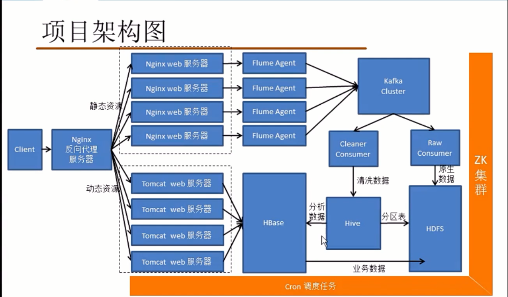
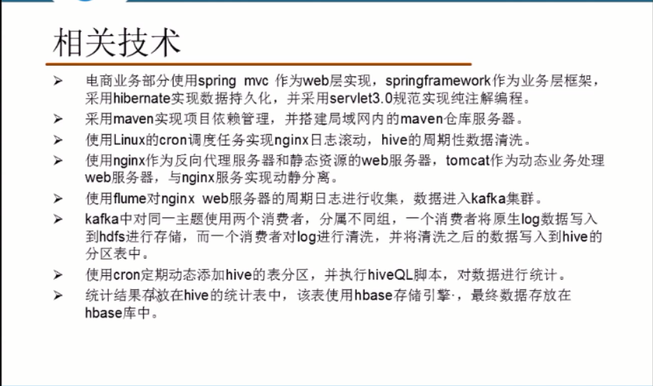

# 大数据电商项目

## 相关架构图



相关技术：



## 数据库

mysql> create database eshop ;

mysql> create table eshop.users(id int primary key auto_increment,name varchar(20),password varchar(20),regdate datetime,email varchar(20),nickname varchar(20)) ;


## win7 nginx （反向代理）

实现负载均衡

``` 

#user  nobody;
worker_processes  1;

#error_log  logs/error.log;
#error_log  logs/error.log  notice;
#error_log  logs/error.log  info;

#pid        logs/nginx.pid;


events {
    worker_connections  1024;
}


http {
    include       mime.types;
    default_type  application/octet-stream;

    #log_format  main  '$remote_addr - $remote_user [$time_local] "$request" '
    #                  '$status $body_bytes_sent "$http_referer" '
    #                  '"$http_user_agent" "$http_x_forwarded_for"';

    #access_log  logs/access.log  main;

    sendfile        on;
    #tcp_nopush     on;

    #keepalive_timeout  0;
    keepalive_timeout  65;

    #gzip  on;
	
	upstream nginx_servers{
		server 192.168.1.191:80 max_fails=2 fail_timeout=2 weight=1;
		server 192.168.1.192:80 max_fails=2 fail_timeout=2 weight=1;
	}

	upstream tomcat_servers{
		server 192.168.1.181:8080 weight=1;
		server 192.168.1.182:8080 weight=1;
	}

    server {
        listen       8888;
        server_name  localhost;
		access_log off ;
		location ~* \.(png|html|js|css)$ {
			proxy_set_header Host $http_host;
			proxy_pass http://nginx_servers;
		}
		location / {
		    proxy_set_header Host $http_host;
			proxy_pass http://tomcat_servers;
		}

    }


    # another virtual host using mix of IP-, name-, and port-based configuration
    #
    #server {
    #    listen       8000;
    #    listen       somename:8080;
    #    server_name  somename  alias  another.alias;

    #    location / {
    #        root   html;
    #        index  index.html index.htm;
    #    }
    #}


    # HTTPS server
    #
    #server {
    #    listen       443 ssl;
    #    server_name  localhost;

    #    ssl_certificate      cert.pem;
    #    ssl_certificate_key  cert.key;

    #    ssl_session_cache    shared:SSL:1m;
    #    ssl_session_timeout  5m;

    #    ssl_ciphers  HIGH:!aNULL:!MD5;
    #    ssl_prefer_server_ciphers  on;

    #    location / {
    #        root   html;
    #        index  index.html index.htm;
    #    }
    #}

}

```


## 在Liunx配置 Tomcat + nginx（web服务器）

### 在191 192 两台机器上配置nginx web服务器，负责处理静态服务器。

1、安装gcc
安装 nginx 需要先将官网下载的源码进行编译，编译依赖 gcc 环境，如果没有 gcc 环境，则需要安装：
[root@master1 ~]# yum install gcc-c++


2、PCRE pcre-devel 安装
PCRE(Perl Compatible Regular Expressions) 是一个Perl库，包括 perl 兼容的正则表达式库。nginx 的 http 模块使用 pcre 来解析正则表达式，所以需要在 linux 上安装 pcre 库，pcre-devel 是使用 pcre 开发的一个二次开发库。nginx也需要此库。命令：
[root@master1 ~]# yum install -y pcre pcre-devel


3、zlib 安装
zlib 库提供了很多种压缩和解压缩的方式， nginx 使用 zlib 对 http 包的内容进行 gzip ，所以需要在 Centos 上安装 zlib 库。
[root@master1 ~]# yum install -y zlib zlib-devel


4、OpenSSL 安装
OpenSSL 是一个强大的安全套接字层密码库，囊括主要的密码算法、常用的密钥和证书封装管理功能及 SSL 协议，并提供丰富的应用程序供测试或其它目的使用。
nginx 不仅支持 http 协议，还支持 https（即在ssl协议上传输http），所以需要在 Centos 安装 OpenSSL 库。
[root@master1 ~]# yum install -y openssl openssl-devel


5、下载解压
[root@master1 nginx]# tar -zxvf nginx-1.8.1.tar.gz 

6、安装
[root@master1 nginx-1.8.1]# ./configure
[root@master2 nginx-1.8.1]# make
[root@master2 nginx-1.8.1]# make install

//查看nginx安装目录
[root@master1 nginx-1.8.1]# whereis nginx
nginx: /usr/local/nginx


7、启动、停止nginx
[root@master2 nginx-1.8.1]# cd /usr/local/nginx/sbin/
[root@master2 sbin]# ./nginx 
[root@master2 sbin]# ./nginx -s stop              //停止nginx
[root@master2 sbin]# ./nginx	-t				     //检查配置是否正确
[root@master2 sbin]# ./nginx	-s reload		//重新加载配置文件


8、配置nginx

``` 
log_format  main  '$remote_addr - $remote_user [$time_local] "$request" '
                      '$status $body_bytes_sent "$http_referer" '
                      '"$http_user_agent" "$http_x_forwarded_for"';
					  
access_log  logs/access.log  main;

server {
        listen       80;
        server_name  192.168.1.191;

        #charset koi8-r;

        #access_log  logs/host.access.log  main;

        location / {
            root   html;
            index  index.html index.htm;
        }

        #error_page  404              /404.html;

        # redirect server error pages to the static page /50x.html
        #
        error_page   500 502 503 504  /50x.html;
        location = /50x.html {
            root   html;
        }

        # proxy the PHP scripts to Apache listening on 127.0.0.1:80
        #
        #location ~ \.php$ {
        #    proxy_pass   http://127.0.0.1;
        #}

        # pass the PHP scripts to FastCGI server listening on 127.0.0.1:9000
        #
        #location ~ \.php$ {
        #    root           html;
        #    fastcgi_pass   127.0.0.1:9000;
        #    fastcgi_index  index.php;
        #    fastcgi_param  SCRIPT_FILENAME  /scripts$fastcgi_script_name;
        #    include        fastcgi_params;
        #}

        # deny access to .htaccess files, if Apache's document root
        # concurs with nginx's one
        #
        #location ~ /\.ht {
        #    deny  all;
        #}
    }
```

9、部署静态资源到nginx集群

``` 
1.复制web目录到eshop目录

2.删除jsps和WEB-INF子目录，只留js+css|images|phone

3.将eshop js+css|images|phone 文件夹到所有nginx/html/下


```


### 在181 182 两台机器上配置 tomcat web服务器，负责处理动态资源。

将程序打包成jar，然后发布到tomcat服务器中就可以了；

## centos时钟同步

1、同步时钟
[root@master1 ~]# sudo yum install ntp
[root@salve1 ~]# sudo ntpdate ntp.sjtu.edu.cn                   //更新为互联网时间

2、设置时区
[root@salve1 ~]# sudo cp /usr/share/zoneinfo/Asia/Shanghai /etc/localtime

## 日志收集

### 使用centos的cron机制实现nginx的日志滚动。(调度)

* centos下的crontab指令是自带的，无需安装；
* crontab是Linux系统中最有用的工具之一，crontab定时任务是在指定时间执行指定任务；
* crontab在后台运行，通过配置 /etc/crontab 文件调度定时任务；

/etc/crontab：存放着系统运行的定时任务，可以这样查看：
[root@master2 ~]# cat /etc/crontab

1、实现nginx的日志滚动的脚本编写

/root/sh/rolllog.sh

``` 
#!/bin/bash
#
dataformat=`date +%Y-%m-%d-%H-%M`
#
cp /root/nginx/nginx-1.8.1/logs/access.log /root/nginx/nginx-1.8.1/logs/access_$dataformat.log
host=`hostname`
sed -i 's/^/'${host}',&/g' /root/nginx/nginx-1.8.1/logs/access_$dataformat.log
#
lines=`wc -l < /root/nginx/nginx-1.8.1/logs/access_$dataformat.log`
#move access-xxx.log flume's spooldir
mv /root/nginx/nginx-1.8.1/logs/access_$dataformat.log /root/nginx/nginx-1.8.1/logs/flume
# 删除第一行到lines行的日志
sed -i '1,'${lines}'d' /root/nginx/nginx-1.8.1/logs/access.log
# -USR1信号表示重读日志
kill -USR1 `cat /root/nginx/nginx-1.8.1/logs/nginx.pid`
```


2、修改脚本权限：
[root@master1 sh]# chmod 777 rolllog.sh


3、添加定时任务，每一分钟都产生文件

/etc/crontab

``` 
SHELL=/bin/bash
PATH=/sbin:/bin:/usr/sbin:/usr/bin:/root/sh
MAILTO=root

# For details see man 4 crontabs
# Example of job definition:
# .---------------- minute (0 - 59)
# |  .------------- hour (0 - 23)
# |  |  .---------- day of month (1 - 31)
# |  |  |  .------- month (1 - 12) OR jan,feb,mar,apr ...
# |  |  |  |  .---- day of week (0 - 6) (Sunday=0 or 7) OR sun,mon,tue,wed,thu,fri,sat
# |  |  |  |  |
# *  *  *  *  * user-name  command to be executed
*  *  *  *  * root rolllog.sh


```

4、启动crontab
[root@master1 logs]# sudo service crond restart

### kafka + flume集群搭建

1、修改flume文件夹权限为777；
[root@master1 sh]# chmod 777 /usr/local/nginx/logs/flume
[root@master2 sh]# chmod 777 /usr/local/nginx/logs/flume

2、启动zookeeper集群；
[root@salve1 bin]# ./zkServer.sh start
[root@salve2 bin]# ./zkServer.sh start
[root@salve3 bin]# ./zkServer.sh start

3、启动kafka集群，并创建主题eshop
[root@salve1 bin]# ./kafka-server-start.sh ../config/server.properties &
[root@salve2 bin]# ./kafka-server-start.sh ../config/server.properties &
[root@salve3 bin]# ./kafka-server-start.sh ../config/server.properties &

[root@salve2 bin]# ./kafka-topics.sh --zookeeper salve2:2181 --topic eshop --create --partitions 3 --replication-factor 3

4、使用spooldir做为source，监控 /usr/local/nginx/logs/flume文件夹；

191、192两台机器分别配置

/root/Flume/apache-flume-1.8.0-bin/conf/eshop.conf


``` 
a1.sources = r1
a1.channels = c1
a1.sinks = k1

a1.sources.r1.type = spooldir
a1.sources.r1.spoolDir = /usr/local/nginx/logs/flume
a1.sources.r1.fileHeader = true

a1.sinks.k1.type = org.apache.flume.sink.kafka.KafkaSink
a1.sinks.k1.kafka.topic = eshop
a1.sinks.k1.kafka.bootstrap.servers = salve1:9092 salve2:9092 salve3:9092

a1.channels.c1.type = memory

a1.sources.r1.channels = c1
a1.sinks.k1.channel = c1
```

5、启动191、192两台机器上的Flume
[root@master1 bin]# ./flume-ng agent -f ../conf/eshop.conf -n a1
[root@master2 bin]# ./flume-ng agent -f ../conf/eshop.conf -n a1


### 使用crond作业,周期添加表分区

生产环境中一般是一个月执行一次脚本。

``` 
[/usr/local/bin/addpar.sh]
#!/bin/bash
y=`date +%Y`
m=`date +%m`
d=`date +%d`
h=`date +%H`
mi=`date +%M`
hive -e "alter table eshop.logs add partition(year=${y},month=${m},day=${d},hour=${h},minute=${mi})"
```

### Load收集的数据到hive表中

load data inpath '/user/centos/eshop/cleaned/2017/3/2/9/28' into table eshop.logs  partition(year=2017,month=3,day=2,hour=9,minute=28);

### 创建统计结果表

### 将统计结果插入到结果表中

编写脚本，统计topN并将结果插入到hive表中
insert into stats select request,count(*) as c from logs where year = 2017 and month = 3 and day = 2 and hour = 9 and minute = 28 group by request order by c desc ;


 new Thread(){
            public void run() {
                HDFSRawConsumer consumer = new HDFSRawConsumer();
                consumer.processLog();
            }
        }.start();
		
		master1,192.168.1.190 - - [20/Mar/2019:07:20:29 +0800] "GET /eshop/phone/mi.html HTTP/1.0" 200 213 "-" "Mozilla/5.0 (Windows NT 10.0; WOW64) AppleWebKit/537.36 (KHTML, like Gecko) Chrome/71.0.3578.53 Safari/537.36" "-"
		
# 中国移动运营分析平台

## 创建Kafka主题

[root@salve1 bin]#  ./kafka-topics.sh --create --zookeeper salve1:2181 --replication-factor 3 --partitions 3 --topic JsonData


# 小牛学堂大数据24期实训实战

## 依赖包说明

### 解析conf配置文件

``` 
<dependency>
	<groupId>com.typesafe</groupId>
	<artifactId>config</artifactId>
	<version>1.3.1</version>
</dependency>
```

## 广告日志格式

广告ID(String)：id
省份名(String)：provincename
城市名(String)：cityname

``` 
0001 guangdong shenzhen
0002 guangdong guangzhou
0003 guangdong foshan
0004 gansu lanzhou
0005 gansu dingxi
0006 gansu wuwei

```

## 工具类

### String转换成Int、Double

``` 
package com.dongk.xiaoniu.shixun.util

object NBF {


    def toInt(str: String): Int = {
        try {
            str.toInt
        } catch {
            case _: Exception => 0
        }
    }

    def toDouble(str: String): Double = {
        try {
            str.toDouble
        } catch {
            case _: Exception => 0
        }

    }

}

```

### 将日志文件转换成parquet文件格式

hdfs://192.168.1.191/file/xiaoniu_log.log gzip hdfs://192.168.1.191/xiaoniu

``` 

```

## 实体类

### Log实体类

``` 
package com.dongk.xiaoniu.shixun.beans


class Log(val id: String,
          val provincename: String,
          val cityname: String
          ) extends Product with Serializable{

    // 角标和成员属性的映射关系
    override def productElement(n: Int): Any = n match {
        case 0	=> id
        case 1	=> provincename
        case 2	=> cityname
    }

    // 对象一个又多少个成员属性
    override def productArity: Int = 3

    // 比较两个对象是否是同一个对象
    override def canEqual(that: Any): Boolean = that.isInstanceOf[Log]
}


object Log {
    def apply(arr: Array[String]): Log = new Log(
        arr(0),
        arr(1),
        arr(2)
    )
}

```


## 统计各个省、市数据量分布情况（SQL）

我们将统计结果以json文件的格式存储到HDFS

hdfs://192.168.1.191/xiaoniu hdfs://192.168.1.191/xiaoniu_result

``` 
package com.dongk.xiaoniu.shixun.util

import com.dongk.xiaoniu.shixun.beans.Log
import org.apache.spark.rdd.RDD
import org.apache.spark.sql.SQLContext
import org.apache.spark.{SparkConf, SparkContext}

/**
  * 日志转成parquet文件格式
  *
  * 使用自定义类的方式构建schema信息
  */
object Biz2Parquet {

    def main(args: Array[String]): Unit = {

        // 0 校验参数个数
        if (args.length != 3) {
            println(
                """
                  |cn.dmp.tools.Bzip2Parquet
                  |参数：
                  | logInputPath
                  | compressionCode <snappy, gzip, lzo>
                  | resultOutputPath
                """.stripMargin)
            sys.exit()
        }

        // 1 接受程序参数
        val Array(logInputPath, compressionCode,resultOutputPath) = args

        // 2 创建sparkconf->sparkContext
        val sparkConf = new SparkConf()
        sparkConf.setAppName(s"${this.getClass.getSimpleName}")
        sparkConf.setMaster("local[*]")
        // RDD 序列化到磁盘 worker与worker之间的数据传输
        sparkConf.set("spark.serializer", "org.apache.spark.serializer.KryoSerializer")
        // 注册自定义类的序列化方式
        sparkConf.registerKryoClasses(Array(classOf[Log]))

        val sc = new SparkContext(sparkConf)

        val sQLContext = new SQLContext(sc)
        sQLContext.setConf("spark.sql.parquet.compression.codec", compressionCode)

        // 读取日志文件
        val dataLog: RDD[Log] = sc.textFile(logInputPath)
          .map(line => {
              val arr = line.split(" ")
              Log(arr)
          })

        val dataFrame = sQLContext.createDataFrame(dataLog)

        // 按照省份名称及地市名称对数据进行分区
        dataFrame.write.partitionBy("provincename", "cityname").parquet(resultOutputPath)

        sc.stop()

    }


}

```

