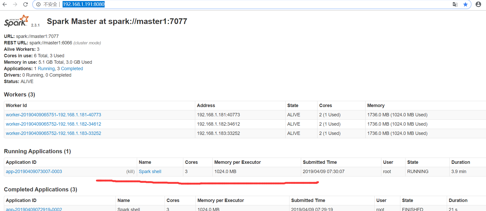
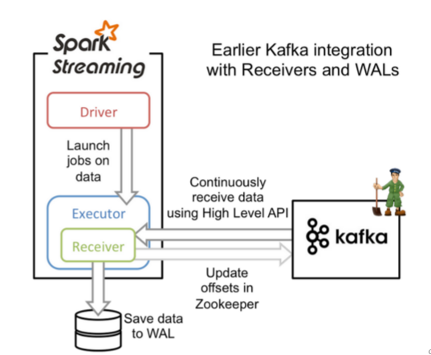

# Spark 有哪些模块？

  - Spark Core：核心库，通用的执行引擎
  - Spark SQL：SQL，可以支持 MySql、Hive等
  - Spark Streaming：流计算，适用于小批量的计算
  - Spark MLlib：机器学习库
  - Spark graph：图计算
 
# Spark 安装模式有哪些？    
   
  - local：本地模式
  - standalone：独立模式
  - yarn：yarn模式
  - mesos：mesos

# Spark的特点？
  
 - 快速：在内存中存储中间结果。
 - 支持多语言：Spark 提供了 Java Scala Python等流行语言的支持。
 - 内置了80+的算子。

# Spark的安装
	  
## Spark 集群搭建（独立模式，和 Hadoop 没有一点关系）

192.168.1.191 : master 节点

192.168.1.181（salve1） : worker 节点

192.168.1.182（salve2） : worker 节

192.168.1.183（salve3）: worker 节点


1、配置 master节点的 slaves。

``` 
salve1
salve2
salve3
```
2、拷贝Spark安装目录到其它的节点。

``` 
 >scp -r spark-2.3.1-bin-hadoop2.6/  root@192.168.1.181:/root/Spark
 >scp -r spark-2.3.1-bin-hadoop2.6/  root@192.168.1.182:/root/Spark
 >scp -r spark-2.3.1-bin-hadoop2.6/  root@192.168.1.183:/root/Spark
```
 
 3、配置其它主机的所有环境变量。
 
``` 
 ##SCALA
 SCALA_HOME=/root/Scala/scala-2.11.12
 export PATH=$PATH:$SCALA_HOME/bin

 ##Spark
 SPARK_HOME=/root/Spark/spark-2.3.1-bin-hadoop2.6
 export  PATH=$PATH:SPARK_HOME/bin:SPARK_HOME/sbin
```

4、启动Spark集群

``` 
  >start-all.sh

 在启动中如果出现错误 "salve1:   JAVA_HOME is not set", 则在 sbin/spark-config.sh 文件中添加JAVA_HOME: 
    
 export JAVA_HOME=/root/java/jdk1.8.0_25
```

5、验证 Spark 集群是否启动成功

http://192.168.1.191:8080/

# Spark中master、worker、executor和driver的关系

首先说一句，master和worker是物理节点，driver和executor是进程。

搭建spark集群的时候我们就已经设置好了master节点和worker节点，一个集群有多个master节点和多个worker节点。

PS：一台机器可以同时作为master和worker节点（举个例子：你有四台机器，你可以选择一台设置为master节点，然后剩下三台设为worker节点，也可以把四台都设为worker节点，这种情况下，有一个机器既是master节点又是worker节点）。

## Task

Task(任务)：RDD中的一个分区对应一个task，task是单个分区上最小的处理流程单元。

## TaskSet

TaskSet(任务集)：一组关联的，但相互之间没有Shuffle依赖关系的Task集合。

## Stage(调度阶段)

Stage(调度阶段)：一个taskSet对应的调度阶段，每个job会根据RDD的宽依赖关系被切分很多Stage，每个stage都包含 一个TaskSet。

## job(作业)

job(作业)：由Action算子触发生成的由一个或者多个stage组成的计算作业。

## DAGScheduler

DAGScheduler：根据job构建基于stage的DAG，并提交stage给TaskScheduler。

## TaskScheduler

TaskScheduler:将Taskset提交给Worker Node集群运行并返回结果。

## master

master节点常驻master守护进程，负责管理worker节点，我们从master节点提交应用。

## worker

worker节点常驻worker守护进程，与master节点通信，并且管理executor进程。

## executor

driver可以运行在master上，也可以运行worker上（根据部署模式的不同）。driver首先会向集群管理者（standalone、yarn，mesos）申请spark应用所需的资源，也就是executor，然后集群管理者会根据spark应用所设置的参数在各个worker上分配一定数量的executor，每个executor都占用一定数量的cpu和memory。在申请到应用所需的资源以后，driver就开始调度和执行我们编写的应用代码了。driver进程会将我们编写的spark应用代码拆分成多个stage，每个stage执行一部分代码片段，并为每个stage创建一批tasks，然后将这些tasks分配到各个executor中执行。

executor进程宿主在worker节点上，一个worker可以有多个executor。每个executor持有一个线程池，每个线程可以执行一个task，executor执行完task以后将结果返回给driver，每个executor执行的task都属于同一个应用。此外executor还有一个功能就是为应用程序中要求缓存的 RDD 提供内存式存储，RDD 是直接缓存在executor进程内的，因此任务可以在运行时充分利用缓存数据加速运算。

## driver

用户提交的程序运行起来就是一个driver，他是一个特殊的excutor进程，这个进程除了一般excutor都具有的运行环境外，这个进程里面运行着DAGscheduler Tasksheduler Schedulerbackedn等组件。

Driver做了什么？

1、运行应用程序的main函数；
2、创建spark的上下文；
3、划分RDD并生成有向无环图（DAGScheduler）；
4、与spark中的其他组进行协调，协调资源等等（SchedulerBackend）；
5、生成并发送task到executor（taskScheduler）；


# Spark RDD和DAG

## RDD

RDD（Resilient Distributed Dataset）叫做弹性分布式数据集，是Spark中最基本的数据抽象；
它代表一个不可变、可分区、里面的元素可并行计算的集合；
RDD具有数据流模型的特点：自动容错、位置感知性调度和可伸缩性；

**RDD的五大特性：**

1、有一个分片列表，能够被切分，就是和Hadoop一样，能被切分的数据才能并行操作。
2、有一个函数计算每一个分片，compute函数。
3、对其他的RDD的依赖列表，依赖又分为宽依赖和窄依赖，但不是所有的RDD都有依赖。
4、可选，key-value型的RDD是根据哈希来分区的，类似于mapreduce的Paritioner接口，控制key分配到哪个reduce.
5、可选：每一个分片的优先计算位置（preferred locations），比如HDFS的block的所在位置应该是优先计算的位置。

## DAG

RDD算子构建了RDD之间的关系，整个计算过程形成了一个由RDD和关系构成的DAG。

## DAG的好处

比较hadoop，每执行一个map或reduce都要开启一个新的进程，是不是很耗时，但是在spark中通过划分RDD的依赖关系，可以让多个窄依赖在一个线程中以流水线执行，快速且节省资源。

DAG将一个job根据宽依赖划分多个stage，一个stage的父stage都执行完才能开始执行，通过这样有逻辑地执行任务可以避免冗余操作，合理安排执行顺序，大大节约了时间。

# RDD宽依赖和窄依赖

介绍下宽依赖（发生shuffle）和窄依赖（不发生shuffle）


## 窄依赖（也叫narrow依赖）

如上图左图：

从父RDD角度看：一个父RDD只被一个子RDD分区使用。父RDD的每个分区最多只能被一个Child RDD的一个分区使用

从子RDD角度看:依赖上级RDD的部分分区，精确知道依赖的上级RDD分区，会选择和自己在同一节点的上级RDD分区，没有网络IO开销，高效。

对应的RDD方法包括：
map
mapValues
flatMap
filter
mapPartitions
mapPartitionsWithIndex

## 宽依赖（也叫shuffle依赖/wide依赖）

从父RDD角度看：一个父RDD被多个子RDD分区使用。父RDD的每个分区可以被多个Child RDD分区依赖

从子RDD角度看:依赖上级RDD的所有分区     无法精确定位依赖的上级RDD分区，相当于依赖所有分区（例如reduceByKey）  计算就涉及到节点间网络传输。

对应的RDD方法包括：
cogroup
groupWith
join
leftOuterJoin
rightOuterJoin
groupByKey
reduceByKey
combineByKey
distinct
intersection
repartition
coalesce

## Spark之所以将依赖分为narrow和 shuffle：

(1)、 narrow dependencies可以支持在同一个集群Executor上，以pipeline管道形式顺序执行多条命令，例如在执行了map后，紧接着执行filter。分区内的计算收敛，不需要依赖所有分区的数据，可以并行地在不同节点进行计算。所以它的失败恢复也更有效，因为它只需要重新计算丢失的parent partition即可。

(2)、shuffle dependencies 则需要所有的父分区都是可用的，必须等RDD的parent partition数据全部ready之后才能开始计算，可能还需要调用类似MapReduce之类的操作进行跨节点传递。从失败恢复的角度看，shuffle dependencies 牵涉RDD各级的多个parent partition。


# Spark Stage的划分

Spark Stage的划分是根据依赖关系来决定的：

其实区分宽窄依赖主要就是看父RDD的一个Partition的流向，要是流向一个的话就是窄依赖，流向多个的话就是宽依赖。看图理解：


**Stage概念**

Spark任务会根据RDD之间的依赖关系，形成一个DAG有向无环图，DAG会提交给DAGScheduler，DAGScheduler会把DAG划分相互依赖的多个stage，划分stage的依据就是RDD之间的宽窄依赖。遇到宽依赖就划分stage,每个stage包含一个或多个task任务。然后将这些task以taskSet的形式提交给TaskScheduler运行。     stage是由一组并行的task组成。

**stage切割规则**
 
切割规则：从后往前，遇到宽依赖就切割stage。


上图
RDDA 独立划分为一个阶段；
RDDC、RDDE、RDDE、RDDF 划分为一个阶段；
RDDB、RDDG 划分为一个阶段；

# Spark 三种运行模式

## standalone
	  

# Spark Shell

**启动Spark Shell**

//--master 表示master节点，如果是高可用，可以用逗号分割开来
// --executor-memory 表示每个executor的大小， 这个值不应该超过worker节点的总内存
//  --total-executor-cores 表示总共有多少个executor，这个值不应该超过worker节点数
[root@master1 bin]# ./spark-shell --master spark://master1:7077 --executor-memory 1g --total-executor-cores 3

## 查看帮助

 scala>:help


## 命令补齐 【后面加Tab键】

scala>sc.	


## 使用Spark 实现World count

1. 加载文件，使用换行符切合文本（文本的行组成的集合）。

scala> val rdd1 = sc.textFile("/home/dongk/world.txt");

2. 按照空格切割每一行数据

scala> val rdd2 = rdd1.flatMap(line => line.split(" "));

3. 将每个单词变换成 key-value 对 ， key是对应的单词， value是1。

scala> val rdd3 = rdd2.map(world=>(world,1));

4. 聚合【相同的key加在一起】, "_" 表示对每个元素的引用。

scala> val rdd4 = rdd3.reduceByKey(_ + _);

5. 查看rdd4的结果

scala> rdd4.collect
	
	
## 提交作业到Spark环境运行。

1. 利用Maven 将程序打成jar包。

2. spark-submit 命令帮助

>./spark-submit --help

3. 在Spark环境运行作业
>./spark-submit --master local --name WordCount --class com.spark.wordcount.JavaWorldCountDemo /home/dongk/jar/spark01-wordcount-0.0.1-SNAPSHOT.jar
   
**注释: Spark 2.1.0 版本是基于Scala 2.11.8 版本的， 因此需要安装 Scala 2.11.8；否则会出现找不到包的问题。**

## 提交作业到 Spark 完全分布式中。

1、启动 Hadoop 集群。

 > cd /root/Hadoop/hadoop-2.6.2/sbin/
 > ./start-all.sh 

2、put 文件到 HDFS 。

 >hadoop fs -copyFromLocal /root/jar/wordCount.txt  /root/wordCount.txt

3、运行 spark-submit 。

> ./spark-submit --name WordCount --class com.spark.wordcount.JavaWorldCountDemo /root/jar/spark01-wordcount-0.0.1-SNAPSHOT.jar hdfs://Master1:8020/root/wordCount.txt

# Spark计算Word Count

**pom.xml**

``` 
<dependencies>

        <!-- https://mvnrepository.com/artifact/org.apache.spark/spark-core -->
        <dependency>
            <groupId>org.apache.spark</groupId>
            <artifactId>spark-core_2.11</artifactId>
            <version>2.3.1</version>
        </dependency>

    </dependencies>
```

**WorldCountDemo.scala**

``` 
package com.dongk.spark

import org.apache.spark.SparkConf
import org.apache.spark.SparkContext

object WorldCountDemo {
     
  def main(args : Array[String]) : Unit = {
         // 创建Spark 配置对象
         val conf = new SparkConf();   
         conf.setAppName("WordCountSpark");
         conf.setMaster("local");      //设置maste属性，下面我们设置为在本地运行
         
         //通过conf创建 Spark 上下文。
         val sc = new SparkContext(conf);
         
         //加载文本文件
         val rdd1 = sc.textFile("file:///root/mr/temperature.txt");
         //val rdd1 = sc.textFile(args(0));
         
         //根据 " " 切割行，并做扁平化操作
         val rdd2 = rdd1.flatMap(line => line.split(" "));
         
         //映射
         val rdd3 = rdd2.map(word => (word,1));
         
         //聚合
         val rdd4 = rdd3.reduceByKey(_ + _);
         
         val r = rdd4.collect();
         
         r.foreach(println);
         
         
  }
  
}
```
# Spark 编程

## Spark编程接口

Spark 中提供了通用接口来抽象每个RDD,这些接口包括：

* 分区信息，它们是数据集的最小分片；
* 依赖关系，指向其父RDD；
* 函数，基于父RDD的计算方法；
* 划分策略和数据位置的元数据。例如：一个HDFS文件的RDD讲文件的每个文件块表示为一个分区；

### RDD分区

我们可以显式的设置RDD的分区数，并且用户可以使用Partitions方法获取RDD划分的分区数。

``` 

```


# spark中reparation和coalesce的用法和区别

## 简介

``` 
package com.dongk.spark

import org.apache.spark.{SparkConf, SparkContext}

object RDDPartition {
  def main(args: Array[String]): Unit = {
    val conf = new SparkConf().setAppName("localTest").setMaster("local[2]")
    val sc = new SparkContext(conf)
    val rdd1 = sc.parallelize(List("hello","jason","jim","vin"),5)
    println(rdd1.partitions.length)  //输出5
    val rdd3 = rdd1.repartition(10)
    println(rdd3.partitions.length)  //输出10
    val rdd4 = rdd1.coalesce(10,true)
    println(rdd4.partitions.length)  //输出10
  }
}

```

从上面的demo中可以看到coalesce和repartition都是用来对RDD的分区重新划分的。

从源码中可以看出repartition方法其实就是调用了coalesce方法,shuffle为true的情况(默认shuffle是fasle).现在假设RDD有X个分区,需要重新划分成Y个分区.

1、如果x<y,说明x个分区里有数据分布不均匀的情况,利用HashPartitioner把x个分区重新划分成了y个分区,此时,需要把shuffle设置成true才行,因为如果设置成false,不会进行shuffle操作,此时父RDD和子RDD之间是窄依赖,这时并不会增加RDD的分区.

2.如果x>y,需要先把x分区中的某些个分区合并成一个新的分区,然后最终合并成y个分区,此时,需要把coalesce方法的shuffle设置成false.

总结:如果想要增加分区的时候,可以用repartition或者coalesce,true都行,但是一定要有shuffle操作,分区数量才会增加,为了让该函数并行执行，通常把shuffle的值设置成true。

## 应用场景

默认情况下，经过了这种filter之后，RDD中的每个partition的数据量，可能都不太一样了。（原本每个partition的数据量可能是差不多的）


每个partition数据量变少了，但是在后面进行处理的时候，还是要跟partition数量一样数量的task，来进行处理；有点浪费task计算资源。

每个partition的数据量不一样，会导致后面的每个task处理每个partition的时候，每个task要处理的数据量就不同，这个时候很容易发生什么问题？数据倾斜。。。。

我们可以调用coalesce压缩分区。

# Spark RDD常用方法


## parallelize

将一个存在的集合，变成一个RDD。这种方式适用于学习spark和做一些spark的测试；

``` 
第一个参数一是一个 Seq集合
第二个参数分区数

var array = List(1, 2, 3, 4, 5, 6, 7, 8)
var rdd = sc.parallelize(array，3)
```

## makeRDD

只有scala版本的才有makeRDD ，跟parallelize类似，单只接受一个参数。

``` 
var array = List(1, 2, 3, 4, 5, 6, 7, 8)
var rdd = sc.makeRDD(array)
```

## map

map()是将函数用于RDD中的每个元素，将返回值构成新的RDD。

``` 
val rdd = spark.sparkContext
      .textFile("/root/file/emp-forSpark.txt")
      .map(w => w.split(" "))
```

## flatMap

扁平化操作
源：RDD[Array[String]]
flatMap操作之后变为： RDD[String]

``` 
package com.dongk.test

import org.apache.spark.{SparkConf, SparkContext}

object test001 {

  def main(args: Array[String]): Unit = {

    val conf = new SparkConf().setAppName("localTest").setMaster("local[2]")
    val sc = new SparkContext(conf)
    val rdd1 = sc.parallelize(List(List("a b c","a b b"),List("d e f","d e e"),List("g h i","a b b")));
    val rdd2 = rdd1.flatMap(_.flatMap(_.split(" ")))
    rdd2.foreach( (x:String) => print(x + ","))   //d,a,b,e,c,a,f,d,e,e,b,b,g,h,i,a,b,b,
	
  }


}

```

## union

将两个RDD合并成一个RDD

``` 
package com.dongk.test

import org.apache.spark.{SparkConf, SparkContext}

object test002 {
  def main(args: Array[String]): Unit = {
    val conf = new SparkConf().setAppName("localTest").setMaster("local[2]")
    val sc = new SparkContext(conf)

    val rdd1 = sc.parallelize(List("a","b","c"));
    val rdd2 = sc.parallelize(List("d","e","f"));
    val rdd3 = rdd1.union(rdd2);
    rdd3.foreach(x => print(x + ","))   //a,b,c,d,e,f,
  }
}

```

## intersection

两个RDD的交集intersection

``` 
package com.dongk.test

import org.apache.spark.{SparkConf, SparkContext}

object test003 {
  def main(args: Array[String]): Unit = {
    val conf = new SparkConf().setAppName("localTest").setMaster("local[2]")
    val sc = new SparkContext(conf)

    val rdd1 = sc.parallelize(List("a","b","c","d"));
    val rdd2 = sc.parallelize(List("d","e","f"));
    val rdd3 = rdd1.intersection(rdd2);    //d,
    rdd3.foreach(x => print(x + ","))
  }
}

```

## join

将两个RDD连接起来

``` 
package com.dongk.test

import org.apache.spark.{SparkConf, SparkContext}

object test004 {
  def main(args: Array[String]): Unit = {
    val conf = new SparkConf().setAppName("localTest").setMaster("local[2]")
    val sc = new SparkContext(conf)

    val rdd1 = sc.parallelize(List(("1","tom"),("2","Jerry"),("3","Baby")));
    val rdd2 = sc.parallelize(List(("1","tom"),("2","Jerry"),("3","Hellen")));
    val rdd3 = rdd1 join rdd2
    rdd3.foreach(println)
  }
}

```

输出结果如下：

(3,(Baby,Hellen))
(2,(Jerry,Jerry))
(1,(tom,tom))

## saveAsTextFile

保存文件到存储系统

``` 
package com.dongk.test

import org.apache.spark.{SparkConf, SparkContext}

object test004 {
  def main(args: Array[String]): Unit = {
    val conf = new SparkConf().setAppName("localTest").setMaster("local[2]")
    val sc = new SparkContext(conf)

    val rdd1 = sc.parallelize(List(("1","tom"),("2","Jerry"),("3","Baby")));
    val rdd2 = sc.parallelize(List(("1","tom"),("2","Jerry"),("3","Hellen")));
    val rdd3 = rdd1 join rdd2
    rdd3.saveAsTextFile("hdfs://192.168.1.191/file/test004.txt")
  }
}

```
## zip

``` 
package com.dongk.test

import org.apache.spark.{SparkConf, SparkContext}

object RDDZipMain {

  def main(args: Array[String]): Unit = {

    val conf = new SparkConf().setAppName("localTest").setMaster("local[2]")
    val sc = new SparkContext(conf)
    val rdd1 = sc.parallelize(List("Jerroy","Hellen","Aramize","Lesize","Contri","Luru","Biana","Apple","Banana"),3)
    val rdd2 = sc.parallelize(List(1,2,3,4,5,6,7,8,9),3)

    //zip函数用于将两个RDD组合成Key/Value形式的RDD;
    //这里默认两个RDD的partition数量以及元素数量都相同，否则会抛出异常。
    val rdd3 = rdd2.zip(rdd1)

    //输出结果：(1,Jerroy)(2,Hellen)(4,Lesize)(3,Aramize)(5,Contri)(6,Luru)(7,Biana)(8,Apple)(9,Banana)
    rdd3.foreach(print)

  }

}

```

## combineByKey

1、使用combineByKey求单词个数

``` 

```

# Spark Cache

## 一个小例子说明cache对性能的重要

在Spark shell中如下操作

scala> val rdd1 = sc.textFile("hdfs://master1/file/teacher.log")
scala> rdd1.count
scala> rdd1.cache
scala> rdd1.count

通过WEB UI 查看运行的Spark Shell


通过WEB UI查看count操作缓存前后的运行效率


通过WEB UI 查看缓存


# Spark Shuffle原理及调优


shuffle对性能的影响

shuffle会消耗大量的堆内存

# SparkSession和SparkContext

SparkSession是Spark 2.0引如的新概念。SparkSession为用户提供了统一的切入点，来让用户学习spark的各项功能。 

在spark的早期版本中，SparkContext是spark的主要切入点，由于RDD是主要的API，我们通过sparkcontext来创建和操作RDD。对于每个其他的API，我们需要使用不同的context。例如，对于Streming，我们需要使用StreamingContext；对于sql，使用sqlContext；对于Hive，使用hiveContext。但是随着DataSet和DataFrame的API逐渐成为标准的API，就需要为他们建立接入点。所以在spark2.0中，引入SparkSession作为DataSet和DataFrame API的切入点，SparkSession封装了SparkConf、SparkContext和SQLContext。为了向后兼容，SQLContext和HiveContext也被保存下来。 
　　 
SparkSession实质上是SQLContext和HiveContext的组合（未来可能还会加上StreamingContext），所以在SQLContext和HiveContext上可用的API在SparkSession上同样是可以使用的。SparkSession内部封装了sparkContext，所以计算实际上是由sparkContext完成的。

# Spark SQL

## Hive + Spark SQL + DataFrame 组合

Hive + Spark SQL + DataFrame 是目前国内主流的大数据组合技术。

Hive : 负责低成本的数据仓库存储；
Spark SQL : 负责高速的计算；
DataFrame：负责复杂的数据挖掘；

## DataFrame

1. DataFrame是一个分布式的面向列组成的数据集，类似于关系型数据库中的表；
2. DataFrame的来源有结构化文件、Hive中的Table、外部数据库、RDD转换而来；

## DataFrame和 RDD的区别

RDD：以Record为单位，Spark优化的时候无法了解Record内部的细节，所以无法进行深度优化，极大限制了Spark的性能；
DataFrame: 以列为单位，可以基于列内部进行优化，从而提高性能；

## 通过结构化文件创建DataFrame

**1. 创建数据文件**
     
员工信息 -> people.json
	 
``` 
{"name":"Michael","job number":"001","age":33,"gender":"male","depId":1,"salary":3000}
{"name":"Andy","job number":"002","age":19,"gender":"female","depId":2,"salary":4000}
{"name":"Justin","job number":"003","age":32,"gender":"male","depId":3,"salary":5000}
{"name":"John","job number":"004","age":53,"gender":"male","depId":1,"salary":6000}
{"name":"Herry","job number":"005","age":23,"gender":"female","depId":2,"salary":7000}
{"name":"Jack","job number":"006","age":34,"gender":"male","depId":3,"salary":3000}
```
	 
新增员工 -> newPeople.json

``` 
{"name":"John","job number":"007","age":33,"gender":"male","depId":1,"salary":4000}
{"name":"Herry","job number":"008","age":19,"gender":"female","depId":2,"salary":6000}
{"name":"Jack","job number":"009","age":32,"gender":"male","depId":3,"salary":5000}
```

部门信息 -> department.json

``` 
{"name":"Development Department","depId":1}
{"name":"Personnel Department","depId":2}
{"name":"Testing Department","depId":3}
```
	 
**2. 上传文件到HDFS系统**	

[root@master1 bin]# hdfs dfs -put /root/file/person.json /root/person.json
[root@master1 bin]# hdfs dfs -put /root/file/newPerson.json /root/newPerson.json
[root@master1 bin]# hdfs dfs -put /root/file/department.json /root/department.json

**3. 启动Spark Shell**

[root@master1 sbin]# ./start-all.sh
[root@master1 bin]# ./spark-shell --master spark://master1:7077

**4. 加载文件生成DataFrame**

生成DataFrame有两种方式：

scala> val sqlContext = new org.apache.spark.sql.SQLContext(sc)
//方式一
scala> val person = sqlContext.jsonFile("hdfs://master1/root/person.json")
//方式二
scala> val dept = sqlContext.load("hdfs://master1/root/department.json","json")

**5.查看DataFrame信息**

scala> person.show
+---+-----+------+----------+-------+------+
|age|depId|gender|job number|   name|salary|
+---+-----+------+----------+-------+------+
| 33|    1|  male|       001|Michael|  3000|
| 19|    2|female|       002|   Andy|  4000|
| 32|    3|  male|       003| Justin|  5000|
| 53|    1|  male|       004|   John|  6000|
| 23|    2|female|       005|  Herry|  7000|
| 34|    3|  male|       006|   Jack|  3000|
+---+-----+------+----------+-------+------+

# RDD转换成DataFrame的两种方式

**方式一：第一种方式是使用反射的方式**

用反射去推倒出来RDD里面的schema。这个方式简单，但是不建议使用，因为在工作当中，使用这种方式是有限制的。
对于以前的版本来说，case class最多支持22个字段如果超过了22个字段，我们就必须要自己开发一个类，实现product接口才行。因此这种方式虽然简单，但是不通用；因为生产中的字段是非常非常多的，是不可能只有20来个字段的。

``` 
private def reflection(spark: SparkSession) = {
    val rdd = spark.sparkContext
      .textFile("/root/file/emp-forSpark.txt")
      .map(w => w.split(" "))

    import spark.implicits._

    val empDF = rdd.map(line =>
      EMP(line(0), line(1), line(2), line(3),
        line(4), line(5), line(6), line(7))).toDF()

    //RDD隐式转换为DataFrame
    empDF.printSchema()
    empDF.show()
  }
```

**方式二：第二种方式是利用编程的方式**

创建一个DataFrame，使用编程的方式 这个方式用的非常多。通过编程方式指定schema ，对于第一种方式的schema其实定义在了case class里面了。

``` 
def program(spark: SparkSession) = {
    val infoRdd = spark.sparkContext
      .textFile("/root/file/emp-forSpark.txt")
      .map(w => w.split(" "))
      .map(line => Row(line(0), line(1), line(2), line(3), line(4), line(5), line(6), line(7)))


    val filedName = Array(
        StructField("empNo", StringType, true)
      , StructField("ename", StringType, true)
      , StructField("job", StringType, true)
      , StructField("mgr", StringType, true)
      , StructField("hireDate", StringType, true)
      , StructField("sal", StringType, true)
      , StructField("comm", StringType, true)
      , StructField("deptNo", StringType, true))

    val schema = StructType(filedName)
    val empDf = spark.createDataFrame(infoRdd, schema)

    empDf.printSchema()
    empDf.show(false)
    
	//保存查询结果
    empDf.coalesce(1)
       .write.format("json")
       .mode(SaveMode.Overwrite)
       .partitionBy("deptno")
       .save("/root/file/emp-jsonTable")
  }
```

# DataFrame常用方法


# Spark Stream

## Spark Streaming 和 Storm有什么区别

Storm:
严格意义上的实时计算框架，可以动态的调整并发度(Spark Streaming是无法动态的调整并行度的)。

Spark Streaming：
准实时计算框架，采用批处理的方式处理数据(比如1秒钟计算一次)，因此相对于Storm而言其吞吐量较大；
并且Spark Streaming提供了map、reduce等复杂操作，这些是storm无法比拟的；

## DStream、Receiver 以及其工作原理

### DStream

DStream 是 spark streaming 提供的一种高级抽象，代表了一个持续不断的数据流。

DStream 内部其实不断产生 RDD，每个 RDD 包含了一个时间段的数据。

Spark streaming 一定是有一个输入的 DStream 接收数据，按照时间划分成一个一个的batch，并转化为一个 RDD，RDD 的数据是分散在各个子节点的 partition 中。

DStream 数据来源：
1、通过输入数据源来创建，比如 Kafka、flume 等；
2、通过其他 DStream 的高阶函数来创建，比如 map、reduce、join 和 window 等；

DStream 通过 StreamingContext创建，且一个JVM只能有一个 StreamingContext创建。

### Receiver

Receiver：receiver是接受者，从source接受数据，存储在内存中共spark处理。

## Spark Streaming 计算 word count

数据源来自socket套接字

1、maven 依赖

``` 
<dependency>
            <groupId>org.apache.spark</groupId>
            <artifactId>spark-streaming_2.11</artifactId>
            <version>2.3.1</version>
	</dependency>
```

2、编写程序

下面我们使用本地模式运行程序，至少需要开2个线程；一个用来接收数据，一个用来计算。

**scala 版**

``` 
package com.dongk.spark.streaming

import org.apache.spark.SparkConf
import org.apache.spark.streaming.{Seconds, StreamingContext}

object streamingwordcount {
  def main(args: Array[String]): Unit = {
    //local[n] n > 1
    val conf = new SparkConf().setMaster("local[2]").setAppName("NetworkWordCount")
    //创建Spark流上下文,批次时长是1s
    val ssc = new StreamingContext(conf, Seconds(10))

    //创建socket文本流
    val lines = ssc.socketTextStream("localhost", 9999)
    //压扁
    val words = lines.flatMap(_.split(" "))
    //变换成对偶
    val pairs = words.map((_,1));

    val count = pairs.reduceByKey(_+_) ;
    count.print()

    //启动
    ssc.start()

    //等待结束
    ssc.awaitTermination()
  }
}

```

**java 版**

``` 
package com.dongk.spark.streaming;

import org.apache.spark.SparkConf;
import org.apache.spark.api.java.Optional;
import org.apache.spark.api.java.function.FlatMapFunction;
import org.apache.spark.api.java.function.Function2;
import org.apache.spark.api.java.function.PairFunction;
import org.apache.spark.streaming.Seconds;
import org.apache.spark.streaming.api.java.JavaDStream;
import org.apache.spark.streaming.api.java.JavaPairDStream;
import org.apache.spark.streaming.api.java.JavaReceiverInputDStream;
import org.apache.spark.streaming.api.java.JavaStreamingContext;
import scala.Tuple2;

import java.util.ArrayList;
import java.util.Iterator;
import java.util.List;

public class javastreamingwordcount {
    public static void main(String args[]) throws InterruptedException {
        SparkConf conf = new SparkConf();
        conf.setAppName("wc");
        conf.setMaster("local[4]");
        //创建Spark流应用上下文
        JavaStreamingContext jsc = new JavaStreamingContext(conf, Seconds.apply(10));

        jsc.checkpoint("file:///d:/scala/check");
        //创建socket离散流
        JavaReceiverInputDStream sock = jsc.socketTextStream("localhost",9999);
        //压扁
        JavaDStream<String> wordsDS = sock.flatMap(new FlatMapFunction<String,String>() {
            public Iterator call(String str) throws Exception {
                List<String> list = new ArrayList<String>() ;
                String[] arr = str.split(" ");
                for(String s : arr){
                    list.add(s);
                }
                return list.iterator();
            }
        });

        //映射成元组
        JavaPairDStream<String,Integer> pairDS = wordsDS.mapToPair(new PairFunction<String, String, Integer>() {
            public Tuple2<String, Integer> call(String s) throws Exception {
                return new Tuple2<String,Integer>(s,1);
            }
        }) ;

        JavaPairDStream<String,Integer> jps = pairDS.updateStateByKey(new Function2<List<Integer>, Optional<Integer>, Optional<Integer>>() {
            public Optional<Integer> call(List<Integer> v1, Optional<Integer> v2) throws Exception {
                Integer newCount = v2.isPresent() ? v2.get() : 0  ;

                System.out.println("old value : " + newCount);
                for(Integer i : v1){
                    System.out.println("new value : " + i);
                    newCount = newCount +  i;
                }
                return Optional.of(newCount);
            }
        });


        //聚合
        JavaPairDStream<String,Integer> countDS = jps.reduceByKey(new Function2<Integer, Integer, Integer>() {
            public Integer call(Integer v1, Integer v2) throws Exception {
                return v1 + v2;
            }
        });


        //打印
        countDS.print();

        jsc.start();

        jsc.awaitTermination();

        jsc.stop();
    }
}

```

3、启动nc服务器

root@ubuntu:~# nc -lk 9999

4、启动spark streaming程序

5、在nc服务器输入word, 在IDEA控制台查看计算结果


## 集成kafka

### Receiver方式

Received是使用Kafka高级Consumer API实现的。与所有接收器一样，从Kafka通过Receiver接收的数据存储在Spark Executor的内存中，然后由Spark Streaming启动的job来处理数据。然而默认配置下，这种方式可能会因为底层的失败而丢失数据。

如果要启用高可靠机制，确保零数据丢失，要启用Spark Streaming的预写日志机制（Write Ahead Log，（已引入）在Spark 1.2）。该机制会同步地将接收到的Kafka数据保存到分布式文件系统（比如HDFS）上的预写日志中，以便底层节点在发生故障时也可以使用预写日志中的数据进行恢复。

如下图：


因为这种方式不是经常使用，我们这里不做介绍。

### Direct方式

在spark1.3之后，引入了Direct方式。不同于Receiver的方式，Direct方式没有receiver这一层，其会周期性的获取Kafka中每个topic的每个partition中的最新offsets，之后根据设定的maxRatePerPartition来处理每个batch。其形式如下图：


这种方法相较于Receiver方式的优势在于：

* **简化并行：** 在Receiver的方式中我们提到创建多个Receiver之后利用union来合并成一个Dstream的方式提高数据传输并行度。而在Direct方式中，Kafka中的partition与RDD中的partition是一一对应的并行读取Kafka数据，这种映射关系也更利于理解和优化。
* **高效：** 在Receiver的方式中，为了达到0数据丢失需要将数据存入Write Ahead Log中，这样在Kafka和日志中就保存了两份数据，浪费！而第二种方式不存在这个问题，只要我们Kafka的数据保留时间足够长，我们都能够从Kafka进行数据恢复。
* **精确：** 在Receiver的方式中，使用的是Kafka的高阶API接口从Zookeeper中获取offset值，这也是传统的从Kafka中读取数据的方式，但由于Spark Streaming消费的数据和Zookeeper中记录的offset不同步，这种方式偶尔会造成数据重复消费。而第二种方式，直接使用了简单的低阶Kafka API，Offsets则利用Spark Streaming的checkpoints进行记录，消除了这种不一致性。


请注意，此方法的一个缺点是它不会更新Zookeeper中的偏移量，因此基于Zookeeper的Kafka监视工具将不会显示进度。但是，您可以在每个批处理中访问此方法处理的偏移量，并自行更新Zookeeper。

接下来，我们将讨论如何在流应用程序中使用此方法。

1、Maven依赖

``` 
<dependency>
            <groupId>org.apache.spark</groupId>
            <artifactId>spark-core_2.11</artifactId>
            <version>2.3.1</version>
        </dependency>
        <dependency>
            <groupId>org.apache.spark</groupId>
            <artifactId>spark-streaming_2.11</artifactId>
            <version>2.3.1</version>
        </dependency>
        <dependency>
            <groupId>org.apache.spark</groupId>
            <artifactId>spark-streaming-kafka-0-10_2.11</artifactId>
            <version>2.3.1</version>
        </dependency>
```

2、编写程序统计收到的单词个数(java版)

``` 
package com.dongk.spark.streaming;

import java.util.*;

import org.apache.spark.SparkConf;
import org.apache.spark.TaskContext;
import org.apache.spark.api.java.*;
import org.apache.spark.api.java.function.*;
import org.apache.spark.streaming.Seconds;
import org.apache.spark.streaming.api.java.*;
import org.apache.spark.streaming.kafka010.*;
import org.apache.kafka.clients.consumer.ConsumerRecord;
import org.apache.kafka.common.TopicPartition;
import org.apache.kafka.common.serialization.StringDeserializer;
import scala.Tuple2;

public class javakafkatostream {

    public static void main(String args[]) throws InterruptedException {
        SparkConf conf = new SparkConf();
        conf.setAppName("kafkaSpark");
        conf.setMaster("local[2]");
        //创建Spark流应用上下文
        JavaStreamingContext streamingContext = new JavaStreamingContext(conf, Seconds.apply(5));

        Map<String, Object> kafkaParams = new HashMap<String, Object>();
        kafkaParams.put("bootstrap.servers", "salve1:9092,salve2:9092,salve3:9092");
        kafkaParams.put("key.deserializer", StringDeserializer.class);
        kafkaParams.put("value.deserializer", StringDeserializer.class);
        kafkaParams.put("group.id", "g6");
        kafkaParams.put("auto.offset.reset", "latest");
        kafkaParams.put("enable.auto.commit", false);

        Collection<String> topics = Arrays.asList("test");

        final JavaInputDStream<ConsumerRecord<String, String>> stream =
                KafkaUtils.createDirectStream(
                        streamingContext,
                        LocationStrategies.PreferConsistent(),
                        ConsumerStrategies.<String, String>Subscribe(topics, kafkaParams)
                );

        //压扁
        JavaDStream<String> wordsDS = stream.flatMap(new FlatMapFunction<ConsumerRecord<String, String>, String>() {
            public Iterator<String> call(ConsumerRecord<String, String> r) throws Exception {
                String value = r.value();
                List<String> list = new ArrayList<String>();
                String[] arr = value.split(" ");
                for (String s : arr) {
                    list.add(s);
                }
                return list.iterator();
            }
        });

        //映射成元组
        JavaPairDStream<String, Integer> pairDS = wordsDS.mapToPair(new PairFunction<String, String, Integer>() {
            public Tuple2<String, Integer> call(String s) throws Exception {
                return new Tuple2<String, Integer>(s, 1);
            }
        });

        //聚合
        JavaPairDStream<String, Integer> countDS = pairDS.reduceByKey(new Function2<Integer, Integer, Integer>() {
            public Integer call(Integer v1, Integer v2) throws Exception {
                return v1 + v2;
            }
        });
        //打印
        countDS.print();

        streamingContext.start();

        streamingContext.awaitTermination();
    }
}

```

3、	启动kafka集群，创建一个主题

4、启动控制台生产者，并生产数据，用于测试

5、在IDEA控制台查看计算结果

## SparkStreaming之updateStateByKey

通过更新函数对该key的状态不断更新，对于每个新的batch而言，Spark Streaming会在使用updateStateByKey的时候为已经存在的key进行state的状态更新；

使用到updateStateByKey要开启checkpoint机制和功能（保存之前计算的状态）。

下面：我们通过updateStateByKey实现计算结果累加效果

第1次执行是（spark,4） 
第2次执行是（spark,8） 
第3次执行是（spark,12）

``` 
package com.dongk.spark.streaming;

import org.apache.spark.SparkConf;
import org.apache.spark.api.java.Optional;
import org.apache.spark.api.java.function.FlatMapFunction;
import org.apache.spark.api.java.function.Function2;
import org.apache.spark.api.java.function.PairFunction;
import org.apache.spark.streaming.Seconds;
import org.apache.spark.streaming.api.java.JavaDStream;
import org.apache.spark.streaming.api.java.JavaPairDStream;
import org.apache.spark.streaming.api.java.JavaReceiverInputDStream;
import org.apache.spark.streaming.api.java.JavaStreamingContext;
import scala.Tuple2;

import java.util.ArrayList;
import java.util.Iterator;
import java.util.List;

public class javastreamingwordcount {
    public static void main(String args[]) throws InterruptedException {
        SparkConf conf = new SparkConf();
        conf.setAppName("wc");
        conf.setMaster("local[4]");
        //创建Spark流应用上下文
        JavaStreamingContext jsc = new JavaStreamingContext(conf, Seconds.apply(10));

        /**
         * 需要设置一个checkpoint的目录
         * 因为我们的计算结果有中间状态，这些中间状态需要存储
         */
        jsc.checkpoint(".");

        //创建socket离散流
        JavaReceiverInputDStream sock = jsc.socketTextStream("localhost",9999);
        //压扁
        JavaDStream<String> wordsDS = sock.flatMap(new FlatMapFunction<String,String>() {
            public Iterator call(String str) throws Exception {
                List<String> list = new ArrayList<String>() ;
                String[] arr = str.split(" ");
                for(String s : arr){
                    list.add(s);
                }
                return list.iterator();
            }
        });

        //映射成元组
        JavaPairDStream<String,Integer> pairDS = wordsDS.mapToPair(new PairFunction<String, String, Integer>() {
            public Tuple2<String, Integer> call(String s) throws Exception {
                return new Tuple2<String,Integer>(s,1);
            }
        }) ;

        JavaPairDStream<String,Integer> jps = pairDS.updateStateByKey(new Function2<List<Integer>, Optional<Integer>, Optional<Integer>>() {
            /**
             * 第一个参数: 分组的操作，key相同的为一组 (hadoop,{1,1,1,1})
             * 第二个参数: 中间状态存储的是单词出现的次数
             *
             */
            public Optional<Integer> call(List<Integer> v1, Optional<Integer> v2) throws Exception {
                Integer newCount = v2.isPresent() ? v2.get() : 0  ;

                System.out.println("old value : " + newCount);
                for(Integer i : v1){
                    System.out.println("new value : " + i);
                    newCount = newCount +  i;
                }
                return Optional.of(newCount);
            }
        });


        //聚合
        JavaPairDStream<String,Integer> countDS = jps.reduceByKey(new Function2<Integer, Integer, Integer>() {
            public Integer call(Integer v1, Integer v2) throws Exception {
                return v1 + v2;
            }
        });


        //打印
        countDS.print();

        jsc.start();

        jsc.awaitTermination();

        jsc.stop();
    }
}

```

## Spark之SparkStreaming -Window

Spark Streaming还提供了窗口计算，允许您在数据的滑动窗口上应用转换。 下图说明了这个滑动窗口。


如图所示，每当窗口滑过源DStream时，落在窗口内的源RDD被组合并进行操作以产生窗口DStream的RDD。

任何窗口都需要指定两个参数：
窗口长度：上图为3
窗口间隔：上图为2

上图中间time3的Dstream会被重复计算，如果你不想出现重叠的部分，把窗口间隔由2改成3即可。

reduceByKeyAndWindow ：对每个滑动窗口的数据执行reduceByKey操作，调用该操作的DStream中的元素格式为(k, v)。

下面代码中，将当前长度为3的时间窗口中的所有数据元素根据key进行合并，统计当前3秒中内不同单词出现的次数；并设置10秒钟（窗口间隔）计算一次。

``` 
package com.dongk.spark.streaming;

import org.apache.spark.SparkConf;
import org.apache.spark.api.java.Optional;
import org.apache.spark.api.java.function.FlatMapFunction;
import org.apache.spark.api.java.function.Function2;
import org.apache.spark.api.java.function.PairFunction;
import org.apache.spark.streaming.Duration;
import org.apache.spark.streaming.Seconds;
import org.apache.spark.streaming.api.java.JavaDStream;
import org.apache.spark.streaming.api.java.JavaPairDStream;
import org.apache.spark.streaming.api.java.JavaReceiverInputDStream;
import org.apache.spark.streaming.api.java.JavaStreamingContext;
import scala.Tuple2;

import java.util.ArrayList;
import java.util.Iterator;
import java.util.List;

public class javareducebykeyandwindow {
    public static void main(String args[]) throws InterruptedException {
        SparkConf conf = new SparkConf();
        conf.setAppName("wc");
        conf.setMaster("local[4]");
        //创建Spark流应用上下文
        JavaStreamingContext jsc = new JavaStreamingContext(conf, Seconds.apply(1));

        //创建socket离散流
        JavaReceiverInputDStream sock = jsc.socketTextStream("localhost",9999);

        //压扁
        JavaDStream<String> wordsDS = sock.flatMap(new FlatMapFunction<String,String>() {
            public Iterator call(String str) throws Exception {
                List<String> list = new ArrayList<String>() ;
                String[] arr = str.split(" ");
                for(String s : arr){
                    list.add(s);
                }
                return list.iterator();
            }
        });

        //映射成元组
        JavaPairDStream<String,Integer> pairDS = wordsDS.mapToPair(new PairFunction<String, String, Integer>() {
            public Tuple2<String, Integer> call(String s) throws Exception {
                return new Tuple2<String,Integer>(s,1);
            }
        }) ;

        //对每个滑动窗口的数据执行reduceByKey操作
        //窗口长度： 3秒
        //窗口间隔： 10秒
        JavaPairDStream<String,Integer> countDS = pairDS.reduceByKeyAndWindow(new Function2<Integer, Integer, Integer>() {
            public Integer call(Integer v1, Integer v2) throws Exception {
                return v1 + v2;
            }
        }, new Duration(3 * 1000),new Duration(10 * 1000));


        //打印
        countDS.print();

        jsc.start();

        jsc.awaitTermination();

        jsc.stop();
    }
}

```


## Spark Streaming 

# Spark 题目

数据准备1：teacher.log

``` 
http://bigdata.edu360.cn/laozhang
http://bigdata.edu360.cn/laozhang
http://bigdata.edu360.cn/laozhao
http://bigdata.edu360.cn/laozhao
http://bigdata.edu360.cn/laozhao
http://bigdata.edu360.cn/laozhao
http://bigdata.edu360.cn/laozhao
http://bigdata.edu360.cn/laoduan
http://bigdata.edu360.cn/laoduan
http://javaee.edu360.cn/xiaoxu
http://javaee.edu360.cn/xiaoxu
http://javaee.edu360.cn/laoyang
http://javaee.edu360.cn/laoyang
http://javaee.edu360.cn/laoyang
http://bigdata.edu360.cn/laozhao
http://bigdata.edu360.cn/laozhao
http://bigdata.edu360.cn/laozhao
http://bigdata.edu360.cn/laozhao
http://bigdata.edu360.cn/laozhao
http://bigdata.edu360.cn/laoduan
http://bigdata.edu360.cn/laoduan
http://javaee.edu360.cn/xiaoxu
http://javaee.edu360.cn/xiaoxu
http://javaee.edu360.cn/laoyang
http://javaee.edu360.cn/laoyang
http://javaee.edu360.cn/laoyang
http://bigdata.edu360.cn/laozhao
http://bigdata.edu360.cn/laozhao
http://bigdata.edu360.cn/laozhao
http://bigdata.edu360.cn/laozhao
http://bigdata.edu360.cn/laozhao
http://bigdata.edu360.cn/laoduan
http://bigdata.edu360.cn/laoduan
http://javaee.edu360.cn/xiaoxu
http://javaee.edu360.cn/xiaoxu
http://javaee.edu360.cn/laoyang
http://javaee.edu360.cn/laoyang
http://javaee.edu360.cn/laoyang
http://php.edu360.cn/laoli
http://php.edu360.cn/laoliu
http://php.edu360.cn/laoli
http://php.edu360.cn/laoli
```

1、求最受欢迎的老师？


2、求每个学科中最受欢迎的老师？