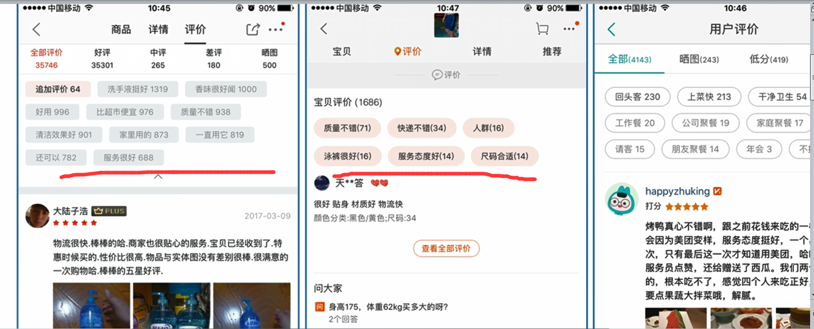

# 团购网站标签效果图

# 数据样式

# 分析思路

line.map(e=>e.split("\t"))  //映射,切分之后为数组
.filter(e=>e.extInfoList != null)  //排除没有评价的
.

86913510 ["午餐","分量适中"]
86913510 ["午餐"]

86913510 午餐
86913510 午餐
86913510 分量适中

(86913510 午餐),1
(86913510 午餐),1
(86913510 分量适中),1

reudceByKey(_ + _)
(86913510 午餐),2
(86913510 分量适中),1

86913510,(午餐,2)
86913510,(分量适中,1)

86913510,((分量适中,1),(午餐,2))

//排序
86913510,((午餐,2),(分量适中,1))

