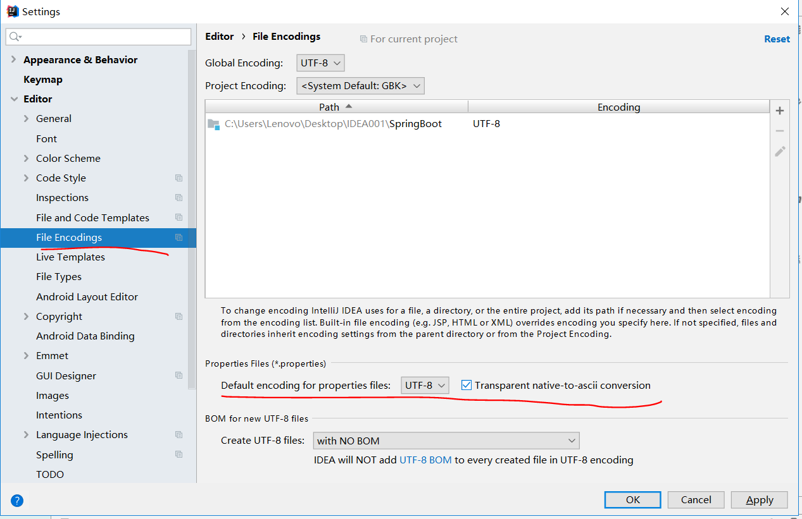

# 配置文件

Spring boot支持的配置文件的格式有.properties、.yml等

## 全局配置文件

配置文件的作用：修改SpringBoot自动配置的默认值；

SpringBoot使用一个全局的配置文件，配置文件名是固定的；

* application.properties
* application.yml

## YAML配置的特点

YAML: 以数据为中心;
XML: 注重格式，可阅读性强；

**配置实例：配置Server端口号**

YAML
```
server:
  port: 8081
```

XML
```
<server>
    <port>8081</port>
</server>
```

# YAML语法

## 基础语法

**k:[空格]v** ：表示一对键值对(空格必须有)；

以空格的缩进来控制层级关系，只要是左对齐的一列数据，都是同一个层级的；

```
server:
    port: 8081
    path: /hello
```

属性和值也是大小写敏感的；

## 值的写法

### 字面量：普通的值（数字，字符串，布尔）
​	
1、k: v字面直接来写；
2、字符串默认不用加上单引号或者双引号；
3、""（双引号）不会转义字符串里面的特殊字符；如{name: "zhangsan \n lisi"}，输出{zhangsan 换行 lisi}；
4、''（单引号）会转义特殊字符；如{name: ‘zhangsan \n lisi’}，输出{zhangsan \n lisi}；

### 对象、Map（属性和值）

k: v 在下一行来写对象的属性和值的关系，注意缩进。

```
friends:
    lastName: zhangsan
    age: 20
```
或
```
friends: {lastName: zhangsan,age: 18}
```

### 数组（List、Set）

用 {- 值} 来表示数组；

```
pets:
 - cat
 - dog
 - pig
```
或
```
pets: [cat,dog,pig]
```

# YAML 配置文件的获取

## 1、文件配置处理器依赖导入

```
<!--导入配置文件处理器，配置文件进行绑定就会有提示-->
<dependency>
    <groupId>org.springframework.boot</groupId>
    <artifactId>spring-boot-configuration-processor</artifactId>
    <optional>true</optional>
</dependency>
```

## 2、JavaBean类

### Person.java

```
package com.dongk.springboot.bean;


import org.springframework.boot.context.properties.ConfigurationProperties;
import org.springframework.stereotype.Component;

import java.util.Date;
import java.util.List;
import java.util.Map;

/**
 * 将配置文件中配置的值映射到这个类中
 *
 * 只有这个组件是容器中的组件，才能使用这个功能
 * */
@Component
@ConfigurationProperties(prefix = "person")
public class Person {

    private String lastName;
    private Integer age;
    private Boolean boss;
    private Date birth;

    private Map<String,Object> maps;
    private List<Object> lists;
    private Dog dog;

    public String getLastName() {
        return lastName;
    }

    public void setLastName(String lastName) {
        this.lastName = lastName;
    }

    public Integer getAge() {
        return age;
    }

    public void setAge(Integer age) {
        this.age = age;
    }

    public Boolean getBoss() {
        return boss;
    }

    public void setBoss(Boolean boss) {
        this.boss = boss;
    }

    public Date getBirth() {
        return birth;
    }

    public void setBirth(Date birth) {
        this.birth = birth;
    }

    public Map<String, Object> getMaps() {
        return maps;
    }

    public void setMaps(Map<String, Object> maps) {
        this.maps = maps;
    }

    public List<Object> getLists() {
        return lists;
    }

    public void setLists(List<Object> lists) {
        this.lists = lists;
    }

    public Dog getDog() {
        return dog;
    }

    public void setDog(Dog dog) {
        this.dog = dog;
    }

    @Override
    public String toString() {
        return "Person{" +
                "lastName='" + lastName + '\'' +
                ", age=" + age +
                ", boss=" + boss +
                ", birth=" + birth +
                ", maps=" + maps +
                ", lists=" + lists +
                ", dog=" + dog +
                '}';
    }
}

```

### Dog.java

```
package com.dongk.springboot.bean;

import org.springframework.stereotype.Component;

@Component
public class Dog {

    private String name;
    private  Integer age;

    public String getName() {
        return name;
    }

    public void setName(String name) {
        this.name = name;
    }

    public Integer getAge() {
        return age;
    }

    public void setAge(Integer age) {
        this.age = age;
    }

    @Override
    public String toString() {
        return "Dog{" +
                "name='" + name + '\'' +
                ", age=" + age +
                '}';
    }
}

```

## 3、 配置文件

```
person:
  lastName: hello
  age: 18
  boss: false
  birth: 2017/12/12
  maps: {k1: v1,k2: 12}
  lists:
    - zhangsan
    - lisi
  dog:
    name: 金毛
    age: 2
```

## 4、主测试类

```
package com.dongk.springboot.bean;

import org.springframework.beans.factory.annotation.Autowired;
import org.springframework.boot.SpringApplication;
import org.springframework.boot.autoconfigure.SpringBootApplication;
import org.springframework.context.ConfigurableApplicationContext;

@SpringBootApplication
public class YamlApp {


    public static void main(String[] args) {
        ConfigurableApplicationContext ctx = SpringApplication.run(YamlApp.class, args);
        Person person = (Person)ctx.getBean("person");
        System.out.println(person);
    }
}

```

## 5、运行结果

```
Person{lastName='hello', age=18, boss=false, birth=Tue Dec 12 00:00:00 CST 2017, maps={k1=v1, k2=12}, lists=[zhangsan, lisi], dog=Dog{name='金毛', age=2}}
```

# Properties配置文件中文乱码问题

上面的例子也可以在.properties配置文件中配置，如下：

```
person.lastName=张三
person.age=${random.int}
person.birth=2017/12/15
person.boss=false
person.maps.k1=v1
person.maps.k2=14
person.lists=a,b,c
person.dog.name=hello_dog
person.dog.age=15
```

IDEA中.properties文件默认为UTF-8编码，中文会在运行时发生乱码，只需要设置在运行时转换为ASCII编码即可，如下：



# 使用@Value获取配置文件中的值

* @Value可以从配置文件中获取值(${});
* @Value可以使用SpEL表达式获取值(#{});
* @Value不支持复杂类型(如Map类型)，而@ConfigurationProperties支持复杂类型;

```
@Value("${person.lastName}")
private String lastName;
@Value("#{3 * 8}")
private Integer age;
```

# @PropertySource

@PropertySource表示加载指定的配置文件；

我们编写一个配置文件 person.properties

```
person.lastName=张三
person.age=${random.int}
person.birth=2017/12/15
person.boss=false
person.maps.k1=v1
person.maps.k2=14
person.lists=a,b,c
person.dog.name=hello_dog
person.dog.age=15
```

在配置类上使用注解@PropertySource，获取person.properties配置文件中的属性

```
@Component
@ConfigurationProperties(prefix = "person")
@PropertySource("classpath:person.properties")
public class Person {
```

# 配置类

定义一个组件;

```
package com.dongk.springboot.service;

public class HelloWorldService {
}

```

我们可以使用配置类，来代替之前Spring中的配置文件；

```
package com.dongk.springboot.conf;

import com.dongk.springboot.service.HelloWorldService;
import org.springframework.context.annotation.Bean;
import org.springframework.context.annotation.Configuration;

/**
 *  @Configuration 指明该类是一个配置类，
 *  用来代替之前的Spring配置文件。
 * */
@Configuration
public class MyAppConfig {

    /**
     * 将方法的返回值添加到容器中；
     * 容器中这个组件的id就是方法名；
     * */
    @Bean
    public HelloWorldService helloWorldService(){
        return new HelloWorldService();
    }
}

```

测试配置类中的组件是否在IOC容器中存在；

```
package com.dongk.springboot;

import com.dongk.springboot.service.HelloWorldService;
import org.springframework.boot.SpringApplication;
import org.springframework.boot.autoconfigure.SpringBootApplication;
import org.springframework.context.ConfigurableApplicationContext;

/**
 *
 * 标明一个主程序类，说明这是一个Spring Boot应用
 * */
@SpringBootApplication
public class MyAppTest {
    public static void main(String[] args) {
        ConfigurableApplicationContext ctx = SpringApplication.run(MyAppTest.class, args);
        HelloWorldService helloWorldService = (HelloWorldService)ctx.getBean("helloWorldService");
        System.out.println("获取HelloWorldService：" + helloWorldService);
    }
}

```

运行结果；

```
获取HelloWorldService：com.dongk.springboot.service.HelloWorldService@3c1e23ff
```

# 配置文件占位符

```
# lastName的值使用uuid
person.lastName=${random.uuid}

# ${person.hello:hello}
# 表示使用配置文件中的属性person.hello
# 如果属性person.hello不存在，默认为hello
person.dog.name=${person.hello:hello}_dog
```

# profile

用于快速切换环境；

## 多profile文件

开发环境端口号
```
server.port=8081
```

生产环境端口号
```
server.port=8082
```

默认端口号
激活开发环境profile
```
server.port=8080
spring.profiles.active=dev
```


## YAML文档块

--- 用来切分文档块，第一块为默认文档块

```
#默认端口号
server:
  port: 8080
spring:
  profiles:
    active: dev

# 开发环境
---
server:
  port: 8081
spring:
  profiles: dev

# 生产环境
---
server:
  port: 8082
spring:
  profiles: pro
```

## 通过命令行激活profile

java -jar SpringBoot-1.0-SNAPSHOT.jar com.dongk.springboot.MyAppTest.java --spring.profiles.active=dev