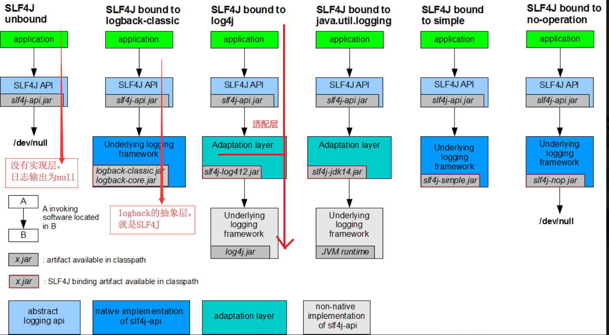
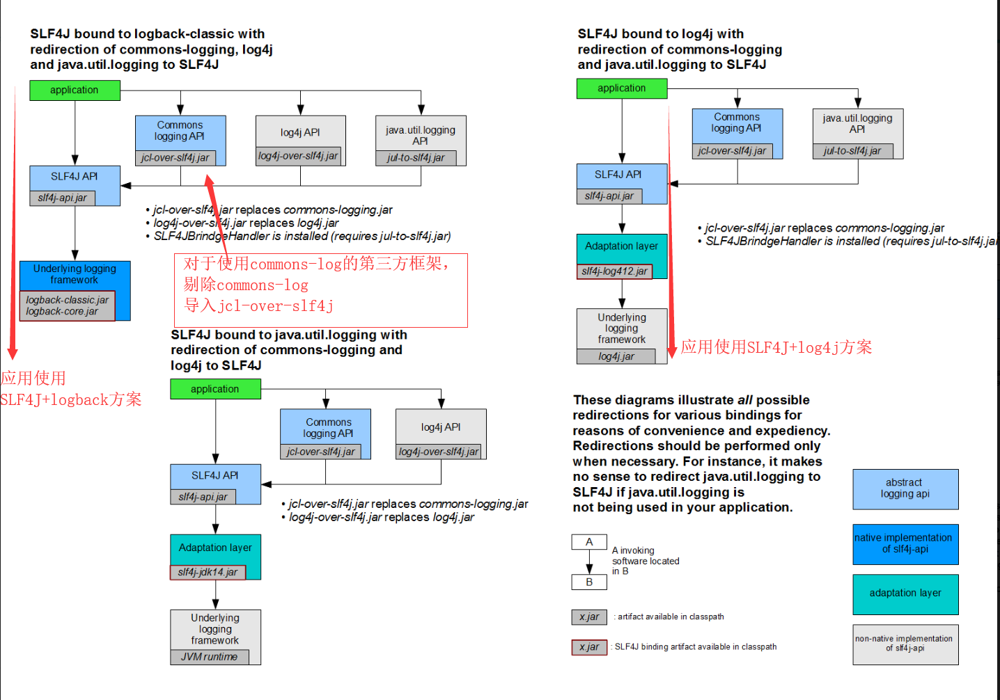
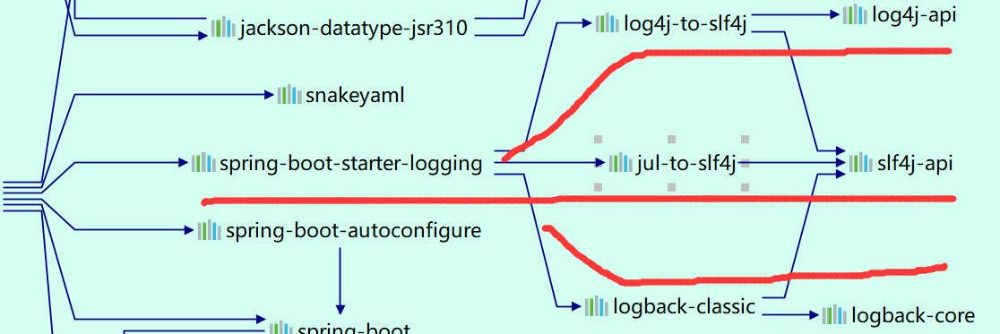

# 市面上的日志框架

关于日志框架统一的做法是，编写统一的接口层(抽象层)，然后根据抽象层编写各自的实现类。

常用的抽象层、实现层框架有：

```

抽象层                                       实现层
JCL（Jakarta Commons Logging）               Log4j 
SLF4j（Simple Logging Facade for Java）      JUL（java.util.logging） 
jboss-logging                                Log4j2
                                             Logback
```

**SpringBoot选用的日志框架如下：**
日志抽象层: SLF4J;
日志实现层: Logback;

# SLF4J日志框架使用原理

在开发的时候，日志记录方法的调用，不应该直接调用日志的实现类，而是调用日志抽象层里面的方法。



1）SLF4J使用logback，可以直接使用；因为logback就是基于SLF4J编写的；

2）SLF4J使用log4j,因为log4j不是基于SLF4J编写的，所以需要一个适配层；适配层的作用就是实现SLF4J的抽象类，而在抽象类内部调用log4j的方法；

# 所有框架统一使用SLF4J的办法

在一个系统中我们想统一使用SLF4J进行日志的输出，但是其中第三方框架使用其它的日志输出框架（Spring（commons-logging）、Hibernate（jboss-logging）），可以采用如下的办法：



1）jcl-over-slf4j里面的类和commons-logging 里面的类一模一样，但是内部却调用了SLF4J的方法；

# SpringBoot日志关系

## SpringBoot底层依赖关系



1）SpringBoot底层是使用SLF4J+logback的形式记录日志；
2）Spring将其它的日志框架都转换成了SLF4J;
3）如果我们要引入其它框架，一定要将其它框架默认的日志依赖排除掉；

# SpringBoot日志默认配置

在程序中记录日志：
```
package com.dongk.springboot.log;

import com.dongk.springboot.MyAppTest;
import org.slf4j.Logger;
import org.slf4j.LoggerFactory;
import org.springframework.boot.SpringApplication;
import org.springframework.boot.autoconfigure.SpringBootApplication;
import org.springframework.context.ConfigurableApplicationContext;


@SpringBootApplication
public class LogApp {

    //日志记录器
   static Logger logger = LoggerFactory.getLogger(LogApp.class);

    public static void main(String[] args) {
        ConfigurableApplicationContext ctx = SpringApplication.run(MyAppTest.class, args);

        //日志的级别
        logger.trace("这是trace日志...");
        logger.debug("这是debug日志...");
        logger.info("这是info日志...");
        logger.warn("这是warn日志...");
        logger.error("这是error日志...");
    }
}

```

控制台输出如下：
```
2019-05-06 21:36:22.682  INFO 216 --- [           main] com.dongk.springboot.log.LogApp          : 这是info日志...
2019-05-06 21:36:22.682  WARN 216 --- [           main] com.dongk.springboot.log.LogApp          : 这是warn日志...
2019-05-06 21:36:22.682 ERROR 216 --- [           main] com.dongk.springboot.log.LogApp          : 这是error日志...
```

可以看出SpringBoot日志级别默认是info。

也可以对SpringBoot日志进行配置：

```
#server.port=8080
#spring.profiles.active=dev

#指定日志级别
logging.level.com.dongk.springboot.log=trace

logging.file=D:/logs/springboot.log

#指定控制台日志格式
logging.pattern.console=%d{yyyy-MM-dd} [%thread] %-5level %logger{50} - %msg%n
#指定文件日志格式
logging.pattern.file=%d{yyyy-MM-dd} [%thread] %-5level %logger{50} - %msg%n

```

日志格式解释如下：

```
日志输出格式：
    %d表示日期时间，
    %thread表示线程名，
    %-5level：级别从左显示5个字符宽度
    %logger{50} 表示logger名字最长50个字符，否则按照句点分割。 
    %msg：日志消息，
    %n是换行符
```


