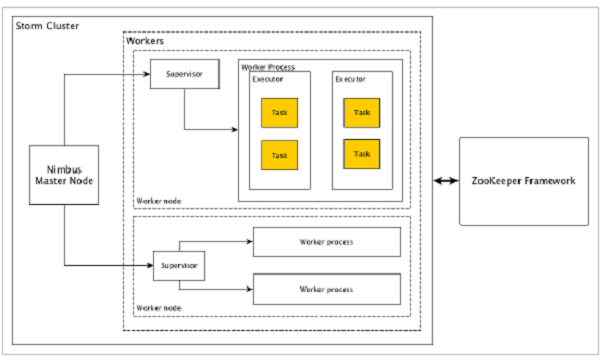

# Storm的特点

1、分布式的实时计算系统。
2、可扩展。
3、低延迟,秒级/分钟级。
4、容错。

# Storm核心组件

Apache Storm从一端读取实时数据的原始流，并将其传递通过一系列小处理单元，并在另一端输出处理/有用的信息。

下图描述了Apache Storm的核心概念。


现在让我们仔细看看Apache Storm的组件：

* **Tuple：** Tuple是Storm中的主要数据结构。它是有序元素的列表。默认情况下，Tuple支持所有数据类型。通常，它被建模为一组逗号分隔的值，并传递到Storm集群。
* **Stream：** 
* 
* Tuple的序列。
* **Spouts：** 流的源。通常，Storm从原始数据源（如Twitter Streaming API，Apache Kafka队列，Kestrel队列等）接受输入数据。否则，您可以编写spouts以从数据源读取数据。“ISpout”是实现spouts的核心接口，一些特定的接口是IRichSpout，BaseRichSpout，KafkaSpout等。
* **Bolts**  Bolts是逻辑处理单元。Spouts将数据传递到Bolts和Bolts过程，并产生新的输出流。Bolts可以执行过滤，聚合，加入，与数据源和数据库交互的操作。Bolts接收数据并发射到一个或多个Bolts。 “IBolt”是实现Bolts的核心接口。一些常见的接口是IRichBolt，IBasicBolt等。

# 拓扑

Spouts和Bolts连接在一起，形成拓扑结构。实时应用程序逻辑在Storm拓扑中指定。简单地说，拓扑是有向图，其中顶点是计算，边缘是数据流。

简单拓扑从spouts开始。Spouts将数据发射到一个或多个Bolts。Bolt表示拓扑中具有最小处理逻辑的节点，并且Bolts的输出可以发射到另一个Bolts作为输入。

Storm保持拓扑始终运行，直到您终止拓扑。Apache Storm的主要工作是运行拓扑，并在给定时间运行任意数量的拓扑。

# Storm架构

Apache Storm的主要亮点是，它是一个容错，快速，没有“单点故障”（SPOF）分布式应用程序。我们可以根据需要在多个系统中安装Apache Storm，以增加应用程序的容量。

让我们看看Apache Storm集群如何设计和其内部架构。下图描述了集群设计。



Apache Storm有两种类型的节点，Nimbus（主节点）和Supervisor（工作节点）。Nimbus是Apache Storm的核心组件。Nimbus的主要工作是运行Storm拓扑。Nimbus分析拓扑并收集要执行的任务。然后，它将任务分配给可用的supervisor。

Supervisor将有一个或多个工作进程。Supervisor将任务委派给工作进程。工作进程将根据需要产生尽可能多的执行器并运行任务。Apache Storm使用内部分布式消息传递系统来进行Nimbus和管理程序之间的通信。

* **Nimbus（主节点）：**  Nimbus是Storm集群的主节点。集群中的所有其他节点称为工作节点。主节点负责在所有工作节点之间分发数据，向工作节点分配任务和监视故障。
* **Supervisor（工作节点）：**  遵循指令的节点被称为Supervisors。Supervisor有多个工作进程，它管理工作进程以完成由nimbus分配的任务。
* **Worker process（工作进程）：**  工作进程将执行与特定拓扑相关的任务。工作进程不会自己运行任务，而是创建执行器并要求他们执行特定的任务。工作进程将有多个执行器。
* **Executor（执行者）：**    执行器只是工作进程产生的单个线程。执行器运行一个或多个任务，但仅用于特定的spout或bolt。
* **Task（任务）：**  任务执行实际的数据处理。所以，它是一个spout或bolt。
* **ZooKeeper framework（ZooKeeper框架）：**  Nimbus是无状态的，所以它依赖于ZooKeeper来监视工作节点的状态。ZooKeeper帮助supervisor与nimbus交互。它负责维持nimbus，supervisor的状态。

# Storm流程

1、Nimbus等待提交的拓扑；
2、提交拓扑后，Nimbus收集task;
3、Nimbus分发task给所有可用的Supervisors；
4、Supervisors周期性发送心跳给Nimbus表示自己还活着。
5、如果Supervisor挂掉，不会发送心跳给Nimbus，Nimbus将task发送给其他的supervisor。
6、Nimubs挂掉，Supervisors会继续执行自己task。
7、task完成后，Supervisors等待新的task。
8、同时，挂掉的Nimbus可以通过监控工具软件自动重启。
9、重新启动的网络将从停止的地方继续。同样，终止Supervisor也可以自动重新启动。由于网络管理程序和Supervisor都可以自动重新启动，并且两者将像以前一样继续，因此Storm保证至少处理所有任务一次。

# Storm集群安装

集群规划

Nimbus：192.168.1.191（master1）
Supervisors：192.168.1.181（salve1）、192.168.1.182（salve2）、192.168.1.183（salve3）

1、在master1机器解压安装包
[root@master1 storm]# tar -zxvf apache-storm-1.2.2.tar.gz

2、在所有机器上配置环境变量

``` 
##Storm
export STORM_HOME=/root/storm/apache-storm-1.2.2
export PATH=$PATH:STORM_HOME/bin
```

3、配置Storm

/root/storm/apache-storm-1.2.2/conf/storm.yaml

``` 
## zookeeper地址
storm.zookeeper.servers:
     - "salve1"
     - "salve2"
     - "salve3"
     - 
## nimbus
nimbus.seeds: ["master1"]

## web UI 配置
ui.host: 0.0.0.0
ui.port: 8080

## supervisor中worker端口配置
supervisor.slots.ports:
    - 6700
    - 6701
    - 6702
    - 6703
```

4、分发到salve1、salve2、salve3
[root@master1 ~]# scp -r storm root@salve1:/root/
[root@master1 ~]# scp -r storm root@salve2:/root/
[root@master1 ~]# scp -r storm root@salve3:/root/

5、启动进程

//启动 nimbus进程
[root@master1 bin]# ./storm nimbus &

//启动supervisor进程
[root@salve1 bin]# ./storm supervisor &
[root@salve2 bin]# ./storm supervisor &
[root@salve3 bin]# ./storm supervisor &


//启动Web UI 进程
[root@master1 bin]# ./storm ui &

6、通过Web UI查看Storm是否启动
http://master1:8080/index.html

# 电话呼叫日志处理

需求：计算呼叫（呼叫者和被呼叫者一样）的次数；

Maven依赖

pom.xml

``` 
<?xml version="1.0" encoding="UTF-8"?>
<project xmlns="http://maven.apache.org/POM/4.0.0"
         xmlns:xsi="http://www.w3.org/2001/XMLSchema-instance"
         xsi:schemaLocation="http://maven.apache.org/POM/4.0.0 http://maven.apache.org/xsd/maven-4.0.0.xsd">
    <modelVersion>4.0.0</modelVersion>

    <groupId>groupId</groupId>
    <artifactId>STORMDEMO</artifactId>
    <version>1.0-SNAPSHOT</version>

    <dependencies>
        <dependency>
            <groupId>org.apache.storm</groupId>
            <artifactId>storm-core</artifactId>
            <version>1.0.3</version>
        </dependency>
        <dependency>
            <groupId>junit</groupId>
            <artifactId>junit</artifactId>
            <version>4.11</version>
        </dependency>
    </dependencies>

</project>
```

## Spout创建

Spout是用于数据生成的组件。基本上，一个spout将实现一个IRichSpout接口。 “IRichSpout”接口有以下重要方法 ：

* open -为Spout提供执行环境。执行器将运行此方法来初始化喷头。

* nextTuple -通过收集器发出生成的数据。

* close -当spout将要关闭时调用此方法。

* declareOutputFields -声明元组的输出模式。

* ack -确认处理了特定元组。

* fail -指定不处理和不重新处理特定元组。

FakeCallLogReaderSpout.java

``` 
package com.dongk.storm.calllog;

import org.apache.storm.spout.SpoutOutputCollector;
import org.apache.storm.task.TopologyContext;
import org.apache.storm.topology.IRichSpout;
import org.apache.storm.topology.OutputFieldsDeclarer;
import org.apache.storm.tuple.Fields;
import org.apache.storm.tuple.Values;

import java.util.ArrayList;
import java.util.List;
import java.util.Map;
import java.util.Random;

public class FakeCallLogReaderSpout  implements IRichSpout {

    //Spout输出收集器
    private SpoutOutputCollector collector;
    //上下文
    private TopologyContext context;

    //是否完成
    private boolean completed = false;
    //随机发生器
    private Random randomGenerator = new Random();
    private Integer idx = 0;

    //conf - 为此spout提供storm配置。
    //context - 提供有关拓扑中的spout位置，其任务ID，输入和输出信息的完整信息。
    //collector - 使我们能够发出将由bolts处理的元组
    public void open(Map conf, TopologyContext context, SpoutOutputCollector collector) {
        this.context = context;
        this.collector = collector;
    }

    public void close() {}

    public void activate() {}

    public void deactivate() {}

    //nextTuple()从与ack()和fail()方法相同的循环中定期调用。
    //它必须释放线程的控制，当没有工作要做，以便其他方法有机会被调用。
    //因此，nextTuple的第一行检查处理是否已完成。如果是这样，它应该休眠至少一毫秒，以减少处理器在返回之前的负载。
    public void nextTuple() {
        if (this.idx <= 1000) {
            List<String> mobileNumbers = new ArrayList<String>();
            mobileNumbers.add("1234123401");
            mobileNumbers.add("1234123402");
            mobileNumbers.add("1234123403");
            mobileNumbers.add("1234123404");

            Integer localIdx = 0;
            while (localIdx++ < 100 && this.idx++ < 1000) {
                //取出主叫
                String caller = mobileNumbers.get(randomGenerator.nextInt(4));
                //取出被叫
                String callee = mobileNumbers.get(randomGenerator.nextInt(4));

                while (caller == callee) {
                    //重新取出被叫
                    callee = mobileNumbers.get(randomGenerator.nextInt(4));
                }
                //模拟通话时长
                Integer duration = randomGenerator.nextInt(60);

                //输出元组
                this.collector.emit(new Values(caller, callee, duration));
            }
        }
    }

    //该方法确认已经处理了特定元组。
    public void ack(Object o) {}

    //此方法通知特定元组尚未完全处理。 Storm将重新处理特定的元组。
    public void fail(Object o) {}

    //此方法用于指定元组的输出模式。
    public void declareOutputFields(OutputFieldsDeclarer declarer) {
        declarer.declare(new Fields("from", "to", "duration"));
    }

    public Map<String, Object> getComponentConfiguration() {
        return null;
    }
}

```

## Bolt创建

Bolt是一个使用元组作为输入，处理元组，并产生新的元组作为输出的组件。Bolts将实现IRichBolt接口。在此程序中，使用两个Bolts类CallLogCreatorBolt和CallLogCounterBolt来执行操作。

IRichBolt接口有以下方法 ：

* prepare -为bolt提供要执行的环境。执行器将运行此方法来初始化spout。

* execute -处理单个元组的输入

* cleanup -当spout要关闭时调用。

* declareOutputFields -声明元组的输出模式。


### 呼叫日志创建者bolt

CallLogCreatorBolt.java

``` 
package com.dongk.storm.calllog;

import org.apache.storm.task.OutputCollector;
import org.apache.storm.task.TopologyContext;
import org.apache.storm.topology.IRichBolt;
import org.apache.storm.topology.OutputFieldsDeclarer;
import org.apache.storm.tuple.Fields;
import org.apache.storm.tuple.Tuple;
import org.apache.storm.tuple.Values;

import java.util.Map;

public class CallLogCreatorBolt  implements IRichBolt {

    private OutputCollector collector;

    //
    public void prepare(Map conf, TopologyContext context, OutputCollector collector) {
        this.collector = collector ;
    }

    public void execute(Tuple tuple) {
        //处理通话记录
        String from = tuple.getString(0);
        String to = tuple.getString(1);
        Integer duration = tuple.getInteger(2);
        //产生新的tuple
        collector.emit(new Values(from + " - " + to, duration));
    }

    public void cleanup() { }

    public void declareOutputFields(OutputFieldsDeclarer declarer) {
        declarer.declare(new Fields("call", "duration"));
    }

    public Map<String, Object> getComponentConfiguration() {
        return null;
    }
}

```

### 呼叫日志计数器Bolt

CallLogCounterBolt.java

``` 
package com.dongk.storm.calllog;

import org.apache.storm.task.OutputCollector;
import org.apache.storm.task.TopologyContext;
import org.apache.storm.topology.IRichBolt;
import org.apache.storm.topology.OutputFieldsDeclarer;
import org.apache.storm.tuple.Fields;
import org.apache.storm.tuple.Tuple;

import java.util.HashMap;
import java.util.Map;

public class CallLogCounterBolt  implements IRichBolt {

    Map<String, Integer> counterMap;
    private OutputCollector collector;

    public void prepare(Map conf, TopologyContext context, OutputCollector collector) {
        this.counterMap = new HashMap<String, Integer>();
        this.collector = collector;
    }

    public void execute(Tuple tuple) {
        String call = tuple.getString(0);
        Integer duration = tuple.getInteger(1);

        if (!counterMap.containsKey(call)) {
            counterMap.put(call, 1);
        } else {
            Integer c = counterMap.get(call) + 1;
            counterMap.put(call, c);
        }
        collector.ack(tuple);
    }

    public void cleanup() {
        for (Map.Entry<String, Integer> entry : counterMap.entrySet()) {
            System.out.println(entry.getKey() + " : " + entry.getValue());
        }
    }

    public void declareOutputFields(OutputFieldsDeclarer declarer) {
        declarer.declare(new Fields("call"));
    }

    public Map<String, Object> getComponentConfiguration() {
        return null;
    }
}

```

## 创建拓扑

TopologyBuilder类提供了简单而容易的方法来创建复杂的拓扑。TopologyBuilder类具有设置spout（setSpout）和设置bolt（setBolt）的方法。最后，TopologyBuilder有createTopology来创建拓扑。

为了开发目的，我们可以使用“LocalCluster”对象创建本地集群，然后使用“LocalCluster”类的“submitTopology”方法提交拓扑。 “submitTopology”的参数之一是“Config”类的实例。“Config”类用于在提交拓扑之前设置配置选项。此配置选项将在运行时与集群配置合并，并使用prepare方法发送到所有任务（spout和bolt）。一旦拓扑提交到集群，我们将等待10秒钟，集群计算提交的拓扑，然后使用“LocalCluster”的“shutdown”方法关闭集群。

LogAnalyserStorm.java

``` 
package com.dongk.storm.calllog;

import org.apache.storm.Config;
import org.apache.storm.LocalCluster;
import org.apache.storm.topology.TopologyBuilder;
import org.apache.storm.tuple.Fields;

public class LogAnalyserStorm {
    public static void main(String[] args) throws InterruptedException {
        TopologyBuilder builder = new TopologyBuilder();
        //设置Spout
        builder.setSpout("spout", new FakeCallLogReaderSpout());
        //设置creator-Bolt
        builder.setBolt("creator-bolt", new CallLogCreatorBolt()).shuffleGrouping("spout");
        //设置counter-Bolt
        builder.setBolt("counter-bolt", new CallLogCounterBolt()).fieldsGrouping("creator-bolt", new Fields("call"));

        Config conf = new Config();
        conf.setDebug(true);

        LocalCluster cluster = new LocalCluster();
        cluster.submitTopology("LogAnalyserStorm", conf, builder.createTopology());
        Thread.sleep(10000);

        //停止集群
        cluster.shutdown();
    }
}

```

# 在完全分布式集群上运行拓扑作业

我们把“电话呼叫日志处理”作业提交到集群上运行，步骤如下：

1、修改 LogAnalyserStorm.java 为分布式集群运行模式；

``` 
package com.dongk.storm.calllog;

import org.apache.storm.Config;
import org.apache.storm.LocalCluster;
import org.apache.storm.StormSubmitter;
import org.apache.storm.topology.TopologyBuilder;
import org.apache.storm.tuple.Fields;

public class LogAnalyserStorm {
    public static void main(String[] args) throws Exception {
        TopologyBuilder builder = new TopologyBuilder();
        //设置Spout
        builder.setSpout("spout", new FakeCallLogReaderSpout());
        //设置creator-Bolt
        builder.setBolt("creator-bolt", new CallLogCreatorBolt()).shuffleGrouping("spout");
        //设置counter-Bolt
        builder.setBolt("counter-bolt", new CallLogCounterBolt()).fieldsGrouping("creator-bolt", new Fields("call"));

        Config conf = new Config();
        conf.setDebug(true);

//        LocalCluster cluster = new LocalCluster();
//        cluster.submitTopology("LogAnalyserStorm", conf, builder.createTopology());
//        Thread.sleep(10000);

        //停止集群
        //cluster.shutdown();

        StormSubmitter.submitTopology("loganalysertopology",conf,builder.createTopology());
    }
}

```

2、将程序打成jar包，并上传到Storm集群所在的服务器；

3、运行程序；
[root@master1 bin]# ./storm jar /root/file/STORMDEMO-1.0-SNAPSHOT.jar com.dongk.storm.calllog.LogAnalyserStorm

4、查看程序运行的结果；

作业运行结果保存在worker.log文件中，如下：

[root@salve2 6700]# pwd
/root/storm/apache-storm-1.2.2/logs/workers-artifacts/loganalysertopology-1-1551792207/6700
[root@salve2 6700]# cat worker.log | grep 1234


# 启动logviewer

可以启动各自节点的logviewer，在Web UI查看各自节点的日志。
如果不启动logviewer，Web UI里面是无法查看日志的。

启动salve1、salve2、salve1的logviewer

[root@salve1 bin]# ./storm logviewer &
[root@salve2 bin]# ./storm logviewer &
[root@salve3 bin]# ./storm logviewer &

# Storm 并行度配置

## Worker配置

Workers (JVMs): 在一个节点上可以运行一个或多个独立的JVM 进程。一个Topology可以包含一个或多个worker(并行的跑在不同的machine上), 所以worker process就是执行一个topology的子集, 并且worker只能对应于一个topology;worker processes的数目, 可以通过配置文件和代码中配置, worker就是执行进程, 所以考虑并发的效果, 数目至少应该大亍machines的数目。

## Executors配置

Executors (threads): 在一个worker JVM进程中运行着多个Java线程。一个executor线程可以执行一个或多个tasks.但一般默认每个executor只执行一个task。一个worker可用包含一个或多个executor。

## Task配置

Tasks(bolt/spout instances):Task就是具体的处理逻辑对象,每一个Spout和Bolt会被当作很多task在整个集群里面执行。每一个task对应到一个线程,而stream grouping则是定义怎么从一堆task发射tuple到另外一堆task。你可以调用TopologyBuilder.setSpout和TopBuilder.setBolt来设置并行度 — 也就是有多少个task，tasks的数目, 可以不配置, 默认和executor1:1, 也可以通过setNumTasks()配置。


## 具体配置

``` 
Config conf = new Config();
conf.setNumWorkers(2); // use two worker processes

topologyBuilder.setSpout("blue-spout", new BlueSpout(), 2); // set parallelism hint to 2

topologyBuilder.setBolt("green-bolt", new GreenBolt(), 2)
               .setNumTasks(4)
               .shuffleGrouping("blue-spout");

topologyBuilder.setBolt("yellow-bolt", new YellowBolt(), 6)
               .shuffleGrouping("green-bolt");

StormSubmitter.submitTopology(
        "mytopology",
        conf,
        topologyBuilder.createTopology()
    );
```

setNumWorkers:表示设置了2个worker,即2个进程；
1个parallelism_hint就代表1个线程；
则总共有2+2+6=10个线程；
每个进程平均分配,则每个进程有5个线程；
对于Green-bolt有2个线程,但是创建了4个task,则每个线程执行2个task；


# 定义socket工具类，监控集群拓扑运行的状况

需求：实现单词统计功能；并通过NetCat监控程序运行情况；

1、 数据来源 WordCountSpout.java 

``` 
package com.dongk.storm.wc;

import com.dongk.storm.util.Util;
import org.apache.storm.spout.SpoutOutputCollector;
import org.apache.storm.task.OutputCollector;
import org.apache.storm.task.TopologyContext;
import org.apache.storm.topology.IRichBolt;
import org.apache.storm.topology.IRichSpout;
import org.apache.storm.topology.OutputFieldsDeclarer;
import org.apache.storm.tuple.Fields;
import org.apache.storm.tuple.Tuple;
import org.apache.storm.tuple.Values;

import java.util.ArrayList;
import java.util.List;
import java.util.Map;
import java.util.Random;

/**
 * Spout
 */
public class WordCountSpout implements IRichSpout{
    private TopologyContext context ;
    private SpoutOutputCollector collector ;

    private List<String> states ;

    private Random r = new Random();

    public void open(Map conf, TopologyContext context, SpoutOutputCollector collector) {
        Util.sendToClient(this,"open()",7777);
        this.context = context ;
        this.collector = collector ;
        states = new ArrayList<String>();
        states.add("hello world tom");
        states.add("hello world tomas");
        states.add("hello world tomasLee");
        states.add("hello world tomson");
    }

    public void close() {

    }

    public void activate() {

    }

    public void deactivate() {

    }

    public void nextTuple() {
        Util.sendToClient(this, "nextTuple()",7777);
        String line = states.get(r.nextInt(4));
        collector.emit(new Values(line));
        try {
            Thread.sleep(1000);
        } catch (InterruptedException e) {
            e.printStackTrace();
        }
    }

    public void ack(Object msgId) {

    }

    public void fail(Object msgId) {

    }

    public void declareOutputFields(OutputFieldsDeclarer declarer) {
        declarer.declare(new Fields("line"));
    }

    public Map<String, Object> getComponentConfiguration() {
        return null;
    }
}

```

2、根据空格切割行 SplitBolt.java

``` 
package com.dongk.storm.wc;

import com.dongk.storm.util.Util;
import org.apache.storm.task.OutputCollector;
import org.apache.storm.task.TopologyContext;
import org.apache.storm.topology.IRichBolt;
import org.apache.storm.topology.OutputFieldsDeclarer;
import org.apache.storm.tuple.Fields;
import org.apache.storm.tuple.Tuple;
import org.apache.storm.tuple.Values;

import java.util.Map;

/**
 */
public class SplitBolt implements IRichBolt {

    private TopologyContext context ;
    private OutputCollector collector ;

    public void prepare(Map stormConf, TopologyContext context, OutputCollector collector) {
        Util.sendToClient(this, "prepare()",8888);
        this.context = context ;
        this.collector = collector ;
    }

    public void execute(Tuple tuple) {
        Util.sendToClient(this, "execute()",8888);
        String line = tuple.getString(0);
        String[] arr = line.split(" ");
        for(String s : arr){
            collector.emit(new Values(s,1));
        }
    }

    public void cleanup() {

    }

    public void declareOutputFields(OutputFieldsDeclarer declarer) {
        declarer.declare(new Fields("word","count"));

    }

    public Map<String, Object> getComponentConfiguration() {
        return null;
    }
}

```

3、计算单词的个数 CountBolt.java

``` 
package com.dongk.storm.wc;

import com.dongk.storm.util.Util;
import org.apache.storm.task.OutputCollector;
import org.apache.storm.task.TopologyContext;
import org.apache.storm.topology.IRichBolt;
import org.apache.storm.topology.OutputFieldsDeclarer;
import org.apache.storm.tuple.Tuple;

import java.util.HashMap;
import java.util.Map;

/**
 * Created by Administrator on 2017/4/1.
 */
public class CountBolt implements IRichBolt{

    private Map<String,Integer> map ;

    private TopologyContext context;
    private OutputCollector collector;

    public void prepare(Map stormConf, TopologyContext context, OutputCollector collector) {
        Util.sendToClient(this, "prepare()",9999);
        this.context = context;
        this.collector = collector;
        map = new HashMap<String, Integer>();
    }

    public void execute(Tuple tuple) {
        Util.sendToClient(this, "execute()",9999);
        String word = tuple.getString(0);
        Integer count = tuple.getInteger(1);
        if(!map.containsKey(word)){
            map.put(word,1);
        }
        else{
            map.put(word,map.get(word) + count);
        }
    }

    public void cleanup() {
        for(Map.Entry<String,Integer> entry : map.entrySet()){
            System.out.println(entry.getKey() + " : " + entry.getValue());
        }
    }

    public void declareOutputFields(OutputFieldsDeclarer declarer) {

    }

    public Map<String, Object> getComponentConfiguration() {
        return null;
    }
}

```

4、构建拓扑 App.java

``` 
package com.dongk.storm.wc;

import org.apache.storm.Config;
import org.apache.storm.LocalCluster;
import org.apache.storm.StormSubmitter;
import org.apache.storm.topology.TopologyBuilder;
import org.apache.storm.tuple.Fields;

/**
 * App
 */
public class App {
    public static void main(String[] args) throws Exception {
        TopologyBuilder builder = new TopologyBuilder();
        //设置Spout
        builder.setSpout("wcspout", new WordCountSpout(),3).setNumTasks(3);
        //设置creator-Bolt
        builder.setBolt("split-bolt", new SplitBolt(),4).shuffleGrouping("wcspout").setNumTasks(4);
        //设置counter-Bolt
        builder.setBolt("counter-bolt", new CountBolt(),5).fieldsGrouping("split-bolt", new Fields("word")).setNumTasks(5);

        Config conf = new Config();
        conf.setNumWorkers(2);
        conf.setDebug(true);

        /**
         * 本地模式storm
         */
        LocalCluster cluster = new LocalCluster();
        cluster.submitTopology("wc", conf, builder.createTopology());
        Thread.sleep(10000);
       // StormSubmitter.submitTopology("wordcount", conf, builder.createTopology());
       cluster.shutdown();

    }
}

```

5、工具类，用于监控程序运行情况 Util.java

``` 
package com.dongk.storm.util;

import java.io.OutputStream;
import java.lang.management.ManagementFactory;
import java.net.InetAddress;
import java.net.Socket;
import java.net.UnknownHostException;

/**
 * Created by Administrator on 2017/4/1.
 */
public class Util {

    //主机名
    public static String getHostname()  {
        try {
            return InetAddress.getLocalHost().getHostName();
        } catch (UnknownHostException e) {
            e.printStackTrace();
        }
        return null ;
    }

    /**
     * 返回进程pid
     */
    public static String getPID(){
        String info = ManagementFactory.getRuntimeMXBean().getName();
        return info.split("@")[0] ;
    }

    //线程信息
    public static String getTID(){
        return Thread.currentThread().getName() ;
    }

    //对象信息
    public static String getOID(Object obj ){
        String cname = obj.getClass().getSimpleName();
        int hash = obj.hashCode() ;
        return cname + "@" + hash ;
    }

    public static String info(Object obj , String msg){
        return getHostname() + "," + getPID() + "," + getTID() + "," + getOID(obj) + "," + msg ;
    }

    /**
     * 向远端发送sock消息
     */
    public static void sendToClient(Object obj,String msg,int port ){
        try {
            String info = info(obj,msg);
            Socket sock = new Socket("master1", port);
            OutputStream os = sock.getOutputStream();
            os.write((info + "\r\n").getBytes());
            os.flush();
            os.close();
        } catch (Exception e) {
            e.printStackTrace();
        }
    }
}


```

6、开启监听端口
[root@master1 ~]# nc -lk 7777
[root@master1 ~]# nc -lk 8888
[root@master1 ~]# nc -lk 9999

# Storm Log级别设置

log4j2.xml 文件放置在resources目录下面。

下面将Storm的日志级别调整到error

``` 
<?xml version="1.0" encoding="UTF-8"?>
<!--
 Licensed to the Apache Software Foundation (ASF) under one or more
 contributor license agreements.  See the NOTICE file distributed with
 this work for additional information regarding copyright ownership.
 The ASF licenses this file to You under the Apache License, Version 2.0
 (the "License"); you may not use this file except in compliance with
 the License.  You may obtain a copy of the License at

     http://www.apache.org/licenses/LICENSE-2.0

 Unless required by applicable law or agreed to in writing, software
 distributed under the License is distributed on an "AS IS" BASIS,
 WITHOUT WARRANTIES OR CONDITIONS OF ANY KIND, either express or implied.
 See the License for the specific language governing permissions and
 limitations under the License.
-->

<configuration monitorInterval="60">
    <Appenders>
        <Console name="Console" target="SYSTEM_OUT">
            <PatternLayout pattern="%-4r [%t] %-5p %c{1.} - %msg%n"/>
        </Console>
    </Appenders>
    <Loggers>
        <Logger name="org.apache.zookeeper" level="WARN"/>
        <Root level="error">
            <AppenderRef ref="Console"/>
        </Root>
    </Loggers>
</configuration>

```

# Storm 分组方式

Storm由数源泉spout到bolt时，可以选择分组策略，实现对spout发出的数据的分发。对多个并行度的时候有用。

## Shuffle Grouping 

随机分组，随机派发stream里面的tuple，保证每个bolt task接收到的tuple数目大致相同。

## Fields Grouping（相同fields去分发到同一个Bolt）

按字段分组，比如，按"user-id"这个字段来分组，那么具有同样"user-id"的 tuple 会被分到相同的Bolt里的一个task， 而不同的"user-id"则可能会被分配到不同的task。 

使用Field分组，可能会产生数据倾斜；如单词统计，我们可以采用下面的办法解决Field分组带来的数据倾斜问题。

``` 
                      随机分组            随机分组               field分组
spout(输出)  ------------------> bolt(切割行)--------------------->bolt(计算单词个数)------------------>bolt（计算单词个数） 

```

我们可以设置守护进程，每5秒钟定时清分一次统计一次计算结果:

1、工具类，用于监控程序运行情况  Util.java

``` 
package com.dongk.storm.util;

import java.io.OutputStream;
import java.lang.management.ManagementFactory;
import java.net.InetAddress;
import java.net.Socket;
import java.net.UnknownHostException;

/**
 * Created by Administrator on 2017/4/1.
 */
public class Util {

    //主机名
    public static String getHostname()  {
        try {
            return InetAddress.getLocalHost().getHostName();
        } catch (UnknownHostException e) {
            e.printStackTrace();
        }
        return null ;
    }

    /**
     * 返回进程pid
     */
    public static String getPID(){
        String info = ManagementFactory.getRuntimeMXBean().getName();
        return info.split("@")[0] ;
    }

    //线程信息
    public static String getTID(){
        return Thread.currentThread().getName() ;
    }

    //对象信息
    public static String getOID(Object obj ){
        String cname = obj.getClass().getSimpleName();
        int hash = obj.hashCode() ;
        return cname + "@" + hash ;
    }

    public static String info(Object obj , String msg){
        return getHostname() + "," + getPID() + "," + getTID() + "," + getOID(obj) + "," + msg ;
    }

    /**
     * 向远端发送sock消息
     */
    public static void sendToClient(Object obj,String msg,int port ){
        try {
            String info = info(obj,msg);
            Socket sock = new Socket("master1", port);
            OutputStream os = sock.getOutputStream();
            os.write((info + "\r\n").getBytes());
            os.flush();
            os.close();
        } catch (Exception e) {
            e.printStackTrace();
        }
    }
}


```

2、用于产生数据 WordCountSpout.java

``` 
package com.dongk.storm.grouping.field;

import org.apache.storm.spout.SpoutOutputCollector;
import org.apache.storm.task.TopologyContext;
import org.apache.storm.topology.IRichSpout;
import org.apache.storm.topology.OutputFieldsDeclarer;
import org.apache.storm.tuple.Fields;
import org.apache.storm.tuple.Values;

import java.util.ArrayList;
import java.util.List;
import java.util.Map;
import java.util.Random;

/**
 * Spout
 */
public class WordCountSpout implements IRichSpout{

    private TopologyContext context ;
    private SpoutOutputCollector collector ;

    private List<String> states ;

    private Random r = new Random();

    private int index = 0;

    public void open(Map conf, TopologyContext context, SpoutOutputCollector collector) {
        this.context = context ;
        this.collector = collector ;
        states = new ArrayList<String>();
        states.add("hello world tom");
        states.add("hello world tomas");
        states.add("hello world tomasLee");
        states.add("hello world tomson");
    }

    public void close() {

    }

    public void activate() {

    }

    public void deactivate() {

    }

    public void nextTuple() {
        if(index < 3){
            String line = states.get(r.nextInt(4));
            collector.emit(new Values(line));
            index ++ ;
        }
    }

    public void ack(Object msgId) {

    }

    public void fail(Object msgId) {

    }

    public void declareOutputFields(OutputFieldsDeclarer declarer) {
        declarer.declare(new Fields("line"));
    }

    public Map<String, Object> getComponentConfiguration() {
        return null;
    }

}

```

3、用于切分行 SplitBolt.java

``` 
package com.dongk.storm.grouping.field;

import org.apache.storm.task.OutputCollector;
import org.apache.storm.task.TopologyContext;
import org.apache.storm.topology.IRichBolt;
import org.apache.storm.topology.OutputFieldsDeclarer;
import org.apache.storm.tuple.Fields;
import org.apache.storm.tuple.Tuple;
import org.apache.storm.tuple.Values;

import java.util.Map;

/**
 */
public class SplitBolt implements IRichBolt {

    private TopologyContext context ;
    private OutputCollector collector ;

    public void prepare(Map stormConf, TopologyContext context, OutputCollector collector) {
        this.context = context ;
        this.collector = collector ;
    }

    public void execute(Tuple tuple) {
        String line = tuple.getString(0);
        String[] arr = line.split(" ");
        for(String s : arr){
            collector.emit(new Values(s,1));
        }
    }

    public void cleanup() {

    }

    public void declareOutputFields(OutputFieldsDeclarer declarer) {
        declarer.declare(new Fields("word","count"));
    }

    public Map<String, Object> getComponentConfiguration() {
        return null;
    }

}

```

4、用于第一次聚合 CountBolt1.java

``` 
package com.dongk.storm.grouping.field;

import org.apache.storm.task.OutputCollector;
import org.apache.storm.task.TopologyContext;
import org.apache.storm.topology.IRichBolt;
import org.apache.storm.topology.OutputFieldsDeclarer;
import org.apache.storm.tuple.Fields;
import org.apache.storm.tuple.Tuple;
import org.apache.storm.tuple.Values;

import java.util.Collections;
import java.util.HashMap;
import java.util.Map;

/**
 *
 *
 */
public class CountBolt1 implements IRichBolt{

    private Map<String,Integer> map ;

    private TopologyContext context;
    private OutputCollector collector;

    private long lastEmitTime = 0 ;

    private long duration = 5000 ;

    public void prepare(Map stormConf, TopologyContext context, OutputCollector collector) {
        this.context = context;
        this.collector = collector;
        map = new HashMap<String, Integer>();
        //
        map = Collections.synchronizedMap(map);
        //分线程，执行清分工作,线程安全问题
        Thread t = new Thread(){
            public void run() {
                while(true){
                    emitData();
                }
            }
        };
        //守护进程
        t.setDaemon(true);
        t.start();
    }

    private void emitData(){
        //清分map
        synchronized (map){
            //判断是否符合清分的条件
            for (Map.Entry<String, Integer> entry : map.entrySet()) {
                //向下一环节发送数据
                collector.emit(new Values(entry.getKey(), entry.getValue()));
            }
            //清空map
            map.clear();
        }
        //休眠
        try {
            Thread.sleep(5000);
        } catch (InterruptedException e) {
            e.printStackTrace();
        }
    }

    public void execute(Tuple tuple) {
        //提取单词
        String word = tuple.getString(0);
        //提取单词个数
        Integer count = tuple.getInteger(1);
        if(!map.containsKey(word)){
            map.put(word, count);
        }
        else{
            map.put(word,map.get(word) + count);
        }

    }

    public void cleanup() {}

    public void declareOutputFields(OutputFieldsDeclarer declarer) {
        declarer.declare(new Fields("word","count"));

    }

    public Map<String, Object> getComponentConfiguration() {
        return null;
    }
}

```

5、 用于第二次聚合 CountBolt2.java

``` 
package com.dongk.storm.grouping.field;

import com.dongk.storm.util.Util;
import org.apache.storm.task.OutputCollector;
import org.apache.storm.task.TopologyContext;
import org.apache.storm.topology.IRichBolt;
import org.apache.storm.topology.OutputFieldsDeclarer;
import org.apache.storm.tuple.Fields;
import org.apache.storm.tuple.Tuple;

import java.util.Collections;
import java.util.HashMap;
import java.util.Map;

/**
 *
 *
 */
public class CountBolt2 implements IRichBolt{

    private Map<String,Integer> map ;

    private TopologyContext context;
    private OutputCollector collector;

    private long lastEmitTime = 0 ;

    private long duration = 5000 ;

    public void prepare(Map stormConf, TopologyContext context, OutputCollector collector) {
        this.context = context;
        this.collector = collector;
        map = new HashMap<String, Integer>();
        //
        map = Collections.synchronizedMap(map);
        //分线程，执行清分工作,线程安全问题
        Thread t = new Thread(){
            public void run() {
                while(true){
                    sendData();
                }
            }
        };
        //守护进程
        t.setDaemon(true);
        t.start();
    }

    private void sendData(){
        synchronized (map){
            //
            for(Map.Entry<String,Integer> entry : map.entrySet()){
                Util.sendToClient(this,entry.getKey() + " : " + entry.getValue(),7777);
            }
            //清空map
            map.clear();
        }
        //休眠
        try {
            Thread.sleep(5000);
        } catch (InterruptedException e) {
            e.printStackTrace();
        }
    }

    public void execute(Tuple tuple) {
        //提取单词
        String word = tuple.getString(0);
        //提取单词个数
        Integer count = tuple.getInteger(1);
        if(!map.containsKey(word)){
            map.put(word, count);
        }
        else{
            map.put(word,map.get(word) + count);
        }

    }

    public void cleanup() {
    }

    public void declareOutputFields(OutputFieldsDeclarer declarer) {
        declarer.declare(new Fields("word","count"));

    }

    public Map<String, Object> getComponentConfiguration() {
        return null;
    }
}

```

6、用于构建拓扑 App.java

``` 
package com.dongk.storm.grouping.field;

import org.apache.storm.Config;
import org.apache.storm.LocalCluster;
import org.apache.storm.topology.TopologyBuilder;
import org.apache.storm.tuple.Fields;

/**
 * App
 */
public class App {
    public static void main(String[] args) throws Exception {
        TopologyBuilder builder = new TopologyBuilder();
        //设置Spout
        builder.setSpout("wcspout", new WordCountSpout()).setNumTasks(2);
        //设置creator-Bolt
        builder.setBolt("split-bolt", new SplitBolt(),1).shuffleGrouping("wcspout").setNumTasks(1);
        //设置counter-Bolt
        builder.setBolt("counter-1", new CountBolt1(),1).shuffleGrouping("split-bolt").setNumTasks(1);
        builder.setBolt("counter-2", new CountBolt2(),3).fieldsGrouping("counter-1",new Fields("word")).setNumTasks(3);

        Config conf = new Config();
        conf.setNumWorkers(2);
        conf.setDebug(true);

        /**
         * 本地模式storm
         */
        LocalCluster cluster = new LocalCluster();
        cluster.submitTopology("wc", conf, builder.createTopology());
        //Thread.sleep(20000);
//        StormSubmitter.submitTopology("wordcount", conf, builder.createTopology());
        //cluster.shutdown();

    }
}

```

## All Grouping

广播发送，对于每一个tuple，所有的bolts都会收到。


## Direct Grouping

指向型分组， 这是一种比较特别的分组方法，用这种分组意味着消息（tuple）的发送者指定由消息接收者的哪个task处理这个消息。只有被声明为 Direct Stream 的消息流可以声明这种分组方法。而且这种消息tuple必须使用 emitDirect 方法来发射。消息处理者可以通过 TopologyContext 来获取处理它的消息的task的id (OutputCollector.emit方法也会返回task的id)  

##  Global Grouping

全局分组，把tuple分配给task id最低的task 。

## 自定义分组

下面我们通过自定义分组实现对半分组(将数据分配到一半的task中)

1、自定义分组 MyGrouping.java

``` 
package com.dongk.storm.grouping.custom;

import org.apache.storm.generated.GlobalStreamId;
import org.apache.storm.grouping.CustomStreamGrouping;
import org.apache.storm.task.WorkerTopologyContext;

import java.util.ArrayList;
import java.util.List;

/**
 * 自定义分组
 */
public class MyGrouping implements CustomStreamGrouping {

    //接受目标任务的id集合
    private List<Integer> targetTasks ;

    public void prepare(WorkerTopologyContext context, GlobalStreamId stream, List<Integer> targetTasks) {
        this.targetTasks = targetTasks ;
    }

    public List<Integer> chooseTasks(int taskId, List<Object> values) {
        List<Integer> subTaskIds = new ArrayList<Integer>();
        for(int i = 0 ; i <= targetTasks.size() / 2 ; i ++){
            subTaskIds.add(targetTasks.get(i));
        }
        return subTaskIds;
    }
}

```

2、生成数据 WordCountSpout.java

``` 
package com.dongk.storm.grouping.custom;

import org.apache.storm.spout.SpoutOutputCollector;
import org.apache.storm.task.TopologyContext;
import org.apache.storm.topology.IRichSpout;
import org.apache.storm.topology.OutputFieldsDeclarer;
import org.apache.storm.tuple.Fields;
import org.apache.storm.tuple.Values;

import java.util.ArrayList;
import java.util.List;
import java.util.Map;
import java.util.Random;

/**
 * Spout
 */
public class WordCountSpout implements IRichSpout{
    private TopologyContext context ;
    private SpoutOutputCollector collector ;

    private List<String> states ;

    private Random r = new Random();

    private int index = 0;

    public void open(Map conf, TopologyContext context, SpoutOutputCollector collector) {
        this.context = context ;
        this.collector = collector ;
        states = new ArrayList<String>();
        states.add("hello world tom");
        states.add("hello world tomas");
        states.add("hello world tomasLee");
        states.add("hello world tomson");
    }

    public void close() {

    }

    public void activate() {

    }

    public void deactivate() {

    }

    public void nextTuple() {
        if(index < 3){
            String line = states.get(r.nextInt(4));
            collector.emit(new Values(line),index);
            index ++ ;
        }
    }

    public void ack(Object msgId) {
    }

    public void fail(Object msgId) {

    }

    public void declareOutputFields(OutputFieldsDeclarer declarer) {
        declarer.declare(new Fields("line"));
    }

    public Map<String, Object> getComponentConfiguration() {
        return null;
    }
}

```

3、切分行数据，并输出收到的数据 SplitBolt.java

``` 
package com.dongk.storm.grouping.custom;

import org.apache.storm.task.OutputCollector;
import org.apache.storm.task.TopologyContext;
import org.apache.storm.topology.IRichBolt;
import org.apache.storm.topology.OutputFieldsDeclarer;
import org.apache.storm.tuple.Fields;
import org.apache.storm.tuple.Tuple;
import org.apache.storm.tuple.Values;

import java.util.Map;

/**
 */
public class SplitBolt implements IRichBolt {

    private TopologyContext context ;
    private OutputCollector collector ;

    public void prepare(Map stormConf, TopologyContext context, OutputCollector collector) {
        System.out.println(this + " : prepare()");
        this.context = context ;
        this.collector = collector ;
    }

    public void execute(Tuple tuple) {
        String line = tuple.getString(0);
        System.out.println(this + " : excute() : " + line);
        String[] arr = line.split(" ");
        for(String s : arr){
            collector.emit(new Values(s,1));
        }
    }

    public void cleanup() {

    }

    public void declareOutputFields(OutputFieldsDeclarer declarer) {
        declarer.declare(new Fields("word","count"));

    }

    public Map<String, Object> getComponentConfiguration() {
        return null;
    }
}

```

4、构建拓扑 App.java

``` 
package com.dongk.storm.grouping.custom;

import org.apache.storm.Config;
import org.apache.storm.LocalCluster;
import org.apache.storm.topology.TopologyBuilder;

/**
 * global是direct分组的特例，选择最小的taskId
 */
public class App {
    public static void main(String[] args) throws Exception {
        TopologyBuilder builder = new TopologyBuilder();
        //设置Spout
        builder.setSpout("wcspout", new WordCountSpout()).setNumTasks(2);
        //设置creator-Bolt
        builder.setBolt("split-bolt", new SplitBolt(),4).customGrouping("wcspout",new MyGrouping()).setNumTasks(4);

        Config conf = new Config();
        conf.setNumWorkers(2);
        conf.setDebug(true);

        /**
         * 本地模式storm
         */
        LocalCluster cluster = new LocalCluster();
        cluster.submitTopology("wc", conf, builder.createTopology());
        System.out.println("hello world");
    }
}

```

# 确保消息被消费

确保消费原理：
spout 发送 tuple(必须有消息ID) 到 bolt，
如果bolt消费完成，则调用ack()告诉spout消费已经完成，spout可以在ack()方法中做一些处理；
如果bolt消费失败，则调用fail()告诉spout消费没有完成，spout可以在fail()方法中做一些处理；

处理方法：
消费失败，一般采用重传的方式处理(控制好失败次数)。

App.java

``` 
package com.dongk.storm.ensure;

import org.apache.storm.Config;
import org.apache.storm.LocalCluster;
import org.apache.storm.topology.TopologyBuilder;

/**
 * App
 */
public class App {
    public static void main(String[] args) throws Exception {
        TopologyBuilder builder = new TopologyBuilder();
        //设置Spout
        builder.setSpout("wcspout", new WordCountSpout()).setNumTasks(1);
        //设置creator-Bolt
        builder.setBolt("split-bolt", new SplitBolt(),2).shuffleGrouping("wcspout").setNumTasks(2);

        Config conf = new Config();
        conf.setNumWorkers(2);
        conf.setDebug(true);

        /**
         * 本地模式storm
         */
        LocalCluster cluster = new LocalCluster();
        cluster.submitTopology("wc", conf, builder.createTopology());
        System.out.println("hello world llll");
    }
}

```

WordCountSpout.java

``` 
package com.dongk.storm.ensure;

import org.apache.storm.spout.SpoutOutputCollector;
import org.apache.storm.task.TopologyContext;
import org.apache.storm.topology.IRichSpout;
import org.apache.storm.topology.OutputFieldsDeclarer;
import org.apache.storm.tuple.Fields;
import org.apache.storm.tuple.Values;

import java.util.*;

/**
 * Spout
 */
public class WordCountSpout implements IRichSpout{
    private TopologyContext context ;
    private SpoutOutputCollector collector ;

    private List<String> states ;

    private Random r = new Random();

    private int index = 0;

    //消息集合, 存放所有消息
    private Map<Long,String> messages = new HashMap<Long, String>();

    //失败消息
    private Map<Long,Integer> failMessages = new HashMap<Long, Integer>();

    public void open(Map conf, TopologyContext context, SpoutOutputCollector collector) {
        this.context = context ;
        this.collector = collector ;
        states = new ArrayList<String>();
        states.add("hello world tom");
        states.add("hello world tomas");
        states.add("hello world tomasLee");
        states.add("hello world tomson");
    }

    public void close() {

    }

    public void activate() {

    }

    public void deactivate() {

    }

    public void nextTuple() {
        if(index < 3){
            String line = states.get(r.nextInt(4));
            //取出时间戳
            long ts = System.currentTimeMillis() ;
            messages.put(ts,line);

            //发送元组，使用ts作为消息id
            collector.emit(new Values(line),ts);
            System.out.println(this + "nextTuple() : " + line + " : " + ts);
            index ++ ;
        }
    }

    /**
     * 回调处理
     */
    public void ack(Object msgId) {
        //成功处理，删除失败重试.
        Long ts = (Long)msgId ;
        failMessages.remove(ts) ;
        messages.remove(ts) ;
    }

    public void fail(Object msgId) {
        //时间戳作为msgId
        Long ts = (Long)msgId;
        //判断消息是否重试了3次
        Integer retryCount = failMessages.get(ts);
        retryCount = (retryCount == null ? 0 : retryCount) ;

        //超过最大重试次数
        if(retryCount >= 3){
            failMessages.remove(ts) ;
            messages.remove(ts) ;
        }
        else{
            //重试
            collector.emit(new Values(messages.get(ts)),ts);
            System.out.println(this + "fail() : " + messages.get(ts) + " : " + ts);
            retryCount ++ ;
            failMessages.put(ts,retryCount);
        }
    }

    public void declareOutputFields(OutputFieldsDeclarer declarer) {
        declarer.declare(new Fields("line"));
    }

    public Map<String, Object> getComponentConfiguration() {
        return null;
    }
}

```

SplitBolt.java

``` 
package com.dongk.storm.ensure;

import org.apache.storm.task.OutputCollector;
import org.apache.storm.task.TopologyContext;
import org.apache.storm.topology.IRichBolt;
import org.apache.storm.topology.OutputFieldsDeclarer;
import org.apache.storm.tuple.Fields;
import org.apache.storm.tuple.Tuple;
import org.apache.storm.tuple.Values;

import java.util.Map;
import java.util.Random;

/**
 */
public class SplitBolt implements IRichBolt {

    private TopologyContext context ;
    private OutputCollector collector ;

    public void prepare(Map stormConf, TopologyContext context, OutputCollector collector) {
        this.context = context ;
        this.collector = collector ;
    }

    public void execute(Tuple tuple) {
        String line = tuple.getString(0);
        if(new Random().nextBoolean()){
            //确认
            collector.ack(tuple);
            System.out.println(this + " : ack() : " + line + " : "+ tuple.getMessageId().toString());
        }
        else{
            //失败
            collector.fail(tuple);
            System.out.println(this + " : fail() : " + line + " : " + tuple.getMessageId().toString());
        }
    }

    public void cleanup() {

    }

    public void declareOutputFields(OutputFieldsDeclarer declarer) {
        declarer.declare(new Fields("word","count"));

    }

    public Map<String, Object> getComponentConfiguration() {
        return null;
    }
}

```

# 集成kafka和HBase

我们使用kafka来收集数据
storm做实时计算
HBase用来保存计算结果


1、Maven 依赖，pom.xml

``` 
<?xml version="1.0" encoding="UTF-8"?>
<project xmlns="http://maven.apache.org/POM/4.0.0"
         xmlns:xsi="http://www.w3.org/2001/XMLSchema-instance"
         xsi:schemaLocation="http://maven.apache.org/POM/4.0.0 http://maven.apache.org/xsd/maven-4.0.0.xsd">
    <modelVersion>4.0.0</modelVersion>

    <groupId>groupId</groupId>
    <artifactId>STORMDEMO</artifactId>
    <version>1.0-SNAPSHOT</version>

    <dependencies>
        <dependency>
            <groupId>org.apache.storm</groupId>
            <artifactId>storm-core</artifactId>
            <version>1.0.3</version>
        </dependency>
        <dependency>
            <groupId>junit</groupId>
            <artifactId>junit</artifactId>
            <version>4.11</version>
        </dependency>
        <dependency>
            <groupId>org.apache.storm</groupId>
            <artifactId>storm-kafka</artifactId>
            <version>1.0.2</version>
        </dependency>
        <dependency>
            <groupId>log4j</groupId>
            <artifactId>log4j</artifactId>
            <version>1.2.17</version>
        </dependency>
        <dependency>
            <groupId>org.apache.kafka</groupId>
            <artifactId>kafka_2.10</artifactId>
            <version>0.8.1.1</version>
            <exclusions>
                <exclusion>
                    <groupId>org.apache.zookeeper</groupId>
                    <artifactId>zookeeper</artifactId>
                </exclusion>
                <exclusion>
                    <groupId>org.slf4j</groupId>
                    <artifactId>slf4j-log4j12</artifactId>
                </exclusion>
                <exclusion>
                    <groupId>log4j</groupId>
                    <artifactId>log4j</artifactId>
                </exclusion>
            </exclusions>
        </dependency>
        <dependency>
            <groupId>org.apache.storm</groupId>
            <artifactId>storm-hbase</artifactId>
            <version>1.0.3</version>
        </dependency>
        <dependency>
            <groupId>org.apache.hbase</groupId>
            <artifactId>hbase-client</artifactId>
            <version>1.2.3</version>
            <exclusions>
                <exclusion>
                    <groupId>org.slf4j</groupId>
                    <artifactId>slf4j-log4j12</artifactId>
                </exclusion>
                <exclusion>
                    <groupId>log4j</groupId>
                    <artifactId>log4j</artifactId>
                </exclusion>
            </exclusions>
        </dependency>
        <dependency>
            <groupId>org.apache.hadoop</groupId>
            <artifactId>hadoop-common</artifactId>
            <version>2.7.3</version>
            <exclusions>
                <exclusion>
                    <groupId>org.slf4j</groupId>
                    <artifactId>slf4j-log4j12</artifactId>
                </exclusion>
                <exclusion>
                    <groupId>log4j</groupId>
                    <artifactId>log4j</artifactId>
                </exclusion>
            </exclusions>
        </dependency>
    </dependencies>

</project>
```

2、App.java

``` 
package com.dongk.storm.kafkahbase;

import org.apache.storm.Config;
import org.apache.storm.LocalCluster;
import org.apache.storm.kafka.*;
import org.apache.storm.spout.SchemeAsMultiScheme;
import org.apache.storm.topology.TopologyBuilder;

import java.util.UUID;

/**
 * App
 */
public class App {
    public static void main(String[] args) throws Exception {
        TopologyBuilder builder = new TopologyBuilder();

        //zk连接串
        String zkConnString = "salve1:2181" ;
        //
        BrokerHosts hosts = new ZkHosts(zkConnString);
        //Spout配置
        SpoutConfig spoutConfig = new SpoutConfig(hosts, "test2", "/test2", UUID.randomUUID().toString());
        spoutConfig.scheme = new SchemeAsMultiScheme(new StringScheme());
        KafkaSpout kafkaSpout = new KafkaSpout(spoutConfig);

        builder.setSpout("kafkaspout", kafkaSpout).setNumTasks(2);
        builder.setBolt("split-bolt", new SplitBolt(),2).shuffleGrouping("kafkaspout").setNumTasks(2);
        builder.setBolt("hbase-bolt", new HBaseBolt(),2).shuffleGrouping("split-bolt").setNumTasks(2);

        Config conf = new Config();
        conf.setNumWorkers(2);
        conf.setDebug(true);

        /**
         * 本地模式storm
         */
        LocalCluster cluster = new LocalCluster();
        cluster.submitTopology("wc", conf, builder.createTopology());
    }
}

```

3、SplitBolt.java

``` 
package com.dongk.storm.kafkahbase;

import org.apache.storm.task.OutputCollector;
import org.apache.storm.task.TopologyContext;
import org.apache.storm.topology.IRichBolt;
import org.apache.storm.topology.OutputFieldsDeclarer;
import org.apache.storm.tuple.Fields;
import org.apache.storm.tuple.Tuple;
import org.apache.storm.tuple.Values;

import java.util.Map;

/**
 */
public class SplitBolt implements IRichBolt {

    private TopologyContext context ;
    private OutputCollector collector ;

    public void prepare(Map stormConf, TopologyContext context, OutputCollector collector) {
        this.context = context ;
        this.collector = collector ;
    }

    public void execute(Tuple tuple) {
        String line = tuple.getString(0);
        String[] arr = line.split(" ");
        for(String s : arr){
            collector.emit(new Values(s,1));
        }
    }

    public void cleanup() {

    }

    public void declareOutputFields(OutputFieldsDeclarer declarer) {
        declarer.declare(new Fields("word","count"));

    }

    public Map<String, Object> getComponentConfiguration() {
        return null;
    }
}

```

4、HBaseBolt.java

``` 
package com.dongk.storm.kafkahbase;

import org.apache.hadoop.conf.Configuration;
import org.apache.hadoop.hbase.HBaseConfiguration;
import org.apache.hadoop.hbase.TableName;
import org.apache.hadoop.hbase.client.Connection;
import org.apache.hadoop.hbase.client.ConnectionFactory;
import org.apache.hadoop.hbase.client.Table;
import org.apache.hadoop.hbase.util.Bytes;
import org.apache.storm.task.OutputCollector;
import org.apache.storm.task.TopologyContext;
import org.apache.storm.topology.IRichBolt;
import org.apache.storm.topology.OutputFieldsDeclarer;
import org.apache.storm.tuple.Tuple;

import java.io.IOException;
import java.util.Map;

/**
 * HbaseBolt,写入数据到hbase库中。
 */
public class HBaseBolt implements IRichBolt {

    private Table t ;
    public void prepare(Map stormConf, TopologyContext context, OutputCollector collector) {
        try {
            Configuration conf = HBaseConfiguration.create();
            Connection conn = ConnectionFactory.createConnection(conf);
            TableName tname = TableName.valueOf("ns1:wordcount");
            t = conn.getTable(tname);
        } catch (IOException e) {
            e.printStackTrace();
        }

    }

    public void execute(Tuple tuple) {
        String word = tuple.getString(0);
        Integer count = tuple.getInteger(1);
        //使用hbase的increment机制进行wordcount
        byte[] rowkey = Bytes.toBytes(word);
        byte[] f = Bytes.toBytes("f1");
        byte[] c = Bytes.toBytes("count");
        try {
            t.incrementColumnValue(rowkey,f,c,count);
        } catch (IOException e) {
        }
    }

    public void cleanup() {
    }

    public void declareOutputFields(OutputFieldsDeclarer declarer) {
    }

    public Map<String, Object> getComponentConfiguration() {
        return null;
    }
}

```

5、HBase配置文件

``` 
<?xml version="1.0"?>
<?xml-stylesheet type="text/xsl" href="configuration.xsl"?>
<!--
/**
 *
 * Licensed to the Apache Software Foundation (ASF) under one
 * or more contributor license agreements.  See the NOTICE file
 * distributed with this work for additional information
 * regarding copyright ownership.  The ASF licenses this file
 * to you under the Apache License, Version 2.0 (the
 * "License"); you may not use this file except in compliance
 * with the License.  You may obtain a copy of the License at
 *
 *     http://www.apache.org/licenses/LICENSE-2.0
 *
 * Unless required by applicable law or agreed to in writing, software
 * distributed under the License is distributed on an "AS IS" BASIS,
 * WITHOUT WARRANTIES OR CONDITIONS OF ANY KIND, either express or implied.
 * See the License for the specific language governing permissions and
 * limitations under the License.
 */
-->
<configuration>
	<!-- 使用完全分布式 -->
	<property>
		<name>hbase.cluster.distributed</name>
		<value>true</value>
	</property>
	<!-- 指定hbase数据在hdfs上的存放路径 -->
	<property>
		<name>hbase.rootdir</name>
		<value>hdfs://192.168.1.191:8020/hbase</value>
	</property>
	<!-- 配置zk地址 -->
	<property>
		<name>hbase.zookeeper.quorum</name>
		<value>192.168.1.181:2181,192.168.1.182:2181,192.168.1.183:2181</value>
	</property>
	<!-- 
	     1.ZooKeeper的zoo.conf中的配置。 快照的存储位置;
	     2.按照zookeeper配置zoo.cfg中的dataDir=/root/Zookeeper/zookeeper-3.4.9/data路径配置即可
         3.把ZooKeeper保存数据的目录地址改掉。
	-->
	<property>
		<name>hbase.zookeeper.property.dataDir</name>
		<value>/root/Zookeeper/zookeeper-3.4.9/data</value>
	</property>		
</configuration>

```