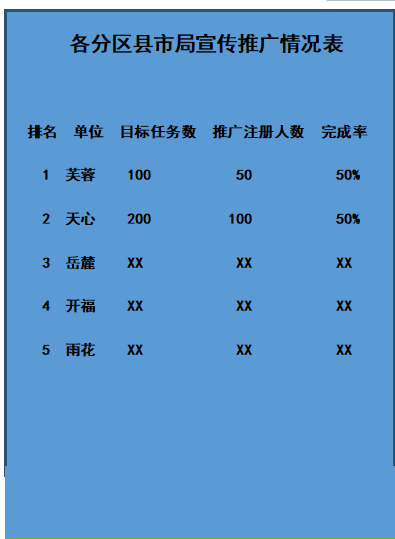

# 注册用户总数、已装机总数、累计登陆人数、日均活跃人数

## 分析

**注册用户总数**
czysp_user_ods_user

count(*)

**已装机总数**

czysp_user_ods_user_agent_log

device_update 字段去重之后 count

**累计登陆人数**

czy_single__ods_xcws_login_log

account 字段去重之后 count

**日均活跃人数**

## SQL语句

```
DROP VIEW  view_summ_user_action;

Create View IF NOT EXISTS view_summ_user_action as 
select
  register.total as registertotal,
  install.total as installtotal,
  login.total as logintotal,
  ' ' as avertotal
from   
( select '1' as id, count(1) as total  from  czysp_user_ods_user)  register
left join
(
 select '1' as id, count(1) as total from(
        select  device_update as total from czysp_user_ods_user_agent_log group by device_update
        ) t
  
) install
on register.id = install.id
left join
(
  select '1' as id,  count(1) as total from czy_single_ods_xcws_login_log group by account
) login
on install.id = login.id;

```


# 各分区县市局宣传推广情况表



## 分析

```

br.org_uuid
st.register_num
st.download_num
st.target_num
st.register_num/st.target_num as complete_rate


dim_changsha_branch  br                     org_uuid
czy_qrcode_ods_czy_code co                  community_uuid 
                                            code
czysp_user_ods_qrcode_statistical st        source_uuid

```

## SQL语句

```
DROP VIEW  view_summ_branch_register;

Create View IF NOT EXISTS view_summ_branch_register as 

select
    row_number() over (order by t.register_num) as sorted,
    t.*
from
(
    select
        br.org_uuid,
        br.name,
        st.register_num,
        st.target_num,
        st.register_num/st.target_num as complete_rate
    from dim_changsha_branch  br
    left join czy_qrcode_ods_czy_code co 
    on br.org_uuid = co.community_uuid
    left join czysp_user_ods_qrcode_statistical st
    on co.code = st.source_uuid
) t;

INVALIDATE METADATA view_summ_branch_register;
```

# 各模块访问人数

# SQL

```
DROP VIEW  view_summ_branch_module;

Create View IF NOT EXISTS view_summ_branch_module as 

select
 app.appname,
 open.count
from
(
  select '巡逻防控' as appname,app.table_pre from czysp_application_ods_application app where app.name regexp '(巡逻防控)'
  union all
  select '积分商城' as appname,app.table_pre from czysp_application_ods_application app where app.name regexp '(商城)'
  union all
  select '民众呼声' as appname,app.table_pre from czysp_application_ods_application app where app.name regexp '(投诉报修)'
  union all
  select '违法举报' as appname,app.table_pre from czysp_application_ods_application app where app.name regexp '(勋章)'
) app
left join 
(select
 open.table_pre,
 count( distinct open.user_uuid) as count
from
czysp_application_ods_application_open open
group by open.table_pre
) open
on app.table_pre = open.table_pre;
```